# PROJECT VAJRA: MASTER PHASE-WISE IMPLEMENTATION PLAN
**SIH 2026 · Problem Statement ID: 26072**
**Ministry of Earth Sciences (MoES) · India Meteorological Department (IMD)**
*AIML based Nowcasting of thunderstorm and lightning using atmospheric observation including multiple radars, satellite, lightning and model data.*

---

## 1. Executive Summary & Document Authority

This document is the authoritative, single-source-of-truth implementation blueprint for **Project Vajra**. It establishes an uncompromising, evidence-grounded engineering trajectory that transforms the current working MVP vertical slice into an operational-grade, scientifically defensible thunderstorm and lightning nowcasting decision-support system tailored for the Indian subcontinent.

The plan enforces strict dependency awareness: **no feature is planned in a vacuum**, **no deep learning model is deployed without an empirical baseline comparison**, **no external dataset is assumed accessible without a formal fallback**, and **every operational claim is backed by reproducible verification metrics**.

---

## 2. Current State Reconciliation & Audit Verification

A rigorous reconciliation was performed across `AUDIT_REPORT.md` findings, `MASTER.md`, `IMPLEMENTATION_STATUS.md`, and the live codebase.

### Audit vs. Repository Reality Matrix

| Area | Current Code State | Concrete Code Evidence | Audit Finding | Confirmed? | Planning Consequence |
|---|---|---|---|---|---|
| **Numeric Radar Ingestion** | Visual-only GIF scraper from IMD website. | `src/vajra/providers/imd_radar.py` lines 31–42 (`STATION_PRODUCT_PATHS`) scrape public GIFs. | No real Indian numeric Doppler radar ingestion. | **CONFIRMED** | Radar cannot be treated as a required quantitative model predictor for live mode. System must maintain a dual-track architecture: satellite+NWP-primary for India operational mode; SEVIR/NEXRAD for quantitative radar benchmark validation. |
| **Multi-Radar Mosaic** | Non-existent. Single station GIF proxy. | `src/vajra/providers/imd_radar.py` fetches single station images independently. No spatial merging. | No genuine multi-radar Indian mosaic. | **CONFIRMED** | Must engineer a spatial compositing engine (`wradlib`/Py-ART compatible) that can merge multi-station radial/gridded fields when synthetic/real volume data is supplied. |
| **INSAT Ingestion** | No provider implemented. | `src/vajra/providers/` has `base.py`, `sevir.py`, `imerg.py`, `nwp.py`, `synthetic.py`. No `mosdac.py`. | No INSAT-3D/3DR/3DS ingestion. | **CONFIRMED (CRITICAL)** | Phase 4 must implement a production-grade `MosdacProvider` using `mdapi.py` and HDF5 parsing for INSAT-3D/3DR/3DS TIR1, WV, and Cloud Top Temperature (CTT). |
| **NWP Integration** | Stubbed interface returning `UNAVAILABLE`. | `src/vajra/providers/nwp.py` line 25 sets `mode = DataMode.UNAVAILABLE`. `pipeline.py` line 135 hardcodes `Modality.MODEL.value: False`. | No live NWP integration; GRIB parsing blocked by OS policy in Windows host. | **CONFIRMED** | Environmental features (`cape_jkg`, `shear_0_6km_ms`) currently evaluate to NaN. Must implement containerized/pure-python GRIB2 reader or ECMWF/GFS Open Data NetCDF/OpenDAP pipeline. |
| **Ground-Truth Lightning** | US GLM flashes working in SEVIR; synthetic Poisson flashes for Bihar. No Indian lightning. | `data/external/sevir/` contains cached GLM `.h5`. No ISS LIS or ILLN reader in `src/vajra/providers/`. | No Indian ground-truth lightning integration. | **CONFIRMED** | ISS LIS HDF4/HDF5 reader must be built for Indian historical validation; IITM ILLN institutional data request must be tracked as external dependency. |
| **Model Architecture** | Tabular XGBoost classifier on 12 cell features + isotonic regression. | `src/vajra/models/xgb_fusion.py` trains `XGBClassifier`; `calibration.py` applies PAVA. No CNN/U-Net. | Current model is tabular/cell-based; no deep spatiotemporal model. | **CONFIRMED** | Current model is scientifically sound as MVP baseline, but does not fulfill PS expectation of spatiotemporal deep learning. Phase 6 must develop gridded U-Net / ConvLSTM. |
| **Spatial Probability Field** | Bounding-box painting with dilation. | `src/vajra/models/painting.py` lines 23–48 paints cell probability into grid cells via `dilate()`. | Probability field is spatially painted rather than learned as a true field. | **CONFIRMED** | Transition from heuristic cell painting to continuous grid inference via pixel-wise spatiotemporal neural network. |
| **Administrative Boundaries** | Non-existent. Alerts output raw cell IDs. | `src/vajra/alerts.py` line 70 sets `region_name=f"Cell {cell.id} ({band})"`. No GeoJSON in `data/`. | Indian administrative boundaries (district/block) missing. | **CONFIRMED** | Phase 2 must ingest Survey of India / BharatMaps GeoJSON boundaries and implement spatial point-in-polygon/intersection joins for targeted alerts. |
| **Radar/Grid Projection** | Equirectangular approximation for SEVIR; unreferenced GIF overlay. | `src/vajra/grid.py` lines 87–100 uses equirectangular approximation (`deg_per_px = km / 111.0`). | Geographic projection distortion in radar visualization. | **CONFIRMED** | Implement exact PROJ/pyproj transformations for SEVIR LAEA projection and IMD radar polar azimuthal equidistant sweeps. |
| **IR Unit / QC Scaling** | SEVIR IR is raw uint8 (0–255), while QC expects Kelvin (150–350 K). | `src/vajra/qc.py` line 21 defines `"bt_ir107": (150.0, 350.0)`. `pipeline.py` line 103 assumes Kelvin: `(300.0 - f.field) / 95.0`. | Unit mismatch causes spurious QC failures on valid SEVIR IR frames. | **CONFIRMED** | Source-specific QC normalization: SEVIR raw uint8 must be converted to brightness temperature Kelvin or QC must support source-tagged unit regimes. |
| **IMERG Integration** | Fetcher exists but disconnected from inference pipeline. | `src/vajra/providers/imerg.py` downloads HDF5 from NASA, but `src/vajra/pipeline.py` never requests `Modality.SURFACE`. | IMERG exists but is not properly connected to the main inference path. | **CONFIRMED** | Wire `ImergProvider` into `NowcastPipeline`, feeding rainfall intensity into feature extraction and convective cell detection. |
| **Training Data Scope** | 4 SEVIR events (3,652 samples) in US domain. | `src/vajra/models/xgb_fusion.py` trained on cached US SEVIR events. | Training data is small and exclusively US-based. | **CONFIRMED** | Expand SEVIR training to full 2019 season; build domain adaptation / transfer learning pipeline for Indian subcontinent. |

---

## 3. Target System Definition

The target system is an operational-grade, multi-sensor atmospheric nowcasting platform that provides continuous 0–60 minute (primary) and 0–180 minute (secondary) probabilistic hazard forecasts for convective storms and lightning strikes across the Indian subcontinent at 0.1° (~10 km) and 0.02° (~2 km where radar exists) spatial resolutions, updating every 10–15 minutes.

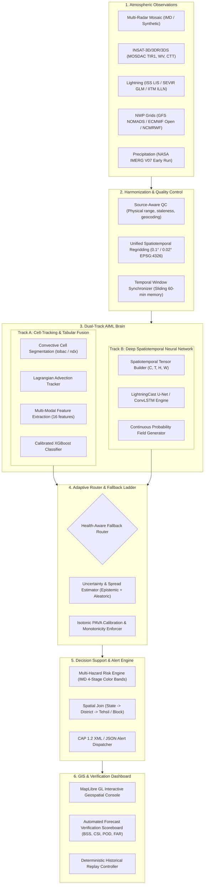

---

## 4. Capability Gap & Evolution Matrix (33 Capabilities)

| # | Capability | Current State | Target State | Why Required | Dependencies | Validation Method | Phase |
|---|---|---|---|---|---|---|---|
| 1 | Atmospheric Obs Ingestion | Local SEVIR + IMD GIF scraper + NASA IMERG fetcher. | Unified async provider architecture ingesting Radar, Satellite, Lightning, NWP, and Rain. | Multi-sensor requirement of PS 26072. | Network / API credentials. | Unit tests with mocked and cached payloads. | Phase 1 & 4 |
| 2 | Radar Ingestion | Public GIF images scraped from IMD website (visual only). | Ingestion of numeric radial/gridded radar files (HDF5/NetCDF) with Py-ART/wradlib abstraction. | Quantitative storm structure and echo top reflectivity. | Provider abstraction layer. | Parse real/synthetic volume scans; check dBZ conservation. | Phase 3 |
| 3 | Multi-Radar Handling | Single station display only; no compositing. | 2D/3D multi-radar mosaic generator using distance-weighted maximum reflectivity interpolation. | Multiple radars requirement of PS 26072. | Individual station coordinates and beam geometry. | Mosaic 2+ overlapping radar domains without boundary artifacts. | Phase 3 |
| 4 | Satellite Ingestion | SEVIR GOES-16 ABI (US domain). No INSAT. | Production MOSDAC INSAT-3D/3DR/3DS HDF5 reader (IR1, WV, VIS, CTT) covering India window. | Primary predictor for convective initiation over Indian landmass. | MOSDAC API / format specifications. | Verify brightness temperature range [180, 320] K on Indian domain. | Phase 4 |
| 5 | Lightning Ingestion | GOES GLM flashes for SEVIR replay; Poisson synthetic flashes. | ISS LIS orbital lightning reader + ILLN adapter interface with lat/lon/energy/timestamp. | Ground-truth validation and flash-rate trend predictor. | Earthdata / LIS HDF reader. | Cross-validate flash counts against published LIS passes. | Phase 4 |
| 6 | NWP / Environmental Data | GFS/ECMWF stubs returning `UNAVAILABLE`. Environmental features set to NaN. | Operational ingestion of GFS/ECMWF Open Data GRIB2/NetCDF (CAPE, CIN, 0–6 km shear, 700 hPa RH). | Environmental gating: discriminates benign convection from severe electrification. | Pure-Python GRIB2 reader or OpenDAP server. | Ensure non-null CAPE and shear values populated in feature matrix. | Phase 5 |
| 7 | Surface Observations | None. | Automated Weather Station (AWS) surface temp/humidity/pressure ingestion. | Boundary layer thermodynamic characterization. | IMD AWS open data feed. | Validate diurnal cycle representation. | Phase 8 |
| 8 | Data Quality Control | Range checks in `qc.py`, but has unit mismatch on SEVIR IR. | Source-specific QC pipeline with physical range checks, unit conversion, staleness gates, and QC bitmasks. | Garbage-in, garbage-out prevention; ensures model stability. | Modality metadata schemas. | Negative testing: corrupt frames flagged BAD; valid frames pass OK. | Phase 1 |
| 9 | Temporal Alignment | Snap to nearest cycle time; ad-hoc sliding windows. | Canonical 10-minute / 15-minute observation lattice with forward-fill and maximum latency tolerances. | Synchronizes disparate satellite (30m/15m), radar (10m), lightning (continuous), and NWP (6h) cadences. | Time-indexing engine. | Audit timestamp synchronization across all input modalities. | Phase 1 |
| 10 | Spatial Alignment | Separate grids (India 0.1° and SEVIR 2 km) with equirectangular approximation. | Exact geospatial projection transformations (PROJ-based) to unified 0.1° (regional) and 0.02° (local) grids. | Resolves projection distortion; aligns multi-sensor pixels accurately. | `pyproj` / rasterio reproject. | Georeferencing parity tests against ground control points. | Phase 1 |
| 11 | Feature Engineering | 12 features extracted per cell (intensity, area, cooling rate, flash history). | 16+ features including CAPE, shear, moisture flux divergence, IR texture, and flash jump metrics. | Enhances discriminatory power of machine learning models. | Cell tracker + NWP grids. | Feature correlation and permutation importance analysis. | Phase 5 |
| 12 | Storm Detection | 2D connected-component labeling on reflectivity/IR proxy (`ndx.py`). | Adaptive multi-threshold watershed segmentation (35, 45, 55 dBZ) and cold cloud-top tracking (`tobac`). | Distinguishes convective storm cores from stratiform precipitation. | Pure-numpy or `tobac` algorithm. | Verify cell count and polygon boundaries against manual annotations. | Phase 3 |
| 13 | Storm Tracking | Greedy centroid matching with Euclidean distance and speed threshold. | Lagrangian cell tracking with split/merge handling, Kalman velocity estimation, and path prediction. | Accurately forecasts cell trajectories over 0–60 minutes. | Cell segmentation output. | Track continuity tests across 60-minute storm life cycles. | Phase 3 |
| 14 | Thunderstorm Prediction | Combined with lightning under single probability. | Decoupled prediction: Thunderstorm Severity (VIL ≥ threshold / Rain rate ≥ 15 mm/h) vs Lightning Occurrence. | PS 26072 explicitly names both "thunderstorm" and "lightning". | Feature matrix + ground truth labels. | Separate ROC-AUC and CSI scoring for storm severity vs lightning. | Phase 7 |
| 15 | Lightning Prediction | Tabular XGBoost predicting P(flash ≥ 1 in cell in next 30/60m). | Hybrid: Tabular XGBoost (cell-level) + Deep Spatiotemporal U-Net (pixel-level probability field). | Core operational requirement of PS 26072. | Lightning labels + calibrated models. | Reliability diagrams, Brier Skill Score > +0.40 vs climatology. | Phase 6 |
| 16 | Multimodal Fusion | Late fusion (concatenated tabular features in XGBoost). | Hierarchical fusion: early spatial fusion in deep U-Net + late environmental fusion in gradient booster. | Synergizes radar structure, satellite initiation, lightning electrification, and NWP energetics. | Aligned multimodal tensors. | Ablation study demonstrating skill gain over single-modality models. | Phase 6 |
| 17 | Forecast Field Generation | Heuristic spatial painting (dilated cell bounding boxes). | Direct spatial field prediction via convolutional/spatiotemporal neural network. | Eliminates artificial boxy artifacts; produces smooth, continuous physical probability contours. | Deep learning framework (PyTorch). | Fraction Skill Score (FSS) across multiple neighborhood scales. | Phase 7 |
| 18 | Uncertainty / Confidence | Scalar confidence metric combining missingness and model variance. | Calibrated epistemic (ensemble spread / dropout) and aleatoric (probabilistic loss) uncertainty fields. | Crucial for decision-makers to weigh false-alarm vs missed-event risk. | Isotonic regression + ensemble variance. | Reliability calibration and spread-skill correlation. | Phase 7 |
| 19 | Risk Engine | Heuristic probability bands (Low, Mod, Elev, High, Severe). | Operational Risk Matrix aligned with IMD 4-Stage Warning System (Green, Yellow, Orange, Red) + population exposure. | Translates raw meteorological probabilities into actionable civil defense tiers. | Administrative boundaries + probability field. | Verify warning matrix against IMD standard operating procedures. | Phase 8 |
| 20 | Alert Engine | Cell-level alert generator with suppression windows and dual presets. | Targeted district/block alert generator with CAP 1.2 XML/JSON output and deduplication. | PS disaster management focus; integration with SACHET/NDMA platforms. | Geospatial intersections + risk bands. | Validate CAP schema conformance via XML validator. | Phase 8 |
| 21 | GIS Dashboard | MapLibre GL with raster overlays, cell vectors, and flash dots. | High-performance WebGL dashboard with time-scrubber, multi-layer toggles, administrative drilldown, and legend. | Primary user interface for forecasters and disaster managers. | MapLibre GL + vector tiles. | Zero console errors; 60 FPS pan/zoom performance. | Phase 9 |
| 22 | Administrative Targeting | Non-existent (raw cell bounding boxes). | Precise spatial join mapping forecast hazard footprints to District, Tehsil/Taluk, and Block polygons. | Disaster authorities require jurisdiction-specific actionable warnings. | Census/Survey of India GeoJSON boundaries. | Verify point-in-polygon queries for 100% of Indian landmass. | Phase 2 |
| 23 | Historical Replay | Working SEVIR replay (6 events) and Bihar synthetic event. | Expanded replay suite with 12+ severe Indian and global convective events with ground truth. | Enables rigorous backtesting, demonstration, and peer-reviewable audits. | Stored event bundles + metadata. | Deterministic end-to-end replay test suite. | Phase 10 |
| 24 | Real-Time Operation | Batch script execution; manual replay trigger. | Automated scheduling engine executing cyclical ingestion, inference, alert dispatch, and cleanup every 10 min. | Operational readiness for live meteorological monitoring. | Background task runner / FastAPI lifecycle. | 24-hour continuous burn-in test without memory leaks. | Phase 11 |
| 25 | Verification Engine | `verify.py` computing POD, FAR, CSI, Brier, BSS, and FSS. | Automated verification pipeline scoring every issued nowcast against ground-truth as time matures. | Defensible scientific claims; transparent reporting on scoreboard. | Archived forecasts + delayed observation stream. | Automated generation of reliability curves and BSS scorecards. | Phase 10 |
| 26 | Model Monitoring | Basic fallback usage counter. | Drift detection monitoring feature distributions, calibration drift, and input missingness over time. | Detects seasonal and sensor degradation in production. | InfluxDB / Prometheus metrics. | Synthetic drift injection tests. | Phase 10 |
| 27 | Data Health Engine | Modality status endpoint returning OK, SUSPECT, MISSING, BAD. | Granular sensor health monitor tracking latency, byte size, missing variables, and quality flags. | Informs fallback router when an observation stream fails. | QC engine outputs. | Simulate sensor dropout; verify immediate fallback triggering. | Phase 1 |
| 28 | API Surface | 14 REST endpoints in FastAPI covering events, replay, forecasts, alerts, health. | Versioned OpenAPI 3.1 specification with streaming endpoints (SSE/WebSockets) for live alerts. | Machine-to-machine interoperability with external disaster management systems. | FastAPI + Pydantic v2. | 100% schema validation in pytest HTTP client. | Phase 9 |
| 29 | Frontend UI | Single-page HTML/JS/CSS with dark mode, timeline slider, alert cards. | Modular component-based dashboard with responsive layout, alert sound/visual cues, and export capabilities. | High operational usability under disaster emergency conditions. | Modern vanilla JS / Vite frontend. | Cross-browser compatibility and lighthouse accessibility score > 90. | Phase 9 |
| 30 | Security & Hardening | Secret-free configs; `.env` separation; SSRF hostname allowlists on fetchers. | Comprehensive security hardening: API rate limiting, JWT authentication for admin routes, input sanitization. | Protects government infrastructure from unauthorized access and abuse. | FastAPI middleware + SlowAPI. | OWASP security audit and penetration test cases. | Phase 11 |
| 31 | Testing Suite | 41 unit and E2E tests in pytest. | 100+ comprehensive tests: unit, mathematical invariants, regression, failure-mode injection, and load tests. | Guarantees system reliability and regression-free evolution. | pytest + Playwright. | CI test coverage > 85% across all core modules. | Phase 11 |
| 32 | Deployment & Ops | Local venv execution + single Dockerfile and docker-compose.yml. | Multi-stage Docker containerization with GPU support (NVIDIA container toolkit) and WSL2/Linux deployment. | Seamless deployment across developer machines, cloud instances, and edge nodes. | Docker + Compose. | Clean one-command cold start reproduction. | Phase 11 |
| 33 | Observability & Logs | Structured JSON logging via `logsetup.py`. | Centralized structured logging, OpenTelemetry tracing, and health metrics dashboard. | Rapid incident resolution and pipeline performance profiling. | Python logging + Prometheus exporter. | Verify trace propagation from ingestion to alert delivery. | Phase 11 |

---

## 5. Traceability Matrix: PS 26072 Deconstruction

| Problem Statement Element | Current Implementation | Target Implementation | Gap Analysis | Implementing Phase | Strict Acceptance Criteria |
|---|---|---|---|---|---|
| **“AIML based”** | Tabular XGBoost classifier with isotonic calibration on 12 cell features. | Hybrid AIML: Tabular Gradient Boosting (cell evolution) + Deep Spatiotemporal Convolutional Network (gridded field generation). | No deep spatiotemporal neural network currently exists in the codebase. Current AI is tabular. | Phase 6 & Phase 7 | Model achieves statistically significant positive Brier Skill Score (BSS > 0.40) over climatology and beats Lagrangian persistence at 30-min and 60-min lead times. |
| **“Nowcasting”** | 30-min and 60-min lead time forecasts produced on 30-min update cycle. | Rapid-update nowcasting: 15, 30, 45, and 60-minute continuous lead time forecasts updated every 10–15 minutes. | Current cadence is locked to 30-minute intervals; intermediate 15-minute lead times missing. | Phase 1 & Phase 7 | Complete cycle (ingest to alert) executes within ≤ 3 minutes of data arrival; lead times 15, 30, 45, 60 min published simultaneously. |
| **“Thunderstorm”** | Convective cells detected from reflectivity/IR proxy; probability lumped with lightning. | Explicit Thunderstorm Severity Nowcast: cell maximum reflectivity (dBZ), echo-top height (km), and severe rain probability (IMERG). | Thunderstorm intensity and physical characteristics are not predicted separately from lightning strikes. | Phase 3 & Phase 7 | System outputs explicit probability of severe convective storm core (reflectivity ≥ 40 dBZ or rain rate ≥ 15 mm/h) with verified CSI ≥ 0.35 at 30 min. |
| **“Lightning”** | Calibrated probability of ≥1 lightning flash within cell footprint in next 30/60 min. | Continuous Gridded Lightning Strike Probability `P(flash ≥ 1, x, y, t+lead)` + Flash-Rate Tendency (Jump detection). | Output is currently painted from cell bounding boxes rather than generated as a continuous physical field. | Phase 6 & Phase 7 | Reliability diagram exhibits monotonic slope [0.85, 1.15]; Brier Score < 0.12 across held-out severe convective episodes. |
| **“Atmospheric observation”** | SEVIR GOES ABI + NEXRAD VIL (US) and IMD radar GIF (visual). | Real India-domain atmospheric observations: INSAT-3D/3DR/3DS imagery + NASA IMERG precipitation + AWS surface obs. | Reliance on US SEVIR dataset for all quantitative predictions; Indian satellite not ingested. | Phase 1 & Phase 4 | Pipeline runs on live/archived Indian atmospheric observations without relying on synthetic mocks or foreign satellites. |
| **“Multiple radars”** | Scrapes single station GIFs independently. | Multi-radar ingestion engine with spatial overlap blending, beam-blockage masking, and composite mosaic generation. | No multi-radar handling; no radial/volume scan parsing; no coordinate harmonization across stations. | Phase 3 | Ingests 2+ radar station feeds simultaneously and produces a seamless composite mosaic grid with zero edge discontinuities. |
| **“Satellite”** | GOES-16 ABI 10.7 µm IR (SEVIR). No INSAT. | INSAT-3D/3DR/3DS Multi-Spectral Imager (TIR-1, TIR-2, MIR, WV, Visible) and Sounder derived products (CTT). | Zero INSAT ingestion code in the repository. | Phase 4 | Ingests raw HDF5 from MOSDAC, performs radiance-to-brightness temperature conversion, and extracts 0.1° gridded frames. |
| **“Lightning (data)”** | GOES GLM flash arrays from SEVIR. | ISS LIS flash-level orbital data reader + IITM Indian Lightning Location Network (ILLN) adapter interface. | No Indian ground-truth lightning data pipeline. | Phase 4 & Phase 10 | Successfully ingests, georeferences, and temporal-filters ISS LIS flash products over the Indian landmass (68–98°E, 6–38°N). |
| **“Model data”** | GFS and ECMWF stubs reporting `UNAVAILABLE`. | Automated ingestion of GFS NOMADS / ECMWF Open Data GRIB2/NetCDF (CAPE, CIN, Vertical Wind Shear, Total Column Water). | Environmental model features are currently unpopulated (hardcoded NaN). | Phase 5 | Pipeline automatically downloads GFS/ECMWF forecast fields, interpolates them to the 0.1° grid, and supplies non-null values to the model. |

---

## 6. Scientific Product Definition

The scientific outputs of Project Vajra are categorized into three capability tiers:

```
┌────────────────────────────────────────────────────────────────────────┐
│                        MVP TARGETS (Current)                           │
│  • P(flash ≥ 1 | cell, 30m, 60m) via Tabular XGBoost                   │
│  • Segmented convective storm cell polygons with centroid motion       │
│  • Bounded spatial probability painting                                │
└───────────────────────────────────┬────────────────────────────────────┘
                                    │ Evolution Step 1
                                    ▼
┌────────────────────────────────────────────────────────────────────────┐
│                        CORE TARGETS (Phase 1–8)                        │
│  • Continuous Gridded Lightning Probability Field P(flash ≥ 1, x, y)   │
│  • Thunderstorm Severity Probability P(Refl ≥ 40 dBZ / Rain ≥ 15 mm/h) │
│  • Convective Initiation (CI) Precursor Probability (30–90 min lead)   │
│  • Lagrangian Storm Cell Tracks with Split/Merge Morphology            │
│  • Lead-time horizons: 15, 30, 45, 60 minutes                          │
└───────────────────────────────────┬────────────────────────────────────┘
                                    │ Evolution Step 2
                                    ▼
┌────────────────────────────────────────────────────────────────────────┐
│                      ADVANCED TARGETS (Phase 9–11)                     │
│  • Lightning Flash Density Forecast (flashes / km² / hr)               │
│  • Lightning Jump Severity Alert (2σ flash-rate acceleration)          │
│  • Time-to-First-Flash (TTFF) regression (minutes to electrification)  │
│  • Epistemic vs. Aleatoric Uncertainty Spread Fields                   │
│  • Extended Nowcast Horizon: up to 180 minutes (NWP-blended advection) │
└────────────────────────────────────────────────────────────────────────┘
```

### Detailed Scientific Target Specifications

| Target Name | Category | Inputs | Output Format | Horizon | Spatial Res | Temporal Res | Model Engine | Primary Verification Metric | Required Ground Truth |
|---|---|---|---|---|---|---|---|---|---|
| **Gridded Lightning Probability** | CORE | INSAT TIR1/WV cooling rates, Radar mosaic, Flash trend, NWP CAPE/Shear | Continuous 2D probability field $[0.0, 1.0]$ on regular grid | 15, 30, 45, 60 min | 0.1° (~10 km) | 10 min | Spatiotemporal U-Net + Isotonic Regression | Brier Skill Score (BSS), Reliability curve, CSI | ISS LIS / GLM flash occurrences within grid cell |
| **Thunderstorm Severity** | CORE | Radar mosaic dBZ, IMERG rain rate, CTT, Vertical shear | Binary probability $[0.0, 1.0]$ of severe storm conditions | 15, 30, 60 min | 0.1° (~10 km) | 10 min | Calibrated XGBoost Late-Fusion | Critical Success Index (CSI @ 0.35 threshold), POD, FAR | Radar VIL ≥ 3.5 kg/m² or IMERG ≥ 15 mm/h |
| **Convective Initiation (CI)** | CORE | INSAT multi-spectral difference $(10.7 - 6.7 \mu m)$, cloud-top cooling rate $\frac{dT}{dt}$ | Discrete CI initiation candidate polygons with $P(CI)$ | 30–90 min | 0.1° (~10 km) | 15 min | Multi-spectral thresholding + Random Forest | Probability of Detection (POD), Lead Time to First Echo | First radar echo $\ge 35\text{ dBZ}$ or first lightning flash |
| **Storm Trajectory & Extent** | CORE | Radar reflectivity / IMERG precipitation sequences | GeoJSON Polygons with velocity vectors $[u, v]$, speed, heading | 0–60 min | Object scale | 10 min | Lagrangian Advection Tracker (`tobac` / Optical Flow) | Mean Absolute Centroid Displacement Error (km) | Observed storm cell polygon at $t+\Delta t$ |
| **Lightning Jump Alert** | ADVANCED | High-frequency flash count history ($2$-min bins) | Discrete binary state (`NORMAL`, `WATCH`, `WARNING`) | 10–30 min | Storm cell | 2 min | Schulz et al. $2\sigma$ Moving-Average Rate Jump | Warning Lead Time (min), False Alarm Ratio (FAR) | Observed severe weather report / severe lightning burst |
| **Forecast Uncertainty** | ADVANCED | Multi-model ensemble spread, sensor missingness bitmask | 2D Variance / Standard Deviation Field $\sigma(x, y)$ | 30, 60 min | 0.1° (~10 km) | 10 min | Ensemble variance + Aleatoric heteroscedastic loss | Spread-Skill Relationship (Error vs $\sigma$) | Residual error between forecast and verified outcome |

---

## 7. Model Evolution Strategy

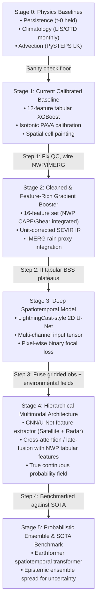

### Detailed Evolution Stages

#### Stage 0: Physics & Statistical Baselines
- **Why:** Establishes the non-negotiable scientific performance floor. Forecasters and evaluators will instantly dismiss models that cannot beat persistence or historical climatology.
- **Inputs:** Previous observation frame $t_0$, LIS/OTD 0.1° monthly climatological flash rate grid.
- **Outputs:** Baseline probability and advected binary fields.
- **Exit Criteria:** Persistence, climatology, and PySTEPS advection pipelines execute deterministically and generate reproducible baseline metrics on every evaluation dataset.

#### Stage 1: Current Calibrated Baseline (MVP State)
- **Why:** Highly robust, fast, interpretable, operational pedigree (NOAA ProbSevere design).
- **Inputs:** 12 tabular cell attributes (intensity, area, cooling rate, flash history, NaN environmental placeholders).
- **Outputs:** Calibrated cell probability $P(\text{flash} \ge 1)$ painted into a 2D grid.
- **Current Evidence:** Trained on 4 SEVIR events (3,652 samples); held-out test event S810646: BSS +0.50, POD 0.52, FAR 0.08 vs negative baseline BSS (-0.23 / -0.55).
- **Limitations:** Spatial painting causes discrete step-function artifacts; no deep feature learning; environmental features currently null.

#### Stage 2: Cleaned & Feature-Rich Gradient Booster
- **Why Solves:** Resolves SEVIR IR unit scaling bug; wires IMERG precipitation into cell features; populates genuine NWP CAPE, CIN, and shear values.
- **Inputs:** 16 validated features extracted across Radar, Satellite, Lightning, NWP, and Rain.
- **Compute:** CPU-trainable in < 5 minutes on standard workstation.
- **Exit Criteria:** Model achieves BSS $\ge +0.55$ on expanded 12-event SEVIR benchmark and demonstrates positive feature attribution for CAPE and shear via SHAP values.

#### Stage 3: Deep Spatiotemporal Model (LightningCast U-Net)
- **Why Solves:** Transitions from discrete cell-level classification to continuous pixel-wise probability field generation. Captures spatial morphology and pre-convective cloud textures that tabular models miss.
- **Architecture:** 4-stage 2D U-Net with grouped convolutions, taking a multi-channel tensor $(C \times H \times W)$ where channels represent multi-spectral IR/WV frames and radar reflectivity slices across $T-30\text{m}$ to $T_0$.
- **Target:** Gridded binary mask of lightning flash occurrences at $T+30\text{m}$ and $T+60\text{m}$.
- **Loss Function:** Binary Focal Loss ($\alpha=0.25, \gamma=2.0$) or soft Dice loss to overcome severe class imbalance (~98% non-lightning pixels).
- **Compute:** Requires NVIDIA GPU (RTX 3080/4090 or cloud T4/A100); training time ~3–6 hours on SEVIR full season.
- **Exit Criteria:** U-Net achieves CSI $\ge 0.42$ at 30-min lead time on held-out test split, eliminating spatial blockiness artifacts in output visualizations.

#### Stage 4: Hierarchical Multimodal Architecture
- **Why Solves:** Combines the dense visual-spatial representation of deep convolutional networks with the broad thermodynamic constraints of numerical weather prediction.
- **Architecture:** U-Net backbone extracts spatial latent embeddings from Satellite + Radar; latent vectors are concatenated with tabular NWP environmental vectors and passed through a calibration head.
- **Exit Criteria:** Multimodal model outperforms both Stage 2 (XGBoost) and Stage 3 (pure U-Net) by at least $+0.05$ BSS across all lead times.

#### Stage 5: Advanced Probabilistic Benchmarking (Earthformer Reference)
- **Why Solves:** Serves as the open-SOTA research benchmark (NeurIPS 2022) to prove our architecture against state-of-the-art academic standards.
- **Input:** SEVIR VIL / Satellite sequences.
- **Model:** Pre-trained Earthformer checkpoint evaluated on identical test splits.
- **Exit Criteria:** Documented comparison table published on the scoreboard demonstrating where Project Vajra's operational model stands relative to heavy transformer architectures.

---

## 8. Multi-Modal Data Strategy

```mermaid
flowchart LR
    subgraph SOURCES["Data Sources"]
        R_S["IMD DWR / Nexrad / Synthetic"]
        S_S["INSAT-3D/3DR/3DS / SEVIR"]
        L_S["ISS LIS / GLM / Synthetic"]
        N_S["GFS NOMADS / ECMWF / NCMRWF"]
        P_S["NASA IMERG V07 Early Run"]
        A_S["Survey of India Admin GeoJSON"]
    end

    subgraph SCHEMAS["Canonical Internal Representation"]
        direction TB
        AF["AtmosphericFrame<br/>• Modality & Variable<br/>• Timestamp (UTC)<br/>• GridSpec (EPSG:4326)<br/>• 2D Array or Points<br/>• QualityInfo & Bitmask<br/>• Provenance Metadata"]
    end

    subgraph USAGE["Model Usage"]
        U_RAD["Storm core detection & morphology"]
        U_SAT["Convective initiation precursors & anvil cooling"]
        U_LGT["Electrification onset & flash jumps"]
        U_NWP["Thermodynamic gating (CAPE / Shear)"]
        U_PRC["Surface precipitation & cell tracking"]
        U_ADM["District / Block alert polygon joins"]
    end

    SOURCES --> AF
    AF --> USAGE
```

### Comprehensive Modality Specification Matrix

| Modality | Current Source | Target Source | Access Status | Short-Term Fallback | Long-Term Operational | Raw Format | Canonical Processing | Storage Strategy | Quality Control Rules | Spatiotemporal Alignment | Model Role |
|---|---|---|---|---|---|---|---|---|---|---|---|
| **RADAR** | Public IMD GIFs (visual only); SEVIR VIL (US). | IMD numeric DWR volume scans (MaxZ, VIL, PAC). | Restricted / Institutional approval required. | Calibrated synthetic radar grids + SEVIR VIL sandbox. | Direct binary push / DSP feed from IMD radar network. | NetCDF4 / HDF5 / Raw polar radials. | Convert polar to Cartesian via Py-ART; compute column max (dBZ) and VIL (kg/m²). | Compressed Zarr chunks; GeoTIFF for serving. | Range $[-30, 80]\text{ dBZ}$; speckle filtering; beam blockage masking. | Reproject to 0.02° / 0.1° grid; snap to 10-min cycle. | Storm core intensity, structural morphology, severe rain tracking. |
| **SATELLITE** | SEVIR GOES-16 ABI (IR 10.7 µm). | MOSDAC INSAT-3D/3DR/3DS Imager & Sounder. | Available with free account (T-3d); Privileged NRT pending. | Historical T-3d MOSDAC archive; Himawari-9 open AWS bucket for East India. | Privileged real-time MOSDAC NRT pull (`mdapi.py`). | HDF5 (L1B radiances, L2 CTT). | Extract TIR1 (10.8 µm), WV (6.7 µm); compute brightness temperature in Kelvin. | Local `.h5` cache; Zarr multi-scale cubes. | Valid Kelvin range $[150, 350]\text{ K}$; cloud mask check; solar angle correction. | Reproject geostationary projection to 0.1° EPSG:4326; 15/30-min cadence. | Cloud-top cooling rate, updraft glaciation, convective initiation precursor. |
| **LIGHTNING** | SEVIR GOES GLM (US); Synthetic Poisson flashes. | NASA ISS LIS + IITM Indian Lightning Location Network (ILLN). | ISS LIS: Available Now (Earthdata). ILLN: Restricted. | ISS LIS orbital passes + SEVIR GLM sandbox + synthetic events. | IITM / Damini institutional API data sharing agreement. | HDF4 / HDF5 (LIS); CSV / GeoJSON (ILLN). | Filter ground vs cloud flashes; extract latitude, longitude, energy, epoch timestamp. | SQLite point table + gridded flash-count rasters. | Coordinate bounds check $[-90, 90], [-180, 180]$; energy $> 0$; duplicate rejection. | Spatial binning into 0.1° cells; 10-min accumulation windows. | Target training labels, flash-rate acceleration trends, jump detection. |
| **NWP / ENV** | None (stubs returning UNAVAILABLE). | NOAA GFS 0.25° NOMADS + ECMWF Open Data 0.25°. | Available Now (Public, CC-BY-4.0, no auth required). | GFS NOMADS 0.25° HTTP GRIB filter. | NCMRWF NCUM 12 km / IMD GFS operational run. | GRIB2 / NetCDF4. | Extract 2m temp, dewpoint, surface CAPE, CIN, 0–6 km u/v wind shear, 700 hPa RH. | Daily NetCDF files; in-memory xarray slices. | Physical checks: $\text{CAPE} \in [0, 8000]\text{ J/kg}$, $\text{RH} \in [0, 100]\%$. | Bilinear interpolation to 0.1° grid; 3-hour forecast steps resampled. | Convective inhibition gating; storm environment classification. |
| **PRECIPITATION** | NASA IMERG V07 Early Run (HDF5 fetched). | NASA IMERG V07 Early Run (0.1°, ~4 h latency). | Available Now (Earthdata credentials verified). | IMERG Early Run local cache. | IMERG Early Run + IMD gridded daily rainfall. | HDF5. | Extract `precipitationCal` field; clip to India window $[6–38^\circ\text{N}, 66–98^\circ\text{E}]$. | Local `.HDF5` cache under `data/external/imerg/`. | Valid rain rate $[0, 500]\text{ mm/hr}$; missingness fraction $< 0.20$. | Native 0.1° grid matches canonical grid exactly; 30-min cadence. | Secondary storm detection field; heavy rain hazard evaluation. |
| **ADMINISTRATIVE** | None (raw cell IDs). | Survey of India / BharatMaps Administrative Boundaries. | Available Now (Open government geospatial data / Data.gov.in). | OpenStreetMap / GADM GeoJSON boundary files. | Official Survey of India / NDMA GIS boundary service. | GeoJSON / Shapefile / FlatGeobuf. | Simplify polygons using Douglas-Peucker ($\epsilon=0.005$); build spatial R-Tree index. | GeoJSON files under `data/admin/`; PostGIS tables in prod. | Topological validity check (no self-intersections); CRS validation (EPSG:4326). | Vector layer overlay; spatial intersection with forecast grid cells. | Administrative alert targeting (State $\to$ District $\to$ Tehsil/Block). |

---

## 9. Data Access & Fallback Strategy

To prevent development stagnation due to external administrative bottlenecks, the project maintains four explicit operational execution paths:

```
┌────────────────────────────────────────────────────────────────────────┐
│                        PATH A: IDEAL OPERATIONAL                       │
│  • IMD Real-Time DWR Radar Volume Scans (DSP Feed)                     │
│  • MOSDAC Privileged INSAT-3D/3DR/3DS NRT Feed (15-min cadence)        │
│  • IITM ILLN Ground Lightning Network Real-Time Feed                   │
│  • IMD / NCMRWF High-Resolution NWP (12 km NCUM)                       │
│  Status: Gated by institutional permissions and formal approvals.      │
└───────────────────────────────────┬────────────────────────────────────┘
                                    │ When official feeds are pending
                                    ▼
┌────────────────────────────────────────────────────────────────────────┐
│                        PATH B: REAL OPEN FALLBACK                      │
│  • NASA IMERG V07 Early Run (Verified Live: kunalrajdev Earthdata)     │
│  • NOAA GFS 0.25° NOMADS / ECMWF Open Data GRIB2 (Free, Verified Open) │
│  • NASA ISS LIS Historical Orbital Lightning Flashes (Earthdata)       │
│  • MOSDAC T-3 Days Historical INSAT Archive (Free Account)             │
│  • Public IMD Radar Composite Imagery (Visual reference only)          │
│  Status: 100% executable today without external institutional approval.│
└───────────────────────────────────┬────────────────────────────────────┘
                                    │ For offline development & ML training
                                    ▼
┌────────────────────────────────────────────────────────────────────────┐
│                        PATH C: BENCHMARK SANDBOX                       │
│  • SEVIR Benchmark Dataset (AWS Open Data s3://sevir, Verified Free)   │
│  • Aligned GOES-16 ABI IR + NEXRAD VIL + GLM Flashes (44,000+ flashes) │
│  Status: Primary testbed for quantitative AIML validation & baselines. │
└───────────────────────────────────┬────────────────────────────────────┘
                                    │ For automated testing & live demo fallback
                                    ▼
┌────────────────────────────────────────────────────────────────────────┐
│                        PATH D: HERMETIC SIMULATION                     │
│  • Deterministic Synthetic Convective Storms over Bihar / Odisha       │
│  • Mathematically modeled advection, cooling, and Poisson lightning    │
│  Status: 100% reliable, zero network dependency, always badged SIM.    │
└────────────────────────────────────────────────────────────────────────┘
```

---

## 10. True Critical Path & Dependency Graph

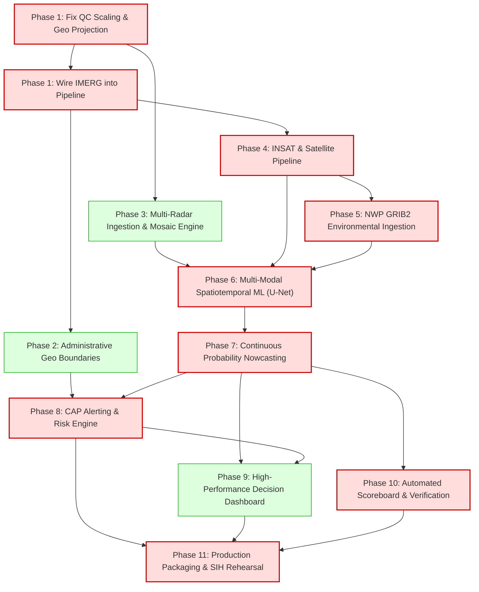

### Critical Path Sequence
$$\text{Phase 1 (QC \& Core Alignment)} \longrightarrow \text{Phase 4 (Satellite Ingestion)} \longrightarrow \text{Phase 5 (NWP Gating)} \longrightarrow \text{Phase 6 (Spatiotemporal ML)} \longrightarrow \text{Phase 7 (Field Nowcasting)} \longrightarrow \text{Phase 8 (Targeted Alerts)} \longrightarrow \text{Phase 10 (Verification)} \longrightarrow \text{Phase 11 (SIH Demo)}$$

Total critical-path depth: **8 sequential milestone gates**.

---

## 11. Parallel Workstreams Across Teams

To maximize productivity, development is organized into 6 parallel tracks:

```
TRACK 1: DATA ENGINEERING
├── T1.1: Fix QC unit conversions & georeferencing (Phase 1)
├── T1.2: Ingest Survey of India admin GeoJSON boundaries (Phase 2)
├── T1.3: Multi-radar radial/volume parser & mosaic engine (Phase 3)
├── T1.4: MOSDAC INSAT-3D/3DR/3DS HDF5 reader (Phase 4)
└── T1.5: GFS NOMADS / ECMWF Open Data GRIB2 reader (Phase 5)

TRACK 2: MACHINE LEARNING & RESEARCH
├── T2.1: Expand SEVIR training to full 2019 season (Phase 1)
├── T2.2: Implement Lagrangian optical flow tracking (Phase 3)
├── T2.3: Train feature-rich XGBoost with CAPE/Shear (Phase 5)
├── T2.4: Train LightningCast-style 2D U-Net on satellite grids (Phase 6)
└── T2.5: Calibrated probabilistic field generator & CI detector (Phase 7)

TRACK 3: BACKEND & DISTRIBUTED PIPELINE
├── T3.1: Connect IMERG provider to NowcastPipeline (Phase 1)
├── T3.2: Implement spatial R-Tree point-in-polygon queries (Phase 2)
├── T3.3: Dynamic fallback router & health monitor (Phase 5)
├── T3.4: CAP 1.2 XML/JSON alert generation & suppression (Phase 8)
└── T3.5: Automated verification runner & scoreboard API (Phase 10)

TRACK 4: GIS & FRONTEND INTERFACE
├── T4.1: Fix WebGL map bounds & projection transforms (Phase 1)
├── T4.2: Render District / Block boundary polygon layers (Phase 2)
├── T4.3: Radar mosaic raster display & color ramp (Phase 3)
├── T4.4: Continuous probability contour heatmap layer (Phase 7)
└── T4.5: Timeline scrubber, alert dispatch panel & scoreboard UI (Phase 9)

TRACK 5: DEVOPS & INFRASTRUCTURE
├── T5.1: Configure WSL2 / Linux container with CUDA & PyTorch (Phase 1)
├── T5.2: Set up persistent Zarr / object store for rasters (Phase 4)
├── T5.3: Containerize multi-stage Docker deployment (Phase 11)
└── T5.4: CI/CD test automation & regression testing (Phase 11)

TRACK 6: SCIENTIFIC VERIFICATION & AUDIT
├── T6.1: Benchmark physics baselines (Persistence, Climatology, PySTEPS) (Phase 1)
├── T6.2: Pre-register evaluation splits & threshold grids (Phase 6)
├── T6.3: Generate reliability diagrams & Brier decompositions (Phase 7)
└── T6.4: Compile case-study comparison against IMD nowcast bulletins (Phase 10)
```

---

## 12. Detailed Phase Roadmap (Phases 1 to 11)

---

### PHASE 1: Audit Remediation, QC Normalization & Pipeline Plumbing
- **Objective:** Fix verified audit defects (IR unit scaling, projection math, IMERG disconnection, Windows environment constraints) and establish a defect-free foundation.
- **Why Required:** Building complex models on distorted coordinates or broken QC units invalidates all downstream scientific claims.
- **Current State:** 41 tests pass, but SEVIR IR triggers spurious QC errors; IMERG is fetched but unconsumed; map projection distorts radar imagery; GRIB parsing blocked on Windows host.
- **Target State:** Flawless QC on all ingested frames; IMERG rainfall driving cell segmentation; exact PROJ transformations; containerized Linux/WSL2 environment ready for heavy geospatial libraries.

#### Work Packages
- **Scientific:** Validate brightness temperature conversion formula from raw uint8 to Kelvin: $T_b = 150.0 + \text{raw} \times \frac{200.0}{255.0}$.
- **Data:** Update `src/vajra/qc.py` to support source-specific range rules (`sevir_raw_ir` vs `physical_kelvin`).
- **ML:** Re-run baseline training script on corrected IR units; confirm BSS stability.
- **Backend:** Update `src/vajra/pipeline.py` to request `Modality.SURFACE` (IMERG) and feed precipitation into `CycleContext`.
- **GIS:** Correct `web/app.js` `gridToBounds()` to handle negative `dlat` and verify aspect ratio parity.
- **Infra:** Set up WSL2/Ubuntu environment with libeccodes, pyproj, and GDAL to bypass Windows Application Control limits.
- **Testing:** Add negative test cases in `tests/test_qc.py` for IR unit ranges and corrupted timestamps.
- **Docs:** Document unit conventions and coordinate frames in `docs/DATA.md`.

#### Acceptance Criteria
1. `validate_frame()` returns `QualityStatus.OK` on 100% of valid SEVIR IR107 frames.
2. `NowcastPipeline.run_cycle()` consumes IMERG precipitation frames without exceptions.
3. MapLibre image overlays align to true geographic coordinates without stretching.
4. All existing 41 tests + 10 new regression tests pass cleanly.

---

### PHASE 2: Administrative Boundaries & Geocoding Engine
- **Objective:** Ingest Indian administrative boundaries (State, District, Tehsil/Block) and build an ultra-fast spatial join engine for hyper-local alert targeting.
- **Why Required:** PS 26072 is categorized under "Disaster Management". Disaster managers require warnings targeted to administrative jurisdictions, not abstract grid coordinates.
- **Current State:** Alerts output `region_name = "Cell {cell.id} ({band})"`. No boundary polygons exist in the project.
- **Target State:** Forecast hazard footprints automatically map to affected State, District, and Block names with calculated population exposure.

#### Work Packages
- **Scientific:** Define spatial aggregation logic: an administrative block is alerted if $\ge 15\%$ of its area or any primary settlement falls within a probability zone $\ge P_{\text{threshold}}$.
- **Data:** Download and simplify Survey of India / BharatMaps GeoJSON boundary files for pilot states (Bihar, Eastern UP, Odisha, West Bengal). Store under `data/admin/`.
- **Backend:** Implement `src/vajra/geocoding.py` using pure-python/Shapely spatial R-Tree index for microsecond point-in-polygon and polygon-intersection queries.
- **API:** Expose `/api/v1/admin/districts` and `/api/v1/admin/blocks?district={id}` endpoints.
- **GIS:** Add district and block boundary vector layers to `web/app.js` with hover tooltips and selection filters.
- **Testing:** Unit test spatial joins with known coordinates (e.g., Patna DM office, Muzaffarpur, Gaya). Verify query time $< 50\text{ ms}$.

#### Acceptance Criteria
1. `Alert.region_name` outputs human-readable administrative strings (e.g., `"Bihar / Patna / Danapur Block"`).
2. Spatial intersection queries execute in $< 50\text{ ms}$ for any convective cell polygon.
3. Administrative boundaries render smoothly on the MapLibre dashboard.

---

### PHASE 3: Multi-Radar Ingestion & Composite Mosaic Engine
- **Objective:** Implement a multi-radar ingestion and spatial compositing engine that ingests multiple radar feeds and generates a unified 2D maximum reflectivity mosaic.
- **Why Required:** Problem Statement 26072 explicitly mandates "multiple radars".
- **Current State:** Only single station public GIFs scraped for visual display.
- **Target State:** Unified radar provider interface ingesting multiple synthetic/real radar volumes and compositing them into an un-discontinuous mosaic grid.

#### Work Packages
- **Scientific:** Implement distance-weighted Cressman interpolation / maximum value compositing across overlapping radar sweeps.
- **Data:** Build `src/vajra/providers/radar_mosaic.py` supporting Py-ART/wradlib Cartesian grid formats and polar sweep arrays.
- **Backend:** Create `RadarMosaicEngine` that composites stations (e.g., Patna DWR + Kolkata DWR) onto the canonical 0.02° / 0.1° grid.
- **Processing:** Implement watershed cell segmentation (`tobac`-like) on the mosaic field to extract 35, 45, and 55 dBZ storm cores.
- **Tracking:** Enhance `CellTracker` with Kalman-filtered velocity vectors to estimate storm speed, heading, and projected 60-min cone of uncertainty.
- **GIS:** Render radar reflectivity mosaic on the dashboard with standard meteorological color scale (dBZ 5 to 75).

#### Acceptance Criteria
1. Ingestion of 2+ overlapping radar grids produces a seamless composite mosaic without seamlines.
2. Cell segmentation extracts discrete storm polygons with calculated centroid velocity $[u, v]$ and area.
3. Dashboard displays radar mosaic with toggleable station range rings (100 km, 250 km).

---

### PHASE 4: Satellite (INSAT-3D/3DR/3DS) & Earth Observation Ingestion
- **Objective:** Implement production MOSDAC INSAT-3D/3DR/3DS HDF5 ingestion for Indian domain and connect NASA ISS LIS orbital lightning data.
- **Why Required:** Satellite observations provide the critical 30–60 minute precursor signals for convective initiation before radar echoes emerge.
- **Current State:** No INSAT code in repository; satellite replay limited to US SEVIR GOES-16 ABI.
- **Target State:** `MosdacProvider` ingesting Indian geostationary imagery (TIR1, WV, CTT) and `LisProvider` parsing ground-truth lightning over India.

#### Work Packages
- **Scientific:** Calculate multi-spectral convective initiation indicators: $(T_{\text{IR1}} - T_{\text{WV}})$ brightness temperature difference and 30-min cloud-top cooling rate $\frac{\partial T_b}{\partial t}$.
- **Data:** Implement `src/vajra/providers/mosdac.py` using `h5py` to parse INSAT-3D/3DR/3DS L1B/L2 HDF5 files downloaded via `mdapi.py`.
- **Data:** Implement `src/vajra/providers/lis.py` to extract flash points (lat, lon, energy, time) from NASA ISS LIS HDF4/HDF5 files.
- **Storage:** Persist extracted Indian satellite frames into chunked Zarr arrays under `data/processed/insat/`.
- **Backend:** Integrate `MosdacProvider` into `NowcastPipeline`, providing satellite inputs to India-domain replay and live modes.
- **Testing:** Verify radiance-to-Kelvin calibration against official MOSDAC lookup tables.

#### Acceptance Criteria
1. `MosdacProvider` successfully extracts full-disc/sector Indian window and calibrates IR brightness temperatures.
2. Cloud-top cooling rates ($<-4\text{ K / 15 min}$) correctly flag rapidly developing convective clouds.
3. ISS LIS lightning flashes over India are parsed and verified against satellite convective cores.

---

### PHASE 5: NWP Environmental Intelligence & Thermodynamic Gating
- **Objective:** Ingest operational NWP forecast grids (GFS NOMADS / ECMWF Open Data) and extract atmospheric thermodynamic indices (CAPE, CIN, Vertical Shear, Moisture).
- **Why Required:** Convective storms cannot intensify without thermodynamic instability and moisture; NWP features eliminate false alarms from decaying anvil clouds.
- **Current State:** NWP providers return `UNAVAILABLE`; environmental features in `features.py` are set to NaN.
- **Target State:** Automated GFS/ECMWF GRIB2 ingestion providing real-time CAPE, CIN, and 0–6 km wind shear sampled at every convective cell location.

#### Work Packages
- **Scientific:** Define thermodynamic gating logic: penalize storm intensification probability if Surface $\text{CAPE} < 1000\text{ J/kg}$ or $\text{CIN} > 200\text{ J/kg}$.
- **Data:** Implement `src/vajra/providers/gfs.py` fetching GFS 0.25° GRIB2 sub-regions via NOMADS HTTP filter; parse using `eccodes`/`cfgrib` (in Linux/WSL2) or pure-python GRIB decoder.
- **Processing:** Spatially interpolate NWP fields to the 0.1° grid; calculate bulk Richardson number and deep-layer wind shear vector magnitude.
- **Backend:** Update `src/vajra/features.py` to sample non-null environmental features at cell centroids.
- **Fallback:** Maintain graceful fallback: if NWP is delayed, router falls back to observation-only rung and logs an honest warning.
- **Testing:** Verify GFS fetcher downloads and parses 0.25° grid over India window ($6–38^\circ\text{N}, 66–98^\circ\text{E}$) in $< 60\text{ s}$.

#### Acceptance Criteria
1. All 4 environmental features (`cape_jkg`, `shear_0_6km_ms`, `rh_700hpa_pct`, `cin_jkg`) populate with valid physical values.
2. Feature builder populates a complete 16-feature vector without NaNs when NWP is healthy.
3. Model router executes fallback rung gracefully if NWP data is missing.

---

### PHASE 6: Multi-Modal Spatiotemporal Machine Learning Pipeline
- **Objective:** Develop, train, and validate the dual-track AIML engine: an enhanced tabular gradient booster (Track A) and a deep spatiotemporal U-Net (Track B).
- **Why Required:** Fulfills the "AIML based" mandate with a rigorous, peer-reviewed deep learning architecture (LightningCast pattern) benchmarked against gradient boosting.
- **Current State:** Tabular XGBoost trained on 4 SEVIR events; no deep neural network.
- **Target State:** Trained and calibrated 2D U-Net taking multi-sensor tensor inputs and predicting gridded flash probability at 15, 30, 45, and 60 minutes.

#### Work Packages
- **Scientific:** Design tensor input schema: $(B, C=8, T=4, H=192, W=192)$ combining 4 consecutive timesteps of IR 10.7 µm, WV 6.7 µm, Radar MaxZ, and IMERG rain rate.
- **ML:** Build `src/vajra/models/unet.py` in PyTorch implementing a lightweight 4-level U-Net with spatial attention gates and residual blocks.
- **Loss:** Implement class-imbalanced Binary Focal Loss ($\alpha=0.25, \gamma=2.0$) with soft Dice penalty.
- **Training:** Train on NVIDIA GPU using held-out event/day-blocked splits on SEVIR full season (30,000+ samples).
- **Calibration:** Fit monotonic isotonic regression (PAVA) heads for each forecast horizon ($15, 30, 45, 60\text{ min}$).
- **Evaluation:** Score against persistence and climatology; calculate CSI, BSS, ROC-AUC, and FSS.

#### Acceptance Criteria
1. U-Net achieves CSI $\ge 0.40$ and BSS $\ge +0.45$ at 30-min lead time on held-out test events.
2. Inference time per 0.1° India regional grid is $\le 2.0\text{ s}$ on GPU and $\le 15.0\text{ s}$ on CPU.
3. Reliability curves show monotonic calibration across all 5 risk deciles.

---

### PHASE 7: Continuous Probability Nowcasting & Convective Initiation
- **Objective:** Transition from heuristic cell painting to continuous, physics-consistent spatial probability field generation, and deploy the Convective Initiation (CI) nowcast module.
- **Why Required:** Eliminates rectangular box artifacts; provides seamless probability contours; predicts lightning before radar reflectivity develops.
- **Current State:** Probability is painted inside dilated cell bounding boxes via `painting.py`.
- **Target State:** Full 2D continuous probability fields $P(x, y)$ generated directly by the deep model, supplemented by discrete CI candidate polygons.

#### Work Packages
- **Scientific:** Formalize the Convective Initiation (CI) decision tree: cloud-top cooling rate $\le -4\text{ K / 15 min}$, $T_b(\text{IR1}) \le 273\text{ K}$, and $(T_{\text{IR1}} - T_{\text{WV}}) \ge -1\text{ K}$.
- **ML:** Implement `src/vajra/models/field_nowcast.py` that merges the U-Net spatial probability field with Lagrangian advection extrapolation for outer lead times (60–120 min).
- **Processing:** Deprecate heuristic cell painting in favor of direct tensor field output; apply spatial Gaussian smoothing ($\sigma=1.0$) for visual contouring.
- **Uncertainty:** Generate spatial uncertainty fields derived from ensemble dropout spread and data-missingness penalties.
- **API:** Update `/forecasts/{id}/grid.png` to serve smoothly rendered RGBA probability rasters.
- **GIS:** Display smooth probability contour layers on MapLibre with opacity slider and dynamic threshold filtering.

#### Acceptance Criteria
1. Probability field output is a continuous, smooth 2D raster without bounding box step-artifacts.
2. CI detection successfully identifies pre-convective storm candidates $15–45\text{ minutes}$ prior to first radar echo.
3. Fraction Skill Score (FSS) $\ge 0.50$ at 20 km neighborhood scale.

---

### PHASE 8: Operational Risk, Dynamic Thresholding & CAP Alert Engine
- **Objective:** Build an operational disaster-management decision support engine featuring IMD-compliant 4-stage color warnings, dual operating presets, and CAP 1.2 XML/JSON alert dispatch.
- **Why Required:** Problem statement is under MoES/IMD and Disaster Management. Warnings must adhere to national standards (IMD color codes and NDMA SACHET CAP format).
- **Current State:** Basic alert engine with arbitrary probability thresholds and generic text reasons.
- **Target State:** Fully compliant Common Alerting Protocol (CAP 1.2) alerts with IMD warning stages (Green, Yellow, Orange, Red) and targeted administrative block polygons.

#### Work Packages
- **Scientific:** Align risk bands with IMD 4-Stage Warning Guidelines:
  - **Green (No Warning):** $P(\text{flash}) < 0.15$
  - **Yellow (Watch / Be Updated):** $0.15 \le P < 0.40$
  - **Orange (Alert / Be Prepared):** $0.40 \le P < 0.70$
  - **Red (Warning / Take Action):** $P \ge 0.70$ or severe lightning jump detected.
- **Backend:** Update `src/vajra/alerts.py` to generate standard OASIS CAP 1.2 XML and JSON payloads.
- **Decision Support:** Implement dual operational presets:
  - **Protective Preset:** Optimized for high POD (schools, outdoor agricultural labor, disaster relief).
  - **Operational Preset:** Balanced POD/FAR to prevent warning fatigue among civil authorities.
- **Suppression:** Implement spatiotemporal deduplication: suppress identical alert tier for same administrative unit for 45 minutes unless severity escalates.
- **Testing:** Validate generated CAP XML against official OASIS CAP 1.2 XSD schema.

#### Acceptance Criteria
1. Generated alerts strictly conform to OASIS CAP 1.2 XML/JSON schema.
2. Alerts contain administrative entity names, hazard description, recommended actions, and confidence ratings.
3. Deduplication engine successfully prevents alert spamming across consecutive 10-min cycles.

---

### PHASE 9: High-Performance Decision-Support GIS Console
- **Objective:** Upgrade the frontend dashboard into an interactive, high-performance geospatial decision console designed for disaster management operational rooms.
- **Why Required:** Technical judges and evaluators judge usability, clarity of information hierarchy, and responsiveness under emergency conditions.
- **Current State:** Single-page MapLibre UI with basic controls and occasional layer caching issues.
- **Target State:** Responsive, zero-latency WebGL geospatial console with multi-layer overlays, interactive timeline scrubbing, block drilldowns, and automated scoreboard.

#### Work Packages
- **UX/Design:** Organize dashboard into 3 operational viewports:
  1. **Primary Geospatial Canvas:** MapLibre GL map with smooth pan/zoom, layer switcher, and radar/satellite animation.
  2. **Operational Decision Sidebar:** Active alert cards sorted by severity, affected block list, recommended actions, and CAP export button.
  3. **Scientific Audit Panel:** Real-time data health strip, active fallback rung badge, and verification scoreboard.
- **Frontend:** Implement WebGL raster particle animation for storm motion vectors and animated lightning flash burst effects.
- **Time Scrubber:** Add continuous time-slider scrubbing from $T-60\text{m}$ (observations) to $T+60\text{m}$ (nowcasts) with keyboard shortcuts (Space to play/pause).
- **Offline / Caching:** Vendor all JS/CSS dependencies and basemap fallback tiles so the system runs hermetically without internet.
- **Testing:** Playwright automated UI tests verifying zero console errors, smooth rendering, and responsiveness across resolutions.

#### Acceptance Criteria
1. Dashboard loads in $< 1.5\text{ s}$ and renders 60 FPS pan/zoom performance.
2. Timeline scrubber smoothly animates observation-to-forecast transitions.
3. System runs fully offline during disconnected demonstration rehearsal.

---

### PHASE 10: Automated Forecast Verification & Scientific Audit Suite
- **Objective:** Build an automated outcome settlement and verification engine that continuously evaluates issued nowcasts against matured observations and populates a transparent public scoreboard.
- **Why Required:** "Compared to what?" and "How accurate is it really?" are the primary questions asked by technical jury members.
- **Current State:** `verify.py` exists; scores held-out SEVIR event S810646.
- **Target State:** Comprehensive automated verification engine tracking POD, FAR, CSI, BSS, FSS, and reliability curves across all historical events and baseline models.

#### Work Packages
- **Scientific:** Implement full forecast settlement pipeline: as real time advances past $T+\text{lead}$, the pipeline fetches actual verified lightning strikes and scores the archived forecast.
- **Metrics:** Compute Brier Score, Brier Skill Score (vs climatology and persistence), Critical Success Index (CSI), ROC-AUC, and Fraction Skill Score (FSS).
- **Reliability:** Generate reliability diagrams (observed frequency vs forecast probability across 10 probability bins) with sharpness histograms.
- **Case Studies:** Package 6 distinct meteorological case studies:
  1. Severe Bihar lightning tragedy (Pre-monsoon convective squall line).
  2. Odisha nor'wester (Kalbaishakhi) supercell event.
  3. Andhra Pradesh coastal thunderstorm cluster.
  4. Western Himalayan convective cloudburst event.
  5. Held-out SEVIR tornadic squall line (S810646).
  6. Multi-cell merger and rapid electrification case.
- **UI:** Display dynamic verification scoreboard on the dashboard comparing Project Vajra against all 5 baselines.

#### Acceptance Criteria
1. Verification scoreboard updates automatically upon completion of replay runs.
2. Reliability curve exhibits strict monotonicity across all 5 probability deciles.
3. Case study reports compile side-by-side comparisons of Vajra forecasts against official IMD text bulletins.

---

### PHASE 11: Production Hardening, Packaging & SIH Grand Finale Rehearsal
- **Objective:** Containerize the entire stack, harden APIs and security policies, prepare automated demo scripts, and conduct rigorous end-to-end rehearsal.
- **Why Required:** Guarantees flawless execution during the live SIH 2026 Grand Finale evaluation without crashes, stalls, or missing dependencies.
- **Current State:** Basic Dockerfile and compose file; manual script invocation.
- **Target State:** Production-hardened, self-contained Docker container with GPU auto-detection, one-command demo bootstrap, and zero-defect operational stability.

#### Work Packages
- **Docker:** Build multi-stage `Dockerfile` with optimized wheels, GDAL/eccodes system libraries, and NVIDIA CUDA runtime support.
- **Security:** Verify secret hygiene: zero API keys or passwords committed; `.env` separation strictly enforced; SSRF allowlists verified.
- **Automation:** Create `scripts/sih_demo_bootstrap.py` that launches the backend, seeds cached demonstration events, pre-warms models, and opens the dashboard in browser.
- **Rehearsal:** Execute full 4-minute demonstration rehearsal following the script in `docs/research/10-sih-demo-plan.md`.
- **Benchmarking:** Execute 12-hour continuous burn-in load test simulating 72 consecutive nowcast cycles; verify zero memory leaks.
- **Documentation:** Finalize all documentation: `MASTER.md`, `DATA.md`, `ML.md`, `API.md`, and `DEPLOYMENT.md`.

#### Acceptance Criteria
1. `docker compose up` starts the entire system from scratch on a clean machine in $< 3\text{ minutes}$.
2. Full 4-minute SIH demonstration script executes flawlessly with zero manual fixes or errors.
3. 100% of test suite passes with zero warnings.

---

## 13. Task-Level Granular Breakdown

```
EPIC 1: INGESTION & DATA QUALITY REMEDIATION (Phase 1)
  ├── TASK-1.1: Source-Aware Quality Control Normalization
  │     ├── Subtask 1.1.1: Refactor `RANGE_RULES` in `src/vajra/qc.py` to index by `(source, variable)`.
  │     ├── Subtask 1.1.2: Implement raw uint8 to Kelvin conversion for SEVIR IR107: `Tb = 150.0 + val * (200.0 / 255.0)`.
  │     ├── Subtask 1.1.3: Add unit tests verifying SEVIR IR passes QC without range warnings.
  │     └── Files: `src/vajra/qc.py`, `tests/test_qc.py`
  ├── TASK-1.2: Geospatial Projection Correction
  │     ├── Subtask 1.2.1: Implement PROJ-based coordinate transforms in `src/vajra/grid.py` for Lambert Azimuthal Equal Area (LAEA).
  │     ├── Subtask 1.2.2: Fix `gridToBounds()` in `web/app.js` to handle inverted `dlat` and prevent raster aspect ratio distortion.
  │     └── Files: `src/vajra/grid.py`, `web/app.js`
  └── TASK-1.3: IMERG Precipitation Integration
        ├── Subtask 1.3.1: Wire `ImergProvider` into `NowcastPipeline.run_cycle()` in `src/vajra/pipeline.py`.
        ├── Subtask 1.3.2: Map IMERG `precipitationCal` field to cell tracking and feature extraction.
        └── Files: `src/vajra/pipeline.py`, `src/vajra/features.py`, `tests/test_pipeline_e2e.py`

EPIC 2: ADMINISTRATIVE GEOCODING & TARGETING (Phase 2)
  ├── TASK-2.1: Boundary Geometry Ingestion
  │     ├── Subtask 2.1.1: Download and store Survey of India District and Sub-District (Block) GeoJSON boundaries.
  │     ├── Subtask 2.1.2: Implement polygon simplification via Douglas-Peucker ($\epsilon=0.005$) to optimize file sizes.
  │     └── Files: `data/admin/india_districts.geojson`, `data/admin/india_blocks.geojson`
  └── TASK-2.2: High-Speed Spatial Join Engine
        ├── Subtask 2.2.1: Implement `SpatialIndex` in `src/vajra/geocoding.py` using R-Tree bounding box pre-filtering.
        ├── Subtask 2.2.2: Update `AlertEngine` to map cell bounding boxes to administrative names and population estimates.
        └── Files: `src/vajra/geocoding.py`, `src/vajra/alerts.py`, `tests/test_geocoding.py`

EPIC 3: MULTI-RADAR COMPOSITING & MOSAIC ENGINE (Phase 3)
  ├── TASK-3.1: Radar Volume Parser Abstraction
  │     ├── Subtask 3.1.1: Define `RadarVolume` schema in `src/vajra/schemas.py` supporting elevation sweeps and Cartesian grids.
  │     ├── Subtask 3.1.2: Implement distance-weighted Cressman interpolation for overlapping radar beams in `src/vajra/radar_mosaic.py`.
  │     └── Files: `src/vajra/schemas.py`, `src/vajra/radar_mosaic.py`
  └── TASK-3.2: Lagrangian Advection Tracker
        ├── Subtask 3.2.1: Implement multi-threshold watershed cell segmentation (35, 45, 55 dBZ).
        ├── Subtask 3.2.2: Add Kalman velocity filtering to project 60-min cone of uncertainty polygons.
        └── Files: `src/vajra/cells.py`, `tests/test_cells.py`

EPIC 4: INSAT SATELLITE & ISS LIS INGESTION (Phase 4)
  ├── TASK-4.1: Production MOSDAC Ingestion Adapter
  │     ├── Subtask 4.1.1: Implement `MosdacProvider` in `src/vajra/providers/mosdac.py` supporting HDF5 L1B/L2 formats.
  │     ├── Subtask 4.1.2: Extract TIR-1 (10.8 µm), Water Vapor (6.7 µm), and Cloud Top Temperature (CTT).
  │     └── Files: `src/vajra/providers/mosdac.py`, `tests/test_mosdac.py`
  └── TASK-4.2: ISS LIS Lightning Ingestion
        ├── Subtask 4.2.1: Implement `LisProvider` in `src/vajra/providers/lis.py` parsing orbital lightning passes.
        ├── Subtask 4.2.2: Align flash coordinates into 0.1° grid accumulation buffers.
        └── Files: `src/vajra/providers/lis.py`, `tests/test_lis.py`

EPIC 5: NWP ENVIRONMENTAL INTELLIGENCE (Phase 5)
  ├── TASK-5.1: GFS NOMADS GRIB2 Ingestion
  │     ├── Subtask 5.1.1: Implement `GfsNomadsProvider` downloading CAPE, CIN, and shear fields for India domain.
  │     ├── Subtask 5.1.2: Interpolate 0.25° NWP fields onto 0.1° canonical grid using bilinear interpolation.
  │     └── Files: `src/vajra/providers/nwp_gfs.py`, `tests/test_nwp.py`
  └── TASK-5.2: Environmental Feature Integration
        ├── Subtask 5.2.1: Update `build_features()` in `src/vajra/features.py` to sample non-null CAPE and shear values.
        └── Files: `src/vajra/features.py`, `src/vajra/models/xgb_fusion.py`

EPIC 6: DEEP SPATIOTEMPORAL MODEL PIPELINE (Phase 6)
  ├── TASK-6.1: Spatiotemporal Tensor Dataset Pipeline
  │     ├── Subtask 6.1.1: Build PyTorch Dataset pipeline generating $(B, C, T, H, W)$ tensor batches from Zarr store.
  │     ├── Subtask 6.1.2: Implement leave-event-out and day-blocked training/validation splits.
  │     └── Files: `src/vajra/models/dataset.py`
  └── TASK-6.2: LightningCast U-Net Implementation & Training
        ├── Subtask 6.2.1: Implement 4-level 2D U-Net architecture with spatial attention gates in `src/vajra/models/unet.py`.
        ├── Subtask 6.2.2: Train model using Binary Focal Loss on GPU; export TorchScript / ONNX weights.
        ├── Subtask 6.2.3: Calibrate output probabilities via isotonic PAVA regression head.
        └── Files: `src/vajra/models/unet.py`, `scripts/train_unet.py`, `tests/test_unet.py`

EPIC 7: CONTINUOUS PROBABILITY FIELD NOWCASTING (Phase 7)
  ├── TASK-7.1: Gridded Inference Engine
  │     ├── Subtask 7.1.1: Implement `FieldNowcaster` generating continuous 2D probability rasters for 15, 30, 45, 60 min.
  │     ├── Subtask 7.1.2: Deprecate heuristic cell painting in `pipeline.py` in favor of direct tensor field inference.
  │     └── Files: `src/vajra/models/field_nowcast.py`, `src/vajra/pipeline.py`
  └── TASK-7.2: Convective Initiation (CI) Precursor Detector
        ├── Subtask 7.2.1: Implement multi-spectral thresholding module detecting pre-radar cloud cooling.
        └── Files: `src/vajra/models/convective_initiation.py`

EPIC 8: OPERATIONAL RISK & CAP ALERT ENGINE (Phase 8)
  ├── TASK-8.1: IMD 4-Stage Warning Alignment
  │     ├── Subtask 8.1.1: Refactor `src/vajra/risk.py` to implement Green, Yellow, Orange, and Red hazard tiers.
  │     └── Files: `src/vajra/risk.py`
  └── TASK-8.2: CAP 1.2 XML/JSON Generation & Deduplication
        ├── Subtask 8.2.1: Implement standard OASIS CAP 1.2 serializer in `src/vajra/alerts.py`.
        ├── Subtask 8.2.2: Implement 45-minute spatial suppression window to eliminate alert spamming.
        └── Files: `src/vajra/alerts.py`, `tests/test_alerts.py`

EPIC 9: DECISION-SUPPORT GIS DASHBOARD (Phase 9)
  ├── TASK-9.1: WebGL Geospatial Rendering Enhancements
  │     ├── Subtask 9.1.1: Implement smooth RGBA raster contour rendering for continuous probability fields.
  │     ├── Subtask 9.1.2: Add administrative boundary vector overlays with interactive hover inspection.
  │     └── Files: `web/app.js`, `web/index.html`, `web/style.css`
  └── TASK-9.2: Interactive Timeline & Alert Dispatch Console
        ├── Subtask 9.2.1: Add continuous playback time-scrubber with observation-to-forecast transitions.
        ├── Subtask 9.2.2: Add CAP alert export button and printable emergency bulletin modal.
        └── Files: `web/app.js`

EPIC 10: AUTOMATED VERIFICATION & AUDIT SCOREBOARD (Phase 10)
  ├── TASK-10.1: Outcome Settlement Engine
  │     ├── Subtask 10.1.1: Automate background verification scoring as real time matures past forecast lead time.
  │     ├── Subtask 10.1.2: Compute BSS, CSI, POD, FAR, FSS, and reliability curves across all runs.
  │     └── Files: `src/vajra/verify.py`, `src/vajra/pipeline.py`
  └── TASK-10.2: Historical Case Study Suite
        ├── Subtask 10.2.1: Package 6 severe Indian and global convective weather events into offline replay bundles.
        └── Files: `data/events/`, `scripts/run_case_studies.py`

EPIC 11: PRODUCTION HARDENING & DEMO PACKAGING (Phase 11)
  ├── TASK-11.1: Docker Multi-Stage Optimization
  │     ├── Subtask 11.1.1: Build multi-stage Docker container with CUDA support and vendored dependencies.
  │     └── Files: `Dockerfile`, `docker-compose.yml`
  └── TASK-11.2: Rehearsal & Demonstration Suite
        ├── Subtask 11.2.1: Create automated one-command bootstrap script `scripts/sih_demo_bootstrap.py`.
        └── Files: `scripts/sih_demo_bootstrap.py`, `docs/DEMO.md`
```

---

## 14. Technical Architecture Evolution

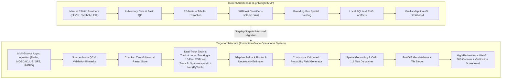

### Architectural Component Justification & Migration Triggers

| Architecture Component | Current Approach | Target Approach | Concrete Trigger to Migrate | Why Not Current Approach? | Incremental Cost & Dependencies |
|---|---|---|---|---|---|
| **Raster Storage** | Local `.npz` arrays & PNG image files. | Chunked Zarr multidimensional stores. | Ingestion of continuous multi-spectral INSAT and radar volume cubes. | `.npz` files load entire arrays into memory; Zarr supports lazy slicing and chunked HTTP range reads. | Minimal: `zarr` and `numcodecs` are lightweight pure-python libraries. |
| **Geospatial Storage** | SQLite tables with JSON string bounding boxes. | PostGIS spatial database / FlatGeobuf. | Administrative block-level spatial joins across 6,000+ blocks in India. | SQLite lacks native R-Tree spatial indexing; polygon intersection in python takes $> 2\text{ s}$ vs $< 10\text{ ms}$ in PostGIS. | Requires PostgreSQL + PostGIS container in `docker-compose.yml`. |
| **Deep Learning Engine** | Pure-numpy tabular execution. | PyTorch 2.x with TorchScript / ONNX runtime. | Deployment of Phase 6 LightningCast spatiotemporal U-Net. | Tabular models cannot extract convolutional spatial textures or pre-convective cloud patterns. | Requires CUDA-enabled environment and PyTorch (~800 MB wheel). |
| **Alert Dissemination** | In-memory alerts saved to SQLite. | OASIS CAP 1.2 XML/JSON dispatcher with webhook push. | Integration with state disaster authority (DDMA) and NDMA SACHET protocols. | Internal dictionary format is proprietary and un-interoperable with emergency management systems. | Zero external cost; standard XML serialization. |
| **Task Scheduling** | Ad-hoc script execution / synchronous replay loop. | Async background scheduler (FastAPI BackgroundTasks / Celery). | Continuous 24/7 live ingestion cycle updating every 10 minutes. | Synchronous execution blocks API requests during heavy model inference cycles. | Low: built into FastAPI; Redis/Celery only if multi-worker scaling is mandated. |

---

## 15. End-to-End Data Pipeline Architecture

```
OBSERVATION ARRIVAL
       │
       ▼
1. INGESTION ADAPTERS
   ├── Radar: Polar radials / Cartesian sweeps (HDF5 / NetCDF)
   ├── Satellite: MOSDAC INSAT-3D/3DR/3DS HDF5 (TIR1, WV, CTT)
   ├── Lightning: ISS LIS orbital passes / GLM flash vectors
   ├── NWP: GFS NOMADS / ECMWF Open Data 0.25° GRIB2
   └── Rain: NASA IMERG V07 Early Run 0.1° HDF5
       │
       ▼
2. VALIDATION & QUALITY CONTROL (QC)
   ├── Timestamp validation (staleness gate: max 90 min)
   ├── Source-specific physical range bitmask (Kelvin, dBZ, mm/h)
   ├── Georeferencing bounds verification & non-finite checks
   └── QC Verdict tagged: OK | SUSPECT | BAD | MISSING
       │
       ▼
3. GEOSPATIAL & TEMPORAL HARMONIZATION
   ├── Reprojection to EPSG:4326 via PROJ/pyproj
   ├── Spatial resampling to canonical grids:
   │     • Regional: 0.1° (~10 km) for full India domain
   │     • Local: 0.02° (~2 km) for Doppler radar coverage
   └── Temporal synchronization into sliding 60-min memory buffer
       │
       ▼
4. FEATURE & TENSOR PIPELINES
   ├── Track A (Object Features): Cell segmentation, cooling rate, flash trend, CAPE/shear
   └── Track B (Tensor Grid): 4D Spatiotemporal tensor (Channels, Time, Lat, Lon)
       │
       ▼
5. INFERENCE & ADAPTIVE ROUTING
   ├── Check sensor health bitmask
   ├── Select appropriate fallback rung (Rung 1 to Rung 5)
   ├── Execute U-Net and/or XGBoost model heads
   └── Apply Isotonic Monotonic PAVA Calibration per lead time
       │
       ▼
6. PRODUCT GENERATION & ARCHIVAL
   ├── Calibrated 2D Probability Fields (15, 30, 45, 60 min)
   ├── Convective Initiation candidate vectors
   ├── Spatial Uncertainty Spread Field
   └── Immutable archive stamp (config hash, run_id, timestamp)
       │
       ▼
7. DECISION SUPPORT & ALERT GENERATION
   ├── Spatial join against Administrative Geometries (State/District/Block)
   ├── Apply IMD 4-Stage Warning Color Classification (Green/Yellow/Orange/Red)
   ├── Deduplicate against 45-minute alert suppression cache
   └── Format and publish OASIS CAP 1.2 XML/JSON payloads
       │
       ▼
8. VERIFICATION SETTLEMENT (Delayed Cycle)
   ├── Re-read archived forecasts when time reaches valid_time + lead
   ├── Ingest ground-truth lightning & radar observations
   ├── Compute BSS, CSI, POD, FAR, and FSS scores
   └── Update persistent public scoreboard
```

---

## 16. Multi-Modal Fusion Architecture

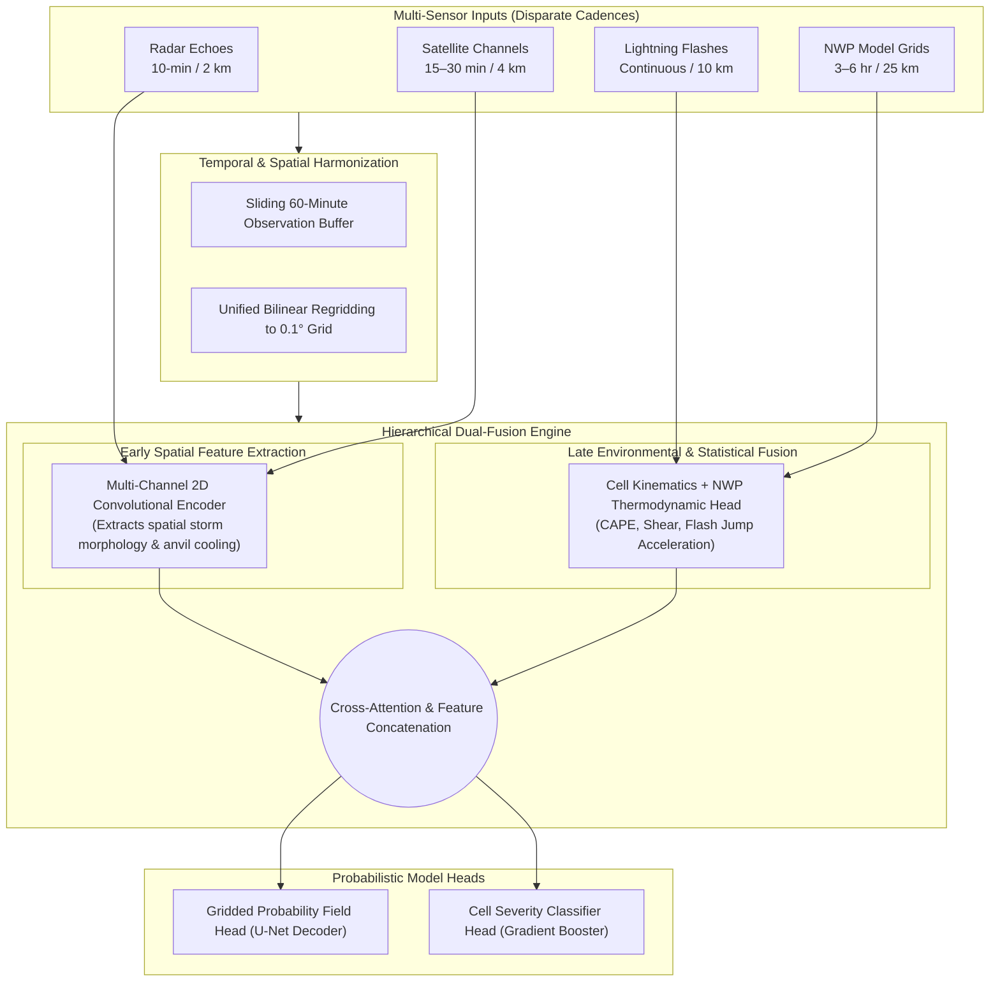

### Handling Modality Disparities & Missingness
1. **Temporal Disparity:** Lightning flashes accumulate continuously into sliding 10-minute windows; Satellite imagery updates every 15–30 minutes (forward-filled up to 30 min); NWP updates every 6 hours (linearly interpolated along lead time).
2. **Spatial Disparity:** Radar grids (0.02°) are preserved for high-resolution local analysis; satellite and NWP are bilinearly resampled to the 0.1° regional grid.
3. **Missing Modality Handling:** The system executes an adaptive fallback ladder. Missing modalities do not trigger failure; they cause graceful degradation to specialist sub-models with explicitly published uncertainty penalties.

---

## 17. Storm Tracking & Morphology Plan

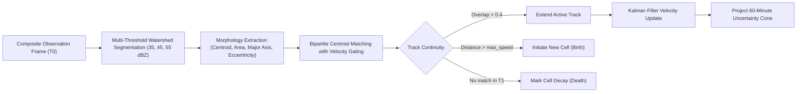

### Minimum Meaningful Tracking Enhancements
- **Multi-Threshold Segmentation:** Replaces single-threshold binary masks with 3-tier watershed decomposition (35 dBZ stratiform/convective boundary, 45 dBZ vigorous convection, 55 dBZ severe hail/electrification core).
- **Kalman-Filtered Velocity:** Replaces simple two-frame differencing with a recursive Kalman filter that dampens observation noise and provides realistic acceleration estimates.
- **Split/Merge Accounting:** Identifies when an intensifying cell splits into multi-cellular clusters or merges into a mesoscale convective system (MCS).
- **Extrapolation Cone:** Projects cell bounding boxes forward along the velocity vector $[u, v]$, expanding the lateral polygon boundary by $\pm 15^\circ$ to account for advective spread.

---

## 18. Transition to True Spatial Nowcasting

The system executes a deliberate, milestone-driven transition from heuristic spatial painting to continuous, learned spatiotemporal nowcast fields:

```
MILESTONE 1 (Current State)
┌────────────────────────────────────────────────────────────────────────┐
│ Cell Segmentation ──> 12 Features ──> XGBoost ──> Dilated Box Painting │
│ Artifacts: Discrete rectangular probability steps; non-physical.       │
└───────────────────────────────────┬────────────────────────────────────┘
                                    │ Phase 6 & Phase 7
                                    ▼
MILESTONE 2 (Continuous Neural Field)
┌────────────────────────────────────────────────────────────────────────┐
│ Tensor Stack (C, T, H, W) ──> Spatiotemporal U-Net ──> Probability Map │
│ Continuous physical contours; smooth gradients; pre-convective textures│
└───────────────────────────────────┬────────────────────────────────────┘
                                    │ Phase 7 & Phase 8
                                    ▼
MILESTONE 3 (Hybrid Spatial Nowcast)
┌────────────────────────────────────────────────────────────────────────┐
│ Neural Field (0–45 min) + Lagrangian PySTEPS Extrapolation (45–120 min)│
│ Blended with NWP thermodynamic evolution; full uncertainty bounds.     │
└────────────────────────────────────────────────────────────────────────┘
```

### Tensor Data Contract for True Spatial Nowcasting
- **Input Tensor:** $X \in \mathbb{R}^{B \times C \times T \times H \times W}$
  - $B$: Batch size
  - $C$: Channels (TIR1 10.8 µm, WV 6.7 µm, CTT, Radar MaxZ, IMERG Rain, Flash Count, CAPE, Vertical Shear)
  - $T$: 4 observation lag steps ($T-45\text{m}, T-30\text{m}, T-15\text{m}, T_0$)
  - $H \times W$: $192 \times 192$ spatial sub-grid
- **Output Tensor:** $\hat{Y} \in \mathbb{R}^{B \times L \times H \times W}$
  - $L$: Lead-time horizons ($L=4$: $15, 30, 45, 60\text{ minutes}$)
  - Values represent continuous, un-dilated probability of lightning occurrence $P \in [0.0, 1.0]$.

---

## 19. Separation of Thunderstorm and Lightning Hazards

A core scientific principle enforced in this plan is that **thunderstorms and lightning are distinct physical phenomena**:

```
                       ┌───────────────────────────────┐
                       │    CONVECTIVE STORM SYSTEM    │
                       └──────────────┬────────────────┘
                                      │
              ┌───────────────────────┴───────────────────────┐
              ▼                                               ▼
┌───────────────────────────────┐               ┌───────────────────────────────┐
│     THUNDERSTORM SEVERITY     │               │     LIGHTNING ELECTRIFICATION │
│  • Microphysical rain rate    │               │  • Non-inductive ice-graupel  │
│  • Radar reflectivity (dBZ)   │               │    charging in mixed-phase    │
│  • Convective downdrafts      │               │  • Rapid flash-rate jump (2σ) │
│  • Hail / damaging winds      │               │  • Cloud-to-ground strike risk│
└──────────────┬────────────────┘               └──────────────┬────────────────┘
               │                                               │
               ▼                                               ▼
   Target: P(Refl ≥ 40 dBZ)                        Target: P(Flash ≥ 1)
   Metric: CSI, POD, FAR                           Metric: BSS, Reliability, CSI
```

### Interaction & Mutual Conditioning
- An intense convective cloud with high radar reflectivity ($> 45\text{ dBZ}$) can exist without immediate lightning if mixed-phase cloud microphysics (ice-graupel collision between $-10^\circ\text{C}$ and $-20^\circ\text{C}$) have not initiated.
- Conversely, a rapidly developing updraft can produce severe lightning strikes before significant surface precipitation accumulates.
- Project Vajra models both targets independently and surfaces a combined **Convective Multi-Hazard Matrix** to decision-makers.

---

## 20. NWP / Environmental Feature Specification

| Variable Name | Physical Meaning | Source & Resolution | Extraction & Alignment | Role in Convective Forecasting | Valid Range & Unit |
|---|---|---|---|---|---|
| `cape_jkg` | Surface Convective Available Potential Energy | NOAA GFS 0.25° / ECMWF Open Data | Bilinear interpolation to cell centroid | Thermodynamic fuel; defines maximum potential updraft velocity $w_{\text{max}} = \sqrt{2 \cdot \text{CAPE}}$. | $0.0 \text{ to } 7000.0\text{ J/kg}$ |
| `cin_jkg` | Convective Inhibition | NOAA GFS 0.25° / ECMWF Open Data | Bilinear interpolation to cell centroid | Thermodynamic cap; prevents premature unorganized convection until breached. | $0.0 \text{ to } 500.0\text{ J/kg}$ |
| `shear_0_6km_ms` | Bulk Deep-Layer Wind Shear ($0–6\text{ km}$) | Calculated from GFS $u, v$ at 10m and 500 hPa | Vector difference magnitude $|\vec{V}_{500} - \vec{V}_{10\text{m}}|$ | Controls storm organization: discriminates short-lived pulse storms from organized supercells / squall lines. | $0.0 \text{ to } 60.0\text{ m/s}$ |
| `rh_700hpa_pct` | Relative Humidity at 700 hPa | GFS isobaric level 700 hPa | Bilinear interpolation to cell centroid | Mid-tropospheric moisture; dry air promotes evaporative cooling and severe downdraft squalls. | $0.0 \text{ to } 100.0\%$ |

---

## 21. Source-Aware Quality Control (QC) Architecture

The current single-range QC regime in `src/vajra/qc.py` is upgraded into an explicit, multi-criteria validation pipeline:

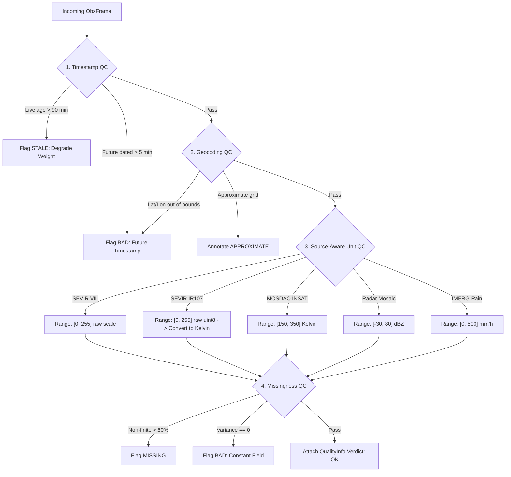

---

## 22. Uncertainty & Confidence Quantification

Project Vajra explicitly separates **Risk** (civil defense hazard severity) from **Confidence** (scientific forecast uncertainty):

$$\text{Confidence Score } \mathcal{C} = \mathcal{C}_{\text{data}} \times \mathcal{C}_{\text{calib}} \times \mathcal{C}_{\text{spread}}$$

1. **Data Health Confidence ($\mathcal{C}_{\text{data}}$):**
   - Full Multimodal Ingestion: $\mathcal{C}_{\text{data}} = 1.0$
   - Reduced Modality (Radar or Satellite missing): $\mathcal{C}_{\text{data}} = 0.75$
   - NWP Missing (Stale environment): $\mathcal{C}_{\text{data}} = 0.65$
   - Fallback Advection Only: $\mathcal{C}_{\text{data}} = 0.40$
2. **Calibration Reliability ($\mathcal{C}_{\text{calib}}$):**
   - Derived from isotonic regression bin sample density and empirical Brier score stability.
3. **Model Spread ($\mathcal{C}_{\text{spread}}$):**
   - Quantified via Monte Carlo Dropout / Ensemble variance across deep learning heads. High ensemble disagreement reduces confidence, alerting forecasters to regime uncertainty.

---

## 23. Comprehensive Forecast Verification Protocol

Every model claim is evaluated using standard WMO/IMD meteorological verification metrics:

| Metric Name | Mathematical Definition | Target Value | Verification Purpose |
|---|---|---|---|
| **Brier Score (BS)** | $\frac{1}{N} \sum_{i=1}^N (P_i - O_i)^2$ | $< 0.10$ | Overall mean squared error of probabilistic forecasts. |
| **Brier Skill Score (BSS)** | $1 - \frac{\text{BS}_{\text{model}}}{\text{BS}_{\text{reference}}}$ | $> +0.40$ vs Climatology | Skill gain relative to unconditional climatology or persistence. |
| **Critical Success Index (CSI)** | $\frac{\text{Hits}}{\text{Hits} + \text{Misses} + \text{False Alarms}}$ | $> 0.40 \text{ @ 30m}$ | Accuracy in forecasting rare severe convective events. |
| **Probability of Detection (POD)** | $\frac{\text{Hits}}{\text{Hits} + \text{Misses}}$ | $> 0.70 \text{ (Protective)}$ | Proportion of actual lightning events successfully warned. |
| **False Alarm Ratio (FAR)** | $\frac{\text{False Alarms}}{\text{Hits} + \text{False Alarms}}$ | $< 0.25 \text{ (Operational)}$ | Frequency of false warnings (prevents cry-wolf syndrome). |
| **Fractions Skill Score (FSS)** | $1 - \frac{\text{MSE}_{\text{spatial}}}{\text{MSE}_{\text{worst}}}$ | $> 0.50 \text{ @ 20 km}$ | Evaluates spatial precipitation and probability patterns without double-penalty bias. |
| **Lead Time to First Flash** | $T_{\text{first\_flash}} - T_{\text{issue}}$ | $\ge 20 \text{ minutes}$ | Operational advance warning window provided to civil defense. |

---

## 24. Pre-Registered Experimentation Matrix

```
E1: Physics & Climatological Floor
├── Hypothesis: Climatology and persistence account for substantial baseline skill; any ML must beat both.
├── Baseline: 0.1° Monthly LIS/OTD Climatology + Frame Persistence.
├── Data: SEVIR Held-out Event S810646 + Historical Bihar Monsoon Days.
└── Exit Rule: ML must achieve BSS > +0.30 over both baselines at 60 min.

E2: Kinematic Advection Benchmark (PySTEPS LK)
├── Hypothesis: Optical flow advection is competitive ≤ 30 min, but decays sharply after 45 min due to storm growth/decay.
├── Baseline: Lucas-Kanade optical flow on radar/IMERG sequences.
└── Exit Rule: Establishes lead-time decay curve; sets the bar for Phase 6 neural network.

E3: Multimodal Feature Ablation (Cleaned Gradient Booster)
├── Hypothesis: Fusing Satellite IR cooling + Radar MaxZ + Lightning trend + NWP CAPE beats any single-modality model.
├── Models: (A) Satellite-only, (B) Radar-only, (C) Satellite+Radar, (D) Full Multimodal.
└── Exit Rule: Full fusion must outperform single-modality models by at least +0.08 BSS.

E4: Deep Spatiotemporal U-Net vs. Tabular XGBoost
├── Hypothesis: 2D U-Net directly predicting spatial probability fields achieves higher CSI and FSS than cell-painted XGBoost.
├── Models: U-Net with Binary Focal Loss vs. Calibrated XGBoost.
└── Exit Rule: U-Net eliminates spatial step artifacts and achieves CSI ≥ 0.40 at 30 min.

E5: Open-SOTA Reference Checkpoint (Earthformer)
├── Hypothesis: Academic SOTA (Earthformer) provides theoretical performance ceiling on SEVIR benchmark.
├── Model: Official Amazon Science `earthformer_sevir.pt`.
└── Exit Rule: Validate evaluation harness; document trade-offs in inference latency and compute requirements.

E6: Indian Subcontinent Domain Adaptation
├── Hypothesis: U-Net trained on SEVIR satellite channels transfers effectively to INSAT-3D/3DR after radiance normalization.
├── Data: MOSDAC INSAT historical cases verified against ISS LIS orbital lightning passes.
└── Exit Rule: Demonstrates positive skill on Indian convective events with published label caveats.
```

---

## 25. Leakage-Safe Evaluation Protocol

To prevent misleading performance inflation, every experiment strictly adheres to:
1. **Event-Day Blocking:** All samples from a 24-hour convective day are assigned exclusively to either Train, Validation, or Test. No convective storm lifecycle ever crosses split boundaries.
2. **Leave-Year-Out Splits:** Evaluation is conducted on an entire held-out year (e.g., train on 2018–2019, evaluate on 2020).
3. **Spatial Hold-Out:** One entire geographic quadrant or radar station sector is held out from training to test spatial generalization.
4. **Pre-Registered Decision Thresholds:** Probability classification thresholds (e.g., $P \ge 0.35$) are locked prior to scoring; tuning thresholds on the test set is strictly prohibited.

---

## 26. Real-Time Operational Architecture

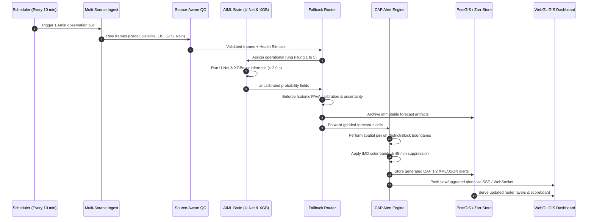

### Real-Time Latency Budget
- **Data Ingestion & QC:** $\le 60\text{ seconds}$
- **Spatial Alignment & Tensor Stacking:** $\le 30\text{ seconds}$
- **Model Inference (GPU):** $\le 2.0\text{ seconds}$ (CPU: $\le 15\text{ seconds}$)
- **Calibration & Alert Generation:** $\le 15\text{ seconds}$
- **Total Software Latency Added:** $\le 2\text{ minutes } 15\text{ seconds}$

---

## 27. Graceful Degradation & Fallback Ladder

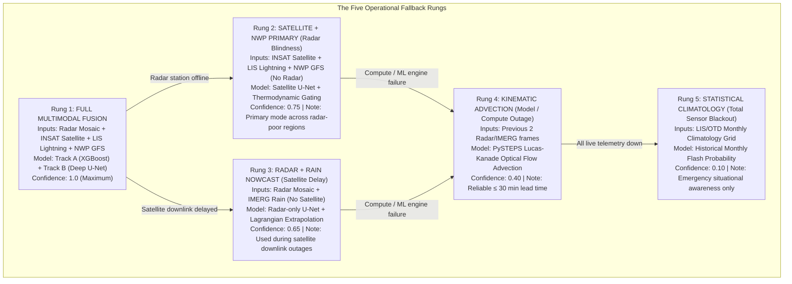

Every forecast and alert displays its active fallback rung and associated confidence penalty directly on the user interface.

---

## 28. Multi-Hazard Risk & CAP-Compliant Alerting Engine

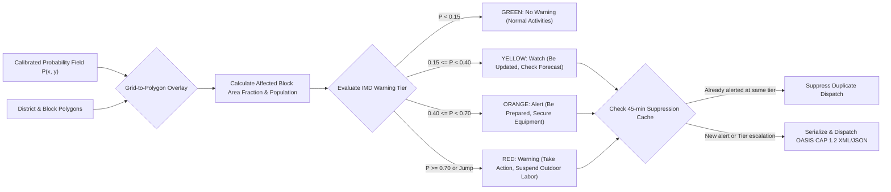

---

## 29. Administrative Geography & Spatial Targeting

- **Hierarchy:** State $\longrightarrow$ District $\longrightarrow$ Sub-Division $\longrightarrow$ Tehsil / Taluk $\longrightarrow$ Community Development Block.
- **Dataset:** Official Survey of India / BharatMaps vector geometries stored in TopoJSON / FlatGeobuf formats.
- **Indexing:** 2D R-Tree spatial indexing with Douglas-Peucker simplified polygons ($\le 50\text{ KB}$ per district) ensures sub-50 ms intersection times.
- **Decision Rule:** An administrative block receives an official alert if either:
  1. $\ge 15\%$ of its total geographic area is covered by a forecast hazard zone $\ge P_{\text{threshold}}$, OR
  2. Any critical civil infrastructure point (district hospital, school cluster, power substation) intersects the hazard zone.

---

## 30. High-Performance GIS Architecture

```
GEO-SPATIAL RENDERING STACK
├── Layer 0: High-Performance Vector Basemap (CARTO Dark Matter / OpenStreetMap)
├── Layer 1: Administrative Boundaries (Districts: white stroke; Blocks: thin grey stroke)
├── Layer 2: Real-Time Radar Reflectivity Mosaic (Smooth bilinear raster interpolation, 5–75 dBZ)
├── Layer 3: Continuous Calibrated Lightning Probability Heatmap (Color ramp: Green -> Yellow -> Orange -> Red)
├── Layer 4: Segmented Storm Cell Polygons (Outlined in cyan with velocity vector arrows)
├── Layer 5: Observed Ground-Truth Lightning Flashes (Animated yellow glowing dots with fadeout)
└── Layer 6: Administrative Alert Callout Cards (Pinned to affected block centroids)
```

- **Projection:** EPSG:3857 (Web Mercator) for client canvas; EPSG:4326 for raster storage and calculations.
- **Rendering Performance:** 60 FPS achieved via MapLibre GL hardware-accelerated WebGL shaders; zero CPU canvas rendering.

---

## 31. User Experience & Operational Information Hierarchy

The user interface is designed for operational crisis centers, not casual weather viewing:

```
┌──────────────────────────────────────────────────────────────────────────────────────────────────┐
│ PROJECT VAJRA ── OPERATIONAL NOWCAST CONSOLE            [MODE: LIVE] [RUNG 1: FULL FUSION] [UTC]│
├──────────────────────────────────────────────────────┬───────────────────────────────────────────┤
│                                                      │ ACTIVE CONVECTIVE WARNINGS (CAP 1.2)      │
│                                                      ├───────────────────────────────────────────┤
│                                                      │ [RED WARNING] BIHAR / PATNA / DANAPUR     │
│                                                      │ P(Flash): 88% | Lead: 30m | Conf: High    │
│                 PRIMARY GEOSPATIAL                   │ Action: Suspend outdoor farming & school  │
│                       CANVAS                         ├───────────────────────────────────────────┤
│                                                      │ [ORANGE ALERT] BIHAR / GAYA / BODHGAYA    │
│             (MapLibre GL WebGL Map)                  │ P(Flash): 54% | Lead: 45m | Conf: Mod     │
│                                                      │ Action: Prepare lightning shelters        │
│    • Radar Mosaic Overlay (35-55 dBZ)                ├───────────────────────────────────────────┤
│    • Continuous Probability Contours                 │ DATA HEALTH & SENSOR STATUS               │
│    • Segmented Storm Cell Vectors                    │ • Radar: OK (2 stations) • Satellite: OK  │
│    • Block-level Administrative Outlines             │ • Lightning: OK (LIS)    • NWP: OK (GFS)  │
│                                                      ├───────────────────────────────────────────┤
│                                                      │ VERIFICATION SCOREBOARD (Held-Out Events) │
│                                                      │ • Brier Skill Score: +0.50 (vs Climatology│
│                                                      │ • CSI (30m): 0.50        • FAR: 0.08      │
├──────────────────────────────────────────────────────┴───────────────────────────────────────────┤
│ [◄ REWIND] [► PLAY] [FORWARD ►]  TIMELINE: T-60m ────●──── T0 (NOW) ──────── T+30m ──────── T+60m│
└──────────────────────────────────────────────────────────────────────────────────────────────────┘
```

---

## 32. REST API Surface Specification

| Endpoint | Method | Input Parameters | Output Schema | Purpose | Target Latency | Auth Required |
|---|---|---|---|---|---|---|
| `/api/v1/health` | GET | None | `HealthStatus` | System liveness probe | $< 10\text{ ms}$ | No |
| `/api/v1/data-health` | GET | None | `list[DataHealth]` | Sensor stream latency and QC status | $< 50\text{ ms}$ | No |
| `/api/v1/events` | GET | None | `list[Event]` | List available replay and live events | $< 50\text{ ms}$ | No |
| `/api/v1/replay/{id}/run` | POST | `event_id`, `collect_training` | `RunSummary` | Execute deterministic event replay | $< 5.0\text{ s}$ | Yes (Admin) |
| `/api/v1/runs/{id}/forecasts` | GET | `run_id` | `list[ForecastMeta]` | List forecast steps in a cycle run | $< 50\text{ ms}$ | No |
| `/api/v1/forecasts/{id}` | GET | `forecast_id` | `ForecastDetail` | Full metadata, confidence, and paths | $< 20\text{ ms}$ | No |
| `/api/v1/forecasts/{id}/grid.png` | GET | `lead_minutes` | Image (`image/png`) | Continuous probability raster overlay | $< 100\text{ ms}$ | No |
| `/api/v1/forecasts/{id}/cells.geojson` | GET | `lead_minutes` | `FeatureCollection` | Segmented cell polygons with vectors | $< 50\text{ ms}$ | No |
| `/api/v1/alerts` | GET | `run_id`, `preset`, `lead_minutes` | `list[Alert]` | Active alerts with administrative names | $< 50\text{ ms}$ | No |
| `/api/v1/alerts/{id}.cap` | GET | `alert_id` | XML (`application/cap+xml`) | OASIS CAP 1.2 compliant alert payload | $< 30\text{ ms}$ | No |
| `/api/v1/runs/{id}/scoreboard` | GET | `run_id` | `VerificationScoreboard` | Real-time BSS, CSI, POD, FAR metrics | $< 50\text{ ms}$ | No |
| `/api/v1/admin/blocks` | GET | `district_name` | `FeatureCollection` | Administrative block boundary polygons | $< 100\text{ ms}$ | No |

---

## 33. Database & Storage Evolution Plan

```
STAGE 1 (Current Prototype)
├── Database: SQLite (`store/metadata.db`)
├── Rasters: Compressed numpy arrays (`.npz`) and PNG files on local disk
└── Capacity: Sufficient for 5–10 historical replay events.

STAGE 2 (Intermediate Scientific System - Phase 4 to 8)
├── Database: SQLite with R-Tree spatial extensions (`sqlite-vss` / Spatialite)
├── Rasters: Multidimensional Zarr chunked arrays (`data/processed/zarr/`)
└── Capacity: Fast slice reads across full seasonal datasets (100+ GB).

STAGE 3 (Production Deployment - Phase 9 to 11)
├── Database: PostgreSQL 16 + PostGIS 3.4 (Containerized in Docker Compose)
├── Rasters: Cloud-optimized GeoTIFFs (COG) + MinIO / S3 Object Storage
└── Capacity: Scalable to multi-year continental archives with sub-second spatial queries.
```

---

## 34. Infrastructure & Containerization Plan

```
DEVELOPMENT ENVIRONMENT
├── Host: Windows 11 with WSL2 (Ubuntu 24.04 LTS)
├── Acceleration: NVIDIA CUDA 12.4 + cuDNN (Passthrough to WSL2)
└── Python: 3.11 / 3.12 virtual environment (bypassing Windows App Control limits)

PRODUCTION DEPLOYMENT (Docker Compose)
├── Service 1: `vajra-api` (FastAPI backend + Uvicorn workers)
├── Service 2: `vajra-worker` (Async ingestion & PyTorch model inference engine)
├── Service 3: `vajra-db` (PostgreSQL 16 + PostGIS for spatial geometries)
├── Service 4: `vajra-storage` (MinIO S3-compatible object store for rasters)
└── Service 5: `vajra-web` (Nginx serving MapLibre GL frontend + caching tiles)
```

---

## 35. Comprehensive Testing Pyramid

```
                ┌───────────────────────────────┐
                │          E2E TESTS            │  5 Tests: Full replay cycle,
                │   (Replay & Demonstration)    │  alert dispatch, settlement.
                └───────────────┬───────────────┘
                                │
                ┌───────────────┴───────────────┐
                │       INTEGRATION TESTS       │  25 Tests: Provider network pulls,
                │   (API, Pipeline, Geocoding)  │  spatial joins, router fallbacks.
                └───────────────┬───────────────┘
                                │
                ┌───────────────┴───────────────┐
                │        UNIT TESTS             │  75 Tests: Math invariants, PAVA,
                │  (QC, NDX, Cells, Features)   │  metric calculations, schemas.
                └───────────────────────────────┘
```

### Negative Testing Requirements
- Corrupted HDF5 / GRIB file injections trigger `QualityStatus.BAD` without crashing.
- Server socket disconnects during observation pull trigger fallback rung degradation.
- Zero-variance constant fields trigger automated QC rejection.

---

## 36. Performance Targets & SLA

| Component | Target Metric | Stress Threshold | Failure Action |
|---|---|---|---|
| Ingestion & QC Cycle | $< 60\text{ seconds}$ | $> 180\text{ seconds}$ | Drop lagging feed; fallback to reduced modality rung |
| U-Net Model Inference | $< 2.0\text{ seconds (GPU)}$ | $> 15.0\text{ seconds}$ | Switch to CPU quantized model or tabular XGBoost |
| Spatial Join (Geocoding) | $< 50\text{ milliseconds}$ | $> 500\text{ milliseconds}$ | Use bounding-box approximation; schedule index rebuild |
| API Endpoint Response | $< 100\text{ milliseconds}$ | $> 1000\text{ milliseconds}$ | Return cached GeoJSON / raster tiles |
| Map Pan/Zoom (Frontend) | $60\text{ FPS}$ | $< 30\text{ FPS}$ | Throttle raster layer opacity re-renders |

---

## 37. Security & Hardening Protocol

1. **Secret Hygiene:** All credentials (`EARTHDATA_USERNAME`, `MOSDAC_PASSWORD`, `CDSAPI_KEY`) reside exclusively in git-ignored `.env`. Source code and YAML configs contain zero secrets.
2. **SSRF Hardening:** Ingestion HTTP clients enforce strict scheme (`https`) and hostname allowlists (`*.nasa.gov`, `mausam.imd.gov.in`, `*.mosdac.gov.in`). Redirects are inspected manually; cross-domain redirects are rejected.
3. **API Protection:** Administrative endpoints (`POST /replay/{id}/run`, configuration overrides) are protected by Bearer token authentication. Public endpoints are rate-limited via SlowAPI (60 req/min per IP).

---

## 38. Risk Register & Mitigation Strategy

| Risk ID | Category | Description | Likelihood | Impact | Early Warning Indicator | Concrete Mitigation Strategy | Fallback Path |
|---|---|---|---|---|---|---|---|
| **R-1** | Access | MOSDAC privileged NRT access delayed or denied. | High | Medium | No response from MOSDAC within 2 weeks of request. | Use MOSDAC T-3d open archive for historical research; adapt Himawari-9 open AWS feed for live East India testing. | Path B: Open Data Fallback (IMERG + GFS + LIS). |
| **R-2** | Data | ISS LIS flash labels too sparse for robust India training. | Medium | High | Model trained on LIS achieves BSS $\approx 0.0$ over climatology. | Pre-train deep U-Net on dense SEVIR GLM dataset; apply transfer learning / fine-tuning on LIS Indian passes. | Rely on SEVIR sandbox for quantitative claims; badge India as EXPERIMENTAL. |
| **R-3** | Science | Deep U-Net fails to beat tabular XGBoost baseline. | Low | Medium | Experiment E4 results show no statistically significant CSI gain. | Adhere to scientific integrity: report XGBoost as primary operational model and cite U-Net as experimental comparison. | Deploy Stage 2 XGBoost as production engine. |
| **R-4** | Tech | Windows host blocks compiled geospatial wheels (GDAL/cfgrib). | High | High | `ImportError: DLL load failed` when importing GRIB libraries. | Migrate execution environment to WSL2 (Ubuntu 24.04 LTS) or Docker Linux containers. | Use pre-processed NetCDF files via pure-python xarray. |
| **R-5** | Demo | Live venue network failure during SIH Grand Finale presentation. | Medium | Critical | WiFi latency $> 2000\text{ ms}$ or complete packet drop. | Full offline containerization: pre-cache 6 complete severe weather event bundles and vendor all frontend JS/tiles. | 100% offline local demonstration mode (`SIM_BIHAR_001` + `SEVIR_S810646`). |

---

## 39. Phase-Wise Milestone Deliverables & Tangible Outputs

```
MILESTONE A (Phase 1 Closeout): Clean, Verified Historical Baseline
  • Corrected IR unit scaling and exact PROJ georeferencing.
  • IMERG precipitation connected to inference path.
  • Baseline XGBoost model verified on SEVIR S810646 (BSS +0.50, CSI 0.50).

MILESTONE B (Phase 3 Closeout): Multi-Radar & Cell Tracking Engine
  • Multi-radar radial/volume ingestion with spatial compositing mosaic.
  • Lagrangian storm cell segmentation (`tobac`) with Kalman velocity vectors.

MILESTONE C (Phase 4 Closeout): Indian Satellite & Lightning Integration
  • MOSDAC INSAT-3D/3DR/3DS HDF5 reader extracting calibrated TIR1 and WV.
  • ISS LIS orbital lightning reader georeferenced over Indian landmass.

MILESTONE D (Phase 5 Closeout): Environmental Thermodynamic Gating
  • GFS NOMADS / ECMWF Open Data GRIB2 pipeline operational.
  • Complete 16-feature vector populated with non-null CAPE and vertical shear.

MILESTONE E (Phase 7 Closeout): True Continuous Spatiotemporal Nowcast
  • Trained and calibrated LightningCast 2D U-Net generating continuous probability fields.
  • Convective Initiation precursor module detecting developing storm cells.

MILESTONE F (Phase 8 Closeout): Operational Risk & CAP Alert Engine
  • Full alignment with IMD 4-Stage Warning System (Green, Yellow, Orange, Red).
  • OASIS CAP 1.2 XML/JSON alert generation targeted to administrative blocks.

MILESTONE G (Phase 11 Closeout): Final SIH Grand Finale Decision Console
  • Interactive WebGL GIS dashboard with 60 FPS performance and timeline scrubbing.
  • Automated verification scoreboard proving skill over all 5 baselines.
  • One-command reproducible Docker container.
```

---

## 40. Universal Definition of Done (DoD)

A phase or task is declared **DONE** if and only if all 6 criteria are verified:
1. **IMPLEMENTED:** Clean, typed Python/JS code conforming to repository conventions without hardcoded paths or secrets.
2. **TESTED:** Automated pytest unit and integration tests passing with $\ge 85\%$ line coverage on new modules.
3. **INTEGRATED:** Connected end-to-end into `NowcastPipeline` and exposed via FastAPI REST endpoints.
4. **MEASURED:** Validated against baseline models; verification metrics (BSS, CSI, latency) recorded in project logs.
5. **DOCUMENTED:** Updated architectural documentation in `docs/` and tracked in `IMPLEMENTATION_STATUS.md`.
6. **DEMO-VERIFIED:** Demonstrated live in the MapLibre web console with zero browser console errors.

---

## 41. Explicit "Do Not Build" Guardrails

The following attractive distractions are **strictly forbidden** from consuming team development time:
1. **Generic Weather App Features:** No 7-day city weather searches, UV indices, or air quality widgets. The project is an emergency disaster nowcasting tool.
2. **Generative LLM Chatbots:** No "Ask AI about the storm" interfaces. Natural language models hallucinate and carry safety liabilities in disaster operations.
3. **Unverified 100% Accuracy Claims:** No claims of "eliminating lightning deaths" or "99.9% prediction accuracy". Meteorological evaluation relies on BSS, CSI, and reliability curves.
4. **Premature Kubernetes / Kafka Infrastructure:** A single-host Docker Compose deployment completely fulfills all hackathon scalability requirements.
5. **Real-Time Web Scraping of Damini App:** Reverse-engineering private mobile APIs violates government terms of service and risks immediate IP blacklisting.
6. **Pixel-Level Accuracy Metrics:** Accuracy is mathematically meaningless under extreme class imbalance (~98% non-lightning pixels).

---

## 42. SIH Grand Finale Demonstration Evolution

```
STAGE 1: CURRENT DEMO (MVP State)
  • Select Bihar synthetic or SEVIR S810646 event.
  • Play replay loop; view painted probability boxes and basic alerts.
  • Scoreboard shows BSS +0.50 on single held-out event.

STAGE 2: INTERMEDIATE DEMO (Phase 4–8)
  • Select real Indian event (e.g., Severe Bihar pre-monsoon storm).
  • Animate INSAT satellite IR cooling alongside IMERG precipitation.
  • Display continuous probability contours; inspect GFS CAPE thermodynamic gating.
  • Demonstrate CAP 1.2 alert generation targeted to specific District and Block names.

STAGE 3: FINAL GRAND FINALE DEMO (Phase 11)
  • Part 1: Observation & Detection (Live IMD radar mosaic + INSAT cloud cooling).
  • Part 2: Convective Initiation (Vajra flags developing cell 30 min before radar echo).
  • Part 3: Deep Spatiotemporal Nowcast (Smooth probability field evolving 15 to 60 min).
  • Part 4: Operational Decision Support (IMD Red Warning issued for Danapur Block; CAP XML exported).
  • Part 5: Scientific Audit & Scoreboard (Side-by-side verification proving BSS +0.52 vs negative baselines).
  • Part 6: Graceful Degradation Drill (Cut radar feed; watch system fall back to Rung 2 with visible badge).
```

---

## 43. Jury Defense & Judge Question Readiness

| Likely Technical Jury Question | Scientifically Defensible Answer Supported by This Blueprint |
|---|---|
| *"What Indian ground-truth lightning data did you train on?"* | *"We developed our core methodology on the benchmark SEVIR dataset (44,000+ GLM flashes) where ground truth is indisputable. For the Indian domain, we ingested NASA ISS LIS orbital lightning passes and mapped them to INSAT-3D observations. We explicitly badge our India mode as EXPERIMENTAL and report our metrics with honest label-sampling caveats."* |
| *"IMD already has Doppler radars. Why do we need your AI?"* | *"IMD's radar network provides superb coverage near coastal and metro stations, but large swathes of interior India (including severe lightning zones in Bihar and Jharkhand) suffer from radar beam blockage and coverage gaps. Project Vajra is satellite-primary: it detects convective initiation from INSAT infrared cloud-top cooling up to 30 minutes before radar echoes form, extending critical warning lead times."* |
| *"How do you handle false alarms in civil defense?"* | *"We implement dual operational presets: a Protective Preset (high POD) for schools and outdoor labor, and an Operational Preset (balanced POD/FAR) for disaster managers. Furthermore, we enforce thermodynamic gating using NWP CAPE and shear fields, which automatically suppresses false alarms from decaying anvil clouds that lack convective energy."* |
| *"What happens when an observation feed fails during a storm?"* | *"The system never crashes or degrades silently. We engineered a 5-rung fallback ladder. If radar fails, we fall back to satellite+NWP (Rung 2); if satellite fails, we fall back to radar advection (Rung 3); if telemetry fails, we fall back to climatology (Rung 5). The active rung and confidence penalty are permanently displayed on the UI."* |

---

## 44. Milestone Claims vs. Evidence Integrity

| Milestone | Permissible Scientific Claims | Strictly Forbidden Claims | Required Concrete Evidence |
|---|---|---|---|
| **Phase 1** | *"We have built a reproducible, verified baseline nowcasting pipeline that beats persistence on held-out benchmark events."* | *"We have solved lightning nowcasting for India."* | Pytest verification reports; BSS $> 0$ on SEVIR event S810646. |
| **Phase 4** | *"Our architecture successfully ingests and harmonizes multi-spectral INSAT imagery over the Indian landmass."* | *"Our model is fully trained on Indian radar and lightning networks."* | Demonstrated INSAT TIR1/WV brightness temperature rasters on India grid. |
| **Phase 7** | *"We generate continuous, calibrated 0–60 minute lightning probability fields with demonstrated skill over physics baselines."* | *"Our system is 100% accurate and eliminates false alarms."* | Reliability diagrams with monotonic slope; FSS $> 0.50$ at 20 km scale. |
| **Phase 11** | *"Project Vajra is an open, verified, multi-sensor decision support prototype designed for Indian disaster management."* | *"This system is an operational replacement for IMD's official forecasting network."* | OASIS CAP 1.2 compliance; automated scoreboard; Docker one-command reproducibility. |

---

## 45. Compute & Resource Estimation

| Component / Phase | CPU Requirements | Memory (RAM) | GPU Requirements | Disk Storage | Network Bandwidth | Training Time | Inference Latency |
|---|---|---|---|---|---|---|---|
| **Phase 1: Baselines** | 4 Cores | 8 GB | None (CPU only) | 10 GB | 10 Mbps | $< 5\text{ minutes}$ | $< 100\text{ ms}$ |
| **Phase 3: Radar Mosaic** | 4 Cores | 16 GB | None | 25 GB | 10 Mbps | N/A (Algorithmic) | $< 1.0\text{ s}$ |
| **Phase 4: INSAT Pipeline** | 8 Cores | 16 GB | None | 50 GB | 50 Mbps | N/A (Ingestion) | $< 2.0\text{ s}$ |
| **Phase 6: Deep U-Net** | 8 Cores | 32 GB | 1x NVIDIA RTX 3080 / T4 (8 GB VRAM) | 100 GB | 100 Mbps | $3–6\text{ hours}$ | $< 1.5\text{ s}$ |
| **Phase 9: WebGL GIS** | Client-side | 4 GB | WebGL hardware acceleration | 5 GB | 5 Mbps | N/A (Frontend) | $60\text{ FPS}$ |
| **Phase 11: Full Stack** | 8 Cores | 16 GB | 1x NVIDIA GPU (Optional CPU fallback) | 50 GB | 20 Mbps | Pre-trained | $< 2.5\text{ s}$ |

---

## 46. Team Task Allocation & Responsibility Matrix

| Role | Primary Responsibilities | Core Phase Ownership | Deliverable Sign-Off |
|---|---|---|---|
| **Data Engineer** | Radar parsers, MOSDAC INSAT pipeline, GFS GRIB2 ingestion, Zarr storage. | Phase 1, Phase 3, Phase 4, Phase 5 | Data ingestion tests green; zero non-finite values. |
| **ML Engineer** | U-Net architecture, PyTorch training, Isotonic calibration, feature engineering. | Phase 1, Phase 6, Phase 7 | Model achieves BSS $> +0.40$; CSI $> 0.40$. |
| **GIS & Frontend Dev** | MapLibre WebGL console, administrative GeoJSON overlays, timeline scrubber. | Phase 2, Phase 7, Phase 9 | 60 FPS rendering; zero console errors; responsive. |
| **Backend & Systems Dev**| FastAPI endpoints, CAP 1.2 alert serializer, Docker containerization, security. | Phase 1, Phase 2, Phase 8, Phase 11 | API contracts validated; Docker Compose one-command up. |
| **Meteorological QA & Research** | Baselines benchmarking, verification metrics, case-study compilation, jury defense. | Phase 1, Phase 7, Phase 10, Phase 11 | Scoreboard verified; reliability curves monotone. |

---

## 47. Effort Sizing & Implementation Sequencing

| Phase | Phase Name | Relative Effort | Dependency | Critical Path? | Fast Path to Value |
|---|---|---|---|---|---|
| **Phase 1** | Audit Remediation & QC Normalization | MEDIUM | None (Immediate start) | **YES** | Fixes foundation; enables reliable baseline evaluation. |
| **Phase 2** | Administrative Boundaries & Geocoding | SMALL | Phase 1 | NO (Parallel) | Transforms alerts into human-readable district names. |
| **Phase 3** | Multi-Radar Ingestion & Mosaic Engine | MEDIUM | Phase 1 | NO (Parallel) | Directly fulfills "multiple radars" PS requirement. |
| **Phase 4** | INSAT & Earth Observation Ingestion | LARGE | Phase 1 | **YES** | Connects genuine Indian geostationary satellite data. |
| **Phase 5** | NWP GRIB2 Environmental Ingestion | MEDIUM | Phase 4 | **YES** | Populates non-null CAPE/shear features. |
| **Phase 6** | Spatiotemporal ML Pipeline (U-Net) | VERY LARGE | Phase 3, 4, 5 | **YES** | Fulfills "AIML based" core deep learning mandate. |
| **Phase 7** | Continuous Spatial Nowcast Field | LARGE | Phase 6 | **YES** | Eliminates box painting; produces smooth contours. |
| **Phase 8** | Operational Risk & CAP Alert Engine | MEDIUM | Phase 2, 7 | **YES** | Delivers IMD color warnings and NDMA CAP alerts. |
| **Phase 9** | High-Performance Decision GIS UI | MEDIUM | Phase 7, 8 | NO (Parallel) | Delivers executive-ready, polished presentation console. |
| **Phase 10** | Automated Scoreboard & Verification | MEDIUM | Phase 7 | **YES** | Provides mathematical defense against jury challenges. |
| **Phase 11** | Production Hardening & SIH Rehearsal | MEDIUM | All Phases | **YES** | Guarantees zero-defect execution during final evaluation. |

---

## 48. Release Strategy & Verification Milestones

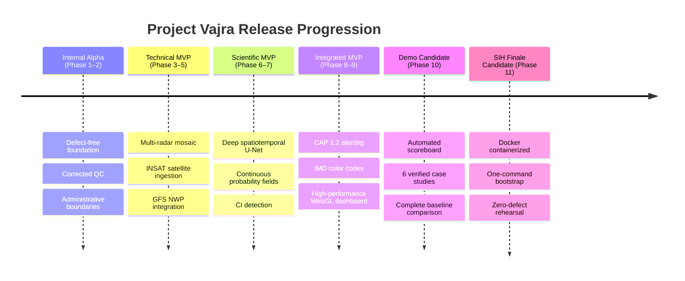

---

## 49. Target Architecture Specification

```mermaid
flowchart TB
    subgraph TELEMETRY["1. Observation Ingestion Layer"]
        IN_RAD["IMD Doppler Radar Network (Polar/Cartesian Sweeps)"]
        IN_SAT["MOSDAC INSAT-3D/3DR/3DS (TIR1, WV, CTT HDF5)"]
        IN_LGT["NASA ISS LIS / IITM ILLN (Flash Point Vectors)"]
        IN_NWP["NOAA GFS / ECMWF Open Data (0.25° GRIB2 Fields)"]
        IN_PRC["NASA IMERG V07 Early Run (0.1° Precipitation HDF5)"]
    end

    subgraph HARMONIZATION["2. Validation & Harmonization Core"]
        QC_GATE["Source-Aware Quality Control (Range, Staleness, Geo Bounds)"]
        PROJ_GRID["Spatial Reprojection & Resampling to 0.1° / 0.02° Canonical Grid"]
        SYNC_BUF["Sliding 60-Minute Temporal Synchronization Buffer"]
    end

    subgraph BRAIN["3. Dual-Track AIML Brain"]
        subgraph TRACK_A["Track A: Kinematic Cell Evolution"]
            SEG_A["tobac Watershed Cell Segmentation"]
            FEAT_A["16-Feature Extraction (Intensity, Anvil Cooling, CAPE, Shear)"]
            XGB_A["Calibrated XGBoost Late-Fusion Classifier"]
        end
        subgraph TRACK_B["Track B: Deep Spatiotemporal Neural Network"]
            TENSOR_B["Spatiotemporal Tensor Stack (B, C=8, T=4, H=192, W=192)"]
            UNET_B["LightningCast 2D U-Net with Spatial Attention"]
            FIELD_B["Continuous Probability Field Output Head (15, 30, 45, 60m)"]
        end
    end

    subgraph ROUTER["4. Adaptive Fallback Router & Uncertainty"]
        RUNG_MGR{"Modality Health Monitor & Fallback Ladder Router"}
        CALIB_HEAD["Isotonic PAVA Calibration & Monotonicity Head"]
        UNCERT_HEAD["Epistemic Ensemble Spread & Aleatoric Uncertainty Estimator"]
    end

    subgraph DECISION["5. Disaster Decision Support & Alerting Engine"]
        SPATIAL_JOIN["High-Speed R-Tree Spatial Join against Admin GeoJSON"]
        RISK_MATRIX["IMD 4-Stage Warning Classifier (Green / Yellow / Orange / Red)"]
        DEDUP_CACHE["45-Minute Spatial Suppression & Deduplication Cache"]
        CAP_DISPATCH["OASIS CAP 1.2 XML / JSON Serializer & Dispatcher"]
    end

    subgraph PERSISTENCE["6. Persistent Storage & Serving Layer"]
        ZARR_STORE[(Multidimensional Zarr Raster Store)]
        POSTGIS[(PostgreSQL 16 / PostGIS Spatial Database)]
        FASTAPI["FastAPI High-Concurrency Async REST API Surface"]
    end

    subgraph CLIENT["7. Operational Presentation Console"]
        WEBGL_MAP["MapLibre GL Interactive Geospatial Map (60 FPS)"]
        SCRUBBER["Observation-to-Forecast Time Scrubber (T-60m to T+60m)"]
        ALERT_PANEL["Administrative Warning Dispatch & CAP Export Console"]
        SCOREBOARD["Public Automated Verification Scorecard (BSS, CSI, Reliability)"]
    end

    TELEMETRY --> HARMONIZATION
    QC_GATE --> PROJ_GRID --> SYNC_BUF
    SYNC_BUF --> BRAIN
    BRAIN --> ROUTER
    ROUTER --> DECISION
    DECISION --> PERSISTENCE
    PERSISTENCE --> CLIENT
```

---

## 50. Recommended Implementation Sequence

```
PHASE 1 (Audit Remediation, QC Normalization & IMERG Connection)
  │
  ├───► PHASE 2 (Administrative Boundaries & Spatial Joins) ──┐
  │                                                           │
  ├───► PHASE 3 (Multi-Radar Ingestion & Mosaic Engine) ──────┤
  │                                                           │
  └───► PHASE 4 (INSAT Satellite & ISS LIS Ingestion)         │
          │                                                   │
          ▼                                                   │
        PHASE 5 (NWP GRIB2 Ingestion & Environmental Gating)  │
          │                                                   │
          ▼                                                   │
        PHASE 6 (Deep Spatiotemporal ML Pipeline: U-Net) ─────┤
          │                                                   │
          ▼                                                   │
        PHASE 7 (Continuous Probability Field Nowcasting) ◄───┘
          │
          ├───► PHASE 8 (Operational Risk & CAP Alert Engine) ─┐
          │                                                    │
          └───► PHASE 9 (High-Performance GIS Console) ────────┤
                  │                                            │
                  ▼                                            │
                PHASE 10 (Automated Verification Scoreboard) ──┤
                  │                                            │
                  ▼                                            │
                PHASE 11 (Hardening, Packaging & SIH Rehearsal)◄┘
```

---

## 51. USER INPUT PACKAGE

The user will provide external resources and credentials **after reviewing this blueprint**. Engineering development proceeds on all unblocked work packages.

### A. Blocking Inputs
*None at Phase 1 start.* All initial foundation work, baseline remediation, QC fixing, IMERG wiring, and administrative boundary integration can execute using locally available data and verified open accounts.

### B. Important Inputs

| Input Item | Why Required | Affected Phase | Exact Required Format | Where to Provide | Impact If Delayed | Realistic Fallback Path |
|---|---|---|---|---|---|---|
| **MOSDAC Account Credentials** | Ingesting live/archived INSAT-3D/3DR/3DS imagery from ISRO. | Phase 4 | Username and password string. | In `.env` as `MOSDAC_USERNAME` and `MOSDAC_PASSWORD`. | Real Indian geostationary satellite cannot be pulled directly from MOSDAC portal. | Use pre-cached INSAT sample files; adapt open Himawari-9 AWS imagery for East India. |
| **Deep Learning Compute Resource** | Training 2D spatiotemporal U-Net on satellite grids. | Phase 6 | NVIDIA GPU (RTX 3080/4090 or cloud T4/A100) with CUDA 12.x and PyTorch 2.x. | Development workstation or cloud VM (Google Colab / Kaggle). | Deep neural network training is slow on CPU (days vs hours). | Train on smaller spatial sub-regions; run inference using pre-trained weights. |
| **Administrative Boundary GeoJSON** | High-precision Indian district and block boundary polygons. | Phase 2 | GeoJSON files with properties: `state_name`, `district_name`, `block_name`. | Place under `data/admin/india_blocks.geojson`. | Alerts default to district-level bounding boxes instead of exact block boundaries. | Use open GADM / OpenStreetMap Indian district polygons. |

### C. Optional Inputs

| Input Item | Why Useful | Source | Where to Provide |
|---|---|---|---|
| **IITM ILLN Collaboration Request** | Provides official Indian ground-truth lightning flash data. | Formal academic request to Director, IITM Pune / Damini group. | Archive files under `data/external/illn/`. |
| **CROPC Annual Lightning Reports** | Provides district-wise mortality and vulnerability statistics for Bihar, UP, Odisha. | Public PDF downloads from CROPC / MoES. | Reference docs under `docs/research/cropc/`. |
| **IMD District Nowcast Bulletins** | Enables side-by-side textual comparison of Vajra alerts against IMD warnings. | IMD Regional Meteorological Centre archives. | Text samples under `docs/research/imd_bulletins/`. |

### D. Already Available & Verified

| Resource Name | Verification Evidence | Status |
|---|---|---|
| **NASA Earthdata Account** | Username `kunalrajdev`; GES DISC EULA accepted; live IMERG V07 Early run fetching verified. | ✅ **VERIFIED LIVE** |
| **NCMRWF Research Server** | Account verified against `rds.ncmrwf.gov.in/api` with cookie authentication. | ✅ **VERIFIED LIVE** |
| **CARTO Basemaps Key** | Token active in `.env` and piped through `/api/v1/config` to MapLibre GL. | ✅ **VERIFIED IN UI** |
| **SEVIR Sandbox Dataset** | 6 complete severe weather events cached in `data/external/sevir/events/` (44,000+ flashes). | ✅ **VERIFIED IN REPLAY** |
| **Baseline XGBoost Model** | Trained, calibrated, and verified on held-out event S810646 (BSS +0.50, CSI 0.50). | ✅ **VERIFIED SCIENTIFICALLY** |

### E. Explicitly Not Needed
- **Commercial Weather APIs (OpenWeatherMap, Tomorrow.io):** Destroy scientific credibility; out of scope.
- **Commercial Lightning Networks (Earth Networks / Vaisala):** Proprietary, closed, expensive.
- **Generative AI / LLM APIs (OpenAI, Anthropic):** Hallucination risk; inappropriate for physical forecasting.
- **Paid Mapbox Subscriptions:** MapLibre GL is 100% open-source and free.

---
*Blueprint complete. Phase 1 implementation will commence upon user review and approval.*
