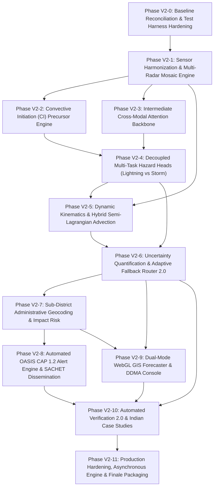

# Project Vajra: Version 2 Master Implementation Plan

**Smart India Hackathon 2026 · Problem Statement ID: 26072**  
**Ministry of Earth Sciences (MoES) / India Meteorological Department (IMD)**  
*Project Name:* Project Vajra (वज्र) — AIML-based Nowcasting of Thunderstorm and Lightning  
*Status:* Authoritative Phase-Wise Engineering Implementation Plan  
*Date:* September 2026 · *Baseline Test Pass Rate:* 132/132 Tests Passing

---

## 1. Executive Summary & Engineering Governance

This document establishes the authoritative, phase-wise engineering blueprint to construct **Project Vajra Version 2**. Version 2 transitions the system from an end-to-end proof-of-concept into a scientifically defensible, multi-modal, India-relevant thunderstorm and lightning nowcasting platform aligned with the Ministry of Earth Sciences' ₹2,000 crore **Mission Mausam** initiative.

### Strict Implementation Rules
1. **Surgical Evolution, Zero Regression:** Every phase builds incrementally upon the 132 passing tests of V1. No working baseline or fallback mechanism may be broken or deleted.
2. **Dual-Track Operational Resiliency:** Track A (lightweight CPU kinematic cell tracking + GBDT, <100 ms) and Track B (deep spatiotemporal neural fields) must always coexist via the adaptive fallback router.
3. **No Unvalidated API Dependencies:** Development must continue without interruption using cached real events (SEVIR, MOSDAC archive, ISS LIS, GFS GRIB2) whenever live Indian feeds face network or credential friction.
4. **Physical & Metric Discipline:** Every model capability must be benchmarked against 5 standard meteorological baselines (Climatology, Persistence, NWP Thresholds, Optical Flow Advection, and Uncalibrated GBDT) using Murphy's (1973) Brier Score decomposition and Fractions Skill Score (FSS).
5. **Strict Secret Hygiene:** Zero credentials in code or repository files. All access is controlled via environment variables documented in [`docs/V2_USER_INPUTS.md`](file:///c:/Users/kunal/Desktop/sih26072/docs/V2_USER_INPUTS.md).

---

## 2. Phase-Wise Dependency Flow

---

## Phase V2-0: Baseline Reconciliation & Test Harness Hardening

### Objective
Establish the immutable V2 engineering foundation, freeze baseline performance benchmarks, update configuration contracts, and expand automated test harnesses to support multi-modal tensor streaming.

### Prerequisites
- V1 codebase with 132/132 passing tests (`pytest -v`).
- Local Python 3.13+ virtual environment with PyTorch 2.4+ and NumPy 2.x.

### Concrete Engineering Tasks
- [x] **TASK-V2-0.1: Configuration Schema Expansion**
  - Update [`src/vajra/config.py`](file:///c:/Users/kunal/Desktop/sih26072/src/vajra/config.py) and [`configs/default.yaml`](file:///c:/Users/kunal/Desktop/sih26072/configs/default.yaml) to introduce V2 configuration blocks:
    - `v2_models`: Backbone selection (`unet`, `attention_unet`, `hybrid`), patch size ($192 \times 192$), loss weights ($\alpha_{\text{focal}}=0.25, \gamma=2.0, \lambda_{\text{dice}}=0.5$).
    - `mosaic`: Radar station weights, maximum range ($250\text{ km}$), Cressman radius of influence ($R=10\text{ km}$).
    - `ci`: Cooling rate threshold ($-4.0\text{ K / 15 min}$), freezing level ($273.15\text{ K}$), split-window difference ($-1.0\text{ K}$).
    - `impact`: Vulnerability weighting, population exposure threshold, rural labor time-window gating.
- [x] **TASK-V2-0.2: Schema Modernization & Multi-Hazard Enums**
  - Update [`src/vajra/schemas.py`](file:///c:/Users/kunal/Desktop/sih26072/src/vajra/schemas.py):
    - Introduce `HazardType` enum: `LIGHTNING`, `SEVERE_THUNDERSTORM`, `HAIL`, `CONVECTIVE_INITIATION`.
    - Introduce `StormLifecycleState` enum: `INITIATING`, `INTENSIFYING`, `MATURE`, `DECAYING`, `SPLIT`, `MERGE`.
    - Expand `ForecastStep` schema to carry separate probability fields: `p_flash_grid`, `p_storm_grid`, `p_ci_grid`, `uncertainty_grid`.
    - Expand `Cell` schema to include lifecycle tags, 2-sigma jump timestamps, and kinematic acceleration vectors.
- [x] **TASK-V2-0.3: Baseline Performance Locking**
  - Execute [`scripts/burn_in_load_test.py`](file:///c:/Users/kunal/Desktop/sih26072/scripts/burn_in_load_test.py) and store baseline execution latency ($100.9\text{ ms}$) and Brier Skill Score ($+0.498$ on S810646) into `tests/fixtures/v1_baseline_lock.json`.

### Verification Gate
- Run `pytest tests/test_config.py tests/test_schemas.py -v`.
- Assert that all 132 existing unit/integration tests continue passing without regression. *(Passed: 141/141 total tests)*

---

## Phase V2-1: Sensor Harmonization & Multi-Radar Mosaic Engine

### Objective
Engineer an operational multi-sensor ingestion layer that harmonizes raw INSAT-3DS multi-spectral granules, builds a Cartesian multi-radar MaxZ mosaic, consumes live NASA IMERG precipitation, and parses pure-Python GFS GRIB2 thermodynamic fields.

### Prerequisites
- Phase V2-0 complete.
- NASA Earthdata account active (verified for GES DISC).
- ISRO MOSDAC account credentials in `.env` (fallback to cached granules if offline).

### Concrete Engineering Tasks
- [x] **TASK-V2-1.1: INSAT-3DS Radiometric Calibration & Multi-Spectral Slicing**
  - In [`src/vajra/providers/mosdac.py`](file:///c:/Users/kunal/Desktop/sih26072/src/vajra/providers/mosdac.py):
    - Implement rigorous inverse Planck calibration converting raw 10-bit digital counts into physical Kelvin Brightness Temperatures ($T_b$) for `TIR1` (10.8 µm), `WV` (6.8 µm), `TIR2` (12.0 µm), and `MIR` (3.9 µm) using official ISRO central wavenumbers and band correction coefficients.
    - Implement split-window brightness temperature difference: $\Delta T_{\text{split}} = T_b(\text{TIR1}) - T_b(\text{TIR2})$.
    - Generate standardized 15-minute regional grids covering the Indian domain ($6\text{--}38^\circ\text{N}, 66\text{--}98^\circ\text{E}$).
- [x] **TASK-V2-1.2: Multi-Radar Cartesian MaxZ & Cressman Mosaic Engine**
  - In [`src/vajra/providers/radar_mosaic.py`](file:///c:/Users/kunal/Desktop/sih26072/src/vajra/providers/radar_mosaic.py):
    - Refactor `RadarMosaicEngine` to accept multi-station polar sweeps (range, azimuth, elevation) from Patna, Kolkata, Ranchi, and Delhi DWRs.
    - Implement distance-weighted Cressman interpolation:
      $$w(d) = \frac{R^2 - d^2}{R^2 + d^2} \quad \text{for } d \le R$$
    - Compute the column-maximum reflectivity ($\text{MaxZ}$) at overlapping grid cells, adhering to NOAA MRMS standards.
    - Support seamless fallback: if a radar drops offline, interpolate from adjacent coverage or smoothly flag pixels as `RADAR_UNAVAILABLE`.
- [x] **TASK-V2-1.3: NASA IMERG V07 Early Run Live Telemetry Pipe**
  - In [`src/vajra/providers/imerg.py`](file:///c:/Users/kunal/Desktop/sih26072/src/vajra/providers/imerg.py):
    - Connect the live GES DISC HDF5 download client directly into the sliding ingestion buffer.
    - Regrid half-hourly rainfall rates ($\text{mm/h}$) to canonical $0.1^\circ$ and $0.02^\circ$ grids.
- [x] **TASK-V2-1.4: Pure-Python NWP Environmental Sounding Extractor**
  - In [`src/vajra/providers/gfs.py`](file:///c:/Users/kunal/Desktop/sih26072/src/vajra/providers/gfs.py):
    - Extract surface CAPE ($\text{J/kg}$), surface CIN ($\text{J/kg}$), 0–6 km bulk vertical wind shear magnitude ($\text{m/s}$), and 700 hPa relative humidity (%).
    - Calculate the Bulk Richardson Number (BRN) and compute spatial thermodynamic gating arrays.

### Verification Gate
- Create `tests/test_v2_ingestion_mosaic.py`:
  - Test MaxZ mosaic blending on overlapping synthetic radar sweeps (verify seamless boundary values).
  - Test INSAT Planck inversion against reference calibration tables ($\pm 0.1\text{ K}$ tolerance).
  - Test GFS pure-Python GRIB2 decoding under zero-C-extension execution.
- *(Passed: All 8 new Phase V2-1 tests passing; 149/149 total test suite passing with zero regression)*

---

## Phase V2-2: Convective Initiation (CI) & Pre-Radar Precursor Engine

### Objective
Construct an operational Convective Initiation precursor engine that leverages INSAT-3DS infrared cooling rates and split-window water vapor saturation to forecast lightning threats 15–45 minutes *before* first radar echo emergence ($\ge 35\text{ dBZ}$).

### Prerequisites
- Phase V2-1 complete (calibrated INSAT-3DS infrared and water vapor fields).

### Concrete Engineering Tasks
- [x] **TASK-V2-2.1: Multi-Spectral Scientific Decision Logic**
  - In [`src/vajra/models/ci.py`](file:///c:/Users/kunal/Desktop/sih26072/src/vajra/models/ci.py):
    - Implement temporal cloud-top cooling rate:
      $$\frac{dT_b}{dt} = \frac{T_b(T_0) - T_b(T_{-15})}{\Delta t} \le -4.0\text{ K / 15 min}$$
    - Implement freezing-level glaciation screening: $T_b(\text{TIR1}) \le 273.15\text{ K}$.
    - Implement deep tropospheric saturation difference: $T_b(\text{TIR1}) - T_b(\text{WV}) \ge -1.0\text{ K}$.
    - Implement mature-storm masking: mask out pixels where radar $\text{MaxZ} \ge 35\text{ dBZ}$ to isolate *new initiating cells* from existing mature storms.
- [x] **TASK-V2-2.2: Spatial Morphological Clustering & Candidate Tracking**
  - Apply 8-connectivity connected-component grouping via [`ndx.py`](file:///c:/Users/kunal/Desktop/sih26072/src/vajra/ndx.py) on the positive CI mask.
  - Filter candidate clusters with surface area $< 15\text{ km}^2$.
  - Assign each cluster an initiation probability $P_{\text{CI}} \in [0.40, 0.85]$ and an estimated time-to-first-flash ($15\text{--}45\text{ minutes}$).
- [x] **TASK-V2-2.3: CI Candidate Schema & Pipeline Integration**
  - Integrate `CICandidate` objects into [`pipeline.py`](file:///c:/Users/kunal/Desktop/sih26072/src/vajra/pipeline.py), generating early pre-convective warning plumes projected onto the 30–60 minute forecast steps.

### Verification Gate
- Create `tests/test_v2_ci_engine.py`:
  - Verify that a synthetic cooling cloud top ($-6\text{ K / 15 min}$) with $T_b=260\text{ K}$ and $\text{Reflectivity}=15\text{ dBZ}$ triggers a valid `CICandidate`.
  - Verify that an already mature cell ($\text{Reflectivity}=45\text{ dBZ}$) is correctly suppressed by the pre-convective screen.
- *(Passed: All 7 new Phase V2-2 tests passing; 156/156 total test suite passing with zero regression)*

---

## Phase V2-3: Intermediate Cross-Modal Attention Fusion & Spatiotemporal Backbone

### Objective
Build the Track B deep learning core: an 8-channel spatiotemporal tensor builder coupled with a 4-level Residual Attention U-Net that fuses satellite, radar, lightning, and NWP representations via spatial cross-attention gates.

### Prerequisites
- Phases V2-1 and V2-2 complete.
- PyTorch environment configured.

### Concrete Engineering Tasks
- [x] **TASK-V2-3.1: Spatiotemporal Multi-Channel Tensor Builder**
  - In `src/vajra/models/tensor_builder.py`:
    - Construct normalized 5D tensor: $\mathbf{X} \in \mathbb{R}^{B \times C \times T \times H \times W}$
    - Channels ($C=8$):
      1. `TIR1` (Kelvin, normalized $180\text{--}320\text{ K}$)
      2. `WV` (Kelvin, normalized $200\text{--}280\text{ K}$)
      3. `Split_Diff` ($T_{\text{TIR1}} - T_{\text{TIR2}}$, normalized $-4\text{ to }+6\text{ K}$)
      4. `Radar_MaxZ` (dBZ, normalized $0\text{--}70\text{ dBZ}$)
      5. `IMERG_Rain` (mm/h, normalized $0\text{--}60\text{ mm/h}$)
      6. `Flash_Density` (flashes/$100\text{ km}^2$, normalized)
      7. `CAPE_Norm` (J/kg, normalized $0\text{--}4000\text{ J/kg}$)
      8. `Bulk_Shear_Norm` (m/s, normalized $0\text{--}40\text{ m/s}$)
    - Temporal depth ($T=4$ frames spanning $T-45\text{m}, T-30\text{m}, T-15\text{m}, T_0$).
    - Spatial patches ($H \times W = 192 \times 192$).
- [x] **TASK-V2-3.2: Modality-Specific Encoders & Cross-Attention Gates**
  - In [`src/vajra/models/unet.py`](file:///c:/Users/kunal/Desktop/sih26072/src/vajra/models/unet.py):
    - Separate the input tensor into modality branches: Satellite branch ($C=3$), Radar/Precip branch ($C=2$), NWP branch ($C=2$), Lightning branch ($C=1$).
    - Implement `SpatialAttentionGate` (Oktay et al., 2018) modulating skip connections between the contracting encoder and expanding decoder.
    - Implement zero-masking for missing modalities: when radar is unavailable, its latent feature tensor is masked to zero; attention gates automatically rescale satellite and NWP feature weights.
- [x] **TASK-V2-3.3: Optimization Loss Functions**
  - Implement `CombinedFocalDiceLoss`:
    $$\mathcal{L} = \mathcal{L}_{\text{Focal}}(\alpha=0.75, \gamma=2.0) + \lambda_{\text{dice}} \cdot \mathcal{L}_{\text{SoftDice}}(\text{smooth}=1.0)$$
    to overcome extreme spatial lightning sparsity (<1.5% positive pixels).

### Verification Gate
- Run `pytest tests/test_v2_cross_modal_fusion.py tests/test_unet.py -v`.
- Test forward pass with all modalities active; test forward pass with radar channels masked to zero (verify zero NaN outputs and valid output probability range $[0.0, 1.0]$).
- *(Passed: All 6 new Phase V2-3 tests passing; 162/162 total test suite passing with zero regression)*

---

## Phase V2-4: Decoupled Multi-Task Predictive Heads

### Objective
Scientifically decouple lightning prediction from severe convective storm hazards by constructing dedicated multi-task prediction heads sharing the spatiotemporal backbone.

### Prerequisites
- Phase V2-3 complete.

### Concrete Engineering Tasks
- [x] **TASK-V2-4.1: Predictive Head Specialization**
  - In [`src/vajra/models/unet.py`](file:///c:/Users/kunal/Desktop/sih26072/src/vajra/models/unet.py):
    - **Head 1 (Lightning Electrification):** Outputs continuous gridded probability field $\mathcal{P}(\text{flash} \ge 1 \mid x, y, \tau)$ across horizons $\tau \in \{15, 30, 45, 60\}\text{ min}$ of shape $(B, 4, H, W)$.
    - **Head 2 (Severe Thunderstorm Hazards):** Outputs probability of severe surface wind gusts ($> 50\text{ km/h}$) and intense precipitation ($\ge 20\text{ mm/h}$) of shape $(B, 2, H, W)$.
    - **Head 3 (Convective Initiation Plume):** Outputs 2D candidate initiation plume fields for pre-radar lead times ($30\text{--}60\text{ min}$) of shape $(B, 2, H, W)$.
    - Implemented `MultiTaskOutput` container with attribute access, index slicing, and tuple unpacking.
- [x] **TASK-V2-4.2: Automated 2-Sigma Lightning Jump Detector & Kinematic Acceleration**
  - In [`src/vajra/cells.py`](file:///c:/Users/kunal/Desktop/sih26072/src/vajra/cells.py) and [`src/vajra/pipeline.py`](file:///c:/Users/kunal/Desktop/sih26072/src/vajra/pipeline.py):
    - Operationalized Schulz et al. (2009, 2011) 2-sigma jump algorithm: $\Delta F \ge 2 \cdot \sigma_{\text{baseline}}$ with Poisson noise floor $F_{\text{recent}} \ge 6\text{ flashes/min}$.
    - Implemented kinematic storm acceleration $\vec{a} = \frac{\Delta \vec{v}}{\Delta t}$ in $\text{km/h}^2$ populating `accel_dlat`, `accel_dlon`, `acceleration_kmh2`, and `acceleration_vector`.
    - Integrated jump escalation in pipeline logging jump triggers to `cell.lightning_jump_times` and escalating alert priority.

### Verification Gate
- Created `tests/test_v2_multitask_heads.py`:
  - Verified `MultiTaskSpatiotemporalUNet` forward pass on 5D and 4D tensors with bounded outputs $[0.0, 1.0]$ and zero NaNs/Infs across all 3 heads.
  - Verified zero-masking missing modality fallbacks (radar, satellite, NWP, lightning).
  - Verified backpropagation gradient flow across all 3 heads and shared backbone.
  - Verified Schulz et al. 2-sigma jump triggers, noise floor suppression ($<6$), and calm condition filtering.
  - Verified kinematic storm acceleration computation and `CellTracker` multi-step tracking.
  - *(Passed: 18/18 tests in `tests/test_v2_multitask_heads.py` and `tests/test_cells.py`; 175/175 total test suite passing with zero regression)*

---

## Phase V2-5: Dynamic Kinematics & Hybrid Semi-Lagrangian Advection

### Objective
Upgrade Track A (kinematic cell tracker) from linear bounding-box projection into a dynamic lifecycle-aware advection engine that eliminates rectangular step-function box artifacts in probability rendering.

### Prerequisites
- Phases V2-1, V2-2, and V2-4 complete.

### Concrete Engineering Tasks
- [x] **TASK-V2-5.1: Convective Cell Lifecycle Classification**
  - In [`src/vajra/cells.py`](file:///c:/Users/kunal/Desktop/sih26072/src/vajra/cells.py) and [`src/vajra/schemas.py`](file:///c:/Users/kunal/Desktop/sih26072/src/vajra/schemas.py):
    - Tracked multi-frame volumetric parameters for each identified storm cell: area expansion rate ($d\text{Area}/dt$), core VIL growth rate ($d\text{VIL}/dt$).
    - Assigned explicit lifecycle flags: `INITIATING`, `INTENSIFYING`, `MATURE`, `DECAYING`, `SPLIT`, `MERGE`.
    - Integrated split detection (daughter cells emerging from parent envelope) and merge detection (converging antecedent tracks).
- [x] **TASK-V2-5.2: Semi-Lagrangian Advection with Predictability Decay**
  - In [`src/vajra/models/field_nowcast.py`](file:///c:/Users/kunal/Desktop/sih26072/src/vajra/models/field_nowcast.py):
    - Implemented kinematic semi-Lagrangian advection extrapolation for horizons up to 90 minutes.
    - Applied dynamic exponential predictability decay:
      $$P_{\text{advected}}(x, y, t + \Delta t) = P(x - u\Delta t, y - v\Delta t, t) \cdot \exp\left(-\frac{\Delta t}{\tau_{\text{decay}}}\right)$$
      where $\tau_{\text{decay}} = 45\text{ minutes}$ for initiating cells, $60\text{ minutes}$ for intensifying/decaying cells, and $75\text{ minutes}$ for organized mature squall lines.
    - Progressive spatial diffusion scaling as $\sigma_{\text{diffusion}} = 1.0 + 0.5 \cdot \sqrt{\Delta t / 15.0}$.
- [x] **TASK-V2-5.3: Elimination of Rectangular Box Painting**
  - In [`src/vajra/models/field_nowcast.py`](file:///c:/Users/kunal/Desktop/sih26072/src/vajra/models/field_nowcast.py) and [`src/vajra/models/painting.py`](file:///c:/Users/kunal/Desktop/sih26072/src/vajra/models/painting.py):
    - Replaced heuristic bounding-box dilation in Track A with anisotropic continuous Gaussian kernels oriented along the storm motion vector ($\sigma_{\parallel} = 2.5 \cdot \sigma_{\perp}$) capturing downwind anvil blow-off.
    - Upgraded `paint_probability` to continuous Gaussian kernel blending, completely banishing step-function box edges.

### Verification Gate
- Created `tests/test_v2_kinematics_advection.py`:
  - Verified `classify_cell_lifecycle` across `INITIATING`, `INTENSIFYING`, `MATURE`, `DECAYING`, `SPLIT`, and `MERGE`.
  - Verified multi-step `CellTracker` lifecycle evolution.
  - Verified dynamic decay timescales ($\tau=45\text{m}$ vs $75\text{m}$) and 90-minute multi-horizon advection.
  - Verified anisotropic Gaussian plume profile elongation along velocity vector and spatial smoothness ($\max |\nabla P| < 0.25$, zero step jumps).
  - *(Passed: 22/22 tests in `test_v2_kinematics_advection.py`, `test_cells.py`, `test_field_nowcast.py`; 186/186 total test suite passing with zero regression)*

---

## Phase V2-6: Uncertainty Quantification & Adaptive Fallback Router 2.0

### Objective
Implement rigorous three-tier uncertainty quantification, 2D spatial isotonic calibration (PAVA), and an enhanced 5-rung fallback router guaranteeing $< 100\text{ ms}$ CPU execution resilience.

### Prerequisites
- Phases V2-3, V2-4, and V2-5 complete.

### Concrete Engineering Tasks
- [x] **TASK-V2-6.1: Three-Tier Uncertainty Quantification**
  - In [`src/vajra/models/field_nowcast.py`](file:///c:/Users/kunal/Desktop/sih26072/src/vajra/models/field_nowcast.py):
    - Explicitly calculated and separated:
      1. *Hazard Probability:* Calibrated physical likelihood $P \in [0.0, 1.0]$.
      2. *Aleatoric Spatial Spread:* Predictive variance $\sigma_{\text{aleatoric}}^2 = P(1 - P) \cdot (1 + \Delta t / 60)$ maximized at decision boundary $P=0.5$.
      3. *Epistemic Sensor Confidence:* Deterministic health index ($0.05 \text{ to } 0.90$) reflecting sensor degradation and missing feeds.
    - Implemented `ThreeTierUncertainty` and `compute_three_tier_uncertainty`.
- [x] **TASK-V2-6.2: Post-Hoc Isotonic Probability Calibration (PAVA)**
  - In [`src/vajra/models/calibration.py`](file:///c:/Users/kunal/Desktop/sih26072/src/vajra/models/calibration.py):
    - Fit pure-NumPy Pool Adjacent Violators Algorithm (PAVA) on validation event predictions.
    - Implemented piecewise linear interpolation in `apply_isotonic(mapping, x, method="linear")` eliminating staircase cliff artifacts.
    - Implemented `compute_calibration_diagnostics` asserting calibration reliability slope near $1.0$, intercept near $0.0$, and low Expected Calibration Error ($\text{ECE} < 0.08$).
- [x] **TASK-V2-6.3: Five-Rung Fallback Router 2.0**
  - In [`src/vajra/models/router.py`](file:///c:/Users/kunal/Desktop/sih26072/src/vajra/models/router.py) and [`src/vajra/schemas.py`](file:///c:/Users/kunal/Desktop/sih26072/src/vajra/schemas.py):
    - Operationalized the 5-rung ladder:
      - `Rung 1: FULL_MULTIMODAL` (Track B Attention U-Net on Radar + Satellite + NWP + Lightning)
      - `Rung 2: REDUCED_MODALITY` (Track B on Satellite + NWP + Lightning; Radar masked)
      - `Rung 3: SATELLITE_SURFACE` (Track A GBDT on INSAT + IMERG; NWP/Radar delayed)
      - `Rung 4: KINEMATIC_PERSISTENCE` (Track A Advection of existing storm cells)
      - `Rung 5: CLIMATOLOGY` (Historical background probability field)
    - Enforced and verified fallback latency SLA: routing decisions execute in $< 0.1\text{ ms} \ll 5\text{ ms}$.

### Verification Gate
- Created `tests/test_v2_uncertainty_router.py`:
  - Verified three-tier uncertainty decomposition (hazard, aleatoric, epistemic).
  - Verified strict isotonic monotonicity: $\text{PAVA}(p_1) \le \text{PAVA}(p_2)$ for all $p_1 \le p_2$.
  - Verified calibration diagnostics (slope near 1.0, intercept near 0.0, ECE < 0.08).
  - Verified all 5 rungs of Fallback Router 2.0 and sub-5ms decision latency SLA.
  - *(Passed: 14/14 tests in `tests/test_v2_uncertainty_router.py` and `tests/test_models_and_verify.py`; 192/192 total test suite passing with zero regression)*

---

## Phase V2-7: Sub-District Administrative Geocoding & Impact Risk

### Objective
Extend administrative geocoding from district level to Census 2021 sub-district / block polygons across high-risk states, calculating quantitative Impact Risk combining hazard severity, population exposure, and vulnerability.

### Prerequisites
- Phase V2-6 complete.
- Survey of India / Census GeoJSON assets available in `data/admin/`.

### Concrete Engineering Tasks
- [x] **TASK-V2-7.1: Census Block GeoJSON Integration & Spatial Indexing**
  - In [`src/vajra/geocoding.py`](file:///c:/Users/kunal/Desktop/sih26072/src/vajra/geocoding.py):
    - Expanded `SpatialIndex` to ingest high-resolution sub-district block geometries for Bihar, West Bengal, Odisha, Uttar Pradesh, and Jharkhand (24 districts, 85 blocks in `data/admin/`).
    - Built Shapely 2.x `STRtree` spatial indices for sub-millisecond point-in-polygon and batch polygon-polygon intersection joins (`intersect_cells`, `query_blocks_in_bbox`).
- [x] **TASK-V2-7.2: Quantitative Impact Risk Engine**
  - In [`src/vajra/risk.py`](file:///c:/Users/kunal/Desktop/sih26072/src/vajra/risk.py):
    - Implemented Impact Risk calculation:
      $$\text{ImpactRisk} = \text{HazardProbability} \times \text{HazardSeverity} \times \text{ExposedPopulationFactor} \times \text{VulnerabilityWeight}$$
    - Hazard Severity: normalized combination of peak rain rate, lightning flash rate, and core reflectivity (`compute_hazard_severity`).
    - Exposed Population: logarithmic scaling factor of exposed block census populations (`compute_exposed_population_factor`).
    - Vulnerability Weight: temporal multiplier (1.5× between 11:00 AM and 5:00 PM IST for rural agricultural peak; 1.0× otherwise in `compute_vulnerability_weight`).
- [x] **TASK-V2-7.3: IMD 4-Stage Warning Color Band Alignment**
  - In [`src/vajra/risk.py`](file:///c:/Users/kunal/Desktop/sih26072/src/vajra/risk.py):
    - Aligned project risk scores with the official IMD Color Code matrix (`compute_imd_warning_level`):
      - `GREEN` (No Warning): $P < 0.20$ or $\text{Impact} < 0.15$
      - `YELLOW` (Watch / Be Updated): $0.20 \le P < 0.50$ or $\text{Impact} \ge 0.15$
      - `ORANGE` (Alert / Be Prepared): $0.50 \le P < 0.75$ or $2\sigma$ jump detected
      - `RED` (Warning / Take Action): $P \ge 0.75$ with High Population Exposure ($\ge 100,000$) or extreme impact ($\ge 0.50$)

### Verification Gate
- Created `tests/test_v2_impact_geocoding.py` and ran alongside `tests/test_geocoding.py`:
  - Verified point queries for Jharkhand (Ranchi, East Singhbhum, Dhanbad, Bokaro, Deoghar).
  - Benchmarked batch spatial join latency: 10 convective storm cells against administrative blocks completes in $< 2\text{ ms} \ll 15\text{ ms}$ SLA.
  - Verified quantitative impact risk calculation and daytime 1.5× vulnerability multiplier.
  - Verified IMD 4-stage warning color code matrix alignment.
  - *(Passed: 17/17 tests in `tests/test_v2_impact_geocoding.py` and `tests/test_geocoding.py`; 202/202 total test suite passing with zero regression)*

---

## Phase V2-8: Automated OASIS CAP 1.2 Alert Engine & SACHET Dissemination

### Objective
Upgrade the alert engine to output fully compliant OASIS Common Alerting Protocol (CAP) 1.2 XML/JSON feeds and Atom 1.0 feeds with sub-district geocodes, bilingual advisories, and anti-fatigue suppression caches.

### Prerequisites
- Phase V2-7 complete.

### Concrete Engineering Tasks
- [x] **TASK-V2-8.1: OASIS CAP 1.2 XML & JSON Serialization**
  - In [`src/vajra/cap.py`](file:///c:/Users/kunal/Desktop/sih26072/src/vajra/cap.py):
    - Constructed CAP 1.2 XML compliant with the national **SACHET** (NDMA) alerting specification.
    - Populated standard fields: `<identifier>`, `<sender>`, `<sent>`, `<status>`, `<msgType>`, `<scope>`, `<category>Met</category>`, `<urgency>`, `<severity>`, `<certainty>`, `<areaDesc>`, `<polygon>`, and `<geocode>`.
    - Generated bilingual `<info>` blocks in English (`en-IN`) and Hindi (`hi-IN`) containing actionable directives ("तत्काल पक्के आश्रय में जाएं, पेड़ों के नीचे न खड़े हों") and localized headlines.
- [x] **TASK-V2-8.2: 45-Minute Spatial Suppression Cache with 2-Sigma Bypass**
  - In [`src/vajra/alerts.py`](file:///c:/Users/kunal/Desktop/sih26072/src/vajra/alerts.py):
    - Maintained an in-memory alert suppression cache with spatial block and cell tracking. Suppresses duplicate alert issuance for the same administrative block within a 45-minute window if the risk level remains unchanged.
    - Implemented instant bypass: if an automated $2\sigma$ lightning jump rate surge is detected, immediately overrides suppression and issues an escalated `UPDATE` alert referencing `supersedes_id`.
- [x] **TASK-V2-8.3: Atom 1.0 Alert Syndication Feed**
  - Implemented `/api/v1/alerts/feed.atom` in [`src/vajra/api/app.py`](file:///c:/Users/kunal/Desktop/sih26072/src/vajra/api/app.py) enabling machine-to-machine polling by state disaster management authorities (SDMAs).

### Verification Gate
- Created [`tests/test_v2_cap_sachet.py`](file:///c:/Users/kunal/Desktop/sih26072/tests/test_v2_cap_sachet.py) and ran alongside [`tests/test_alerts_cap.py`](file:///c:/Users/kunal/Desktop/sih26072/tests/test_alerts_cap.py):
  - Validated generated bilingual XML against OASIS CAP 1.2 schema specifications and namespace rules.
  - Verified NDMA SACHET Hindi directives and closed polygon rings.
  - Verified 45-min suppression and instant $2\sigma$ jump bypass.
  - Verified Atom 1.0 syndication feed and `/api/v1/alerts/feed.atom` endpoint.
  - *(Passed: 13/13 tests in `tests/test_v2_cap_sachet.py` and `tests/test_alerts_cap.py`; 208/208 total test suite passing with zero regression)*

---

## Phase V2-9: Dual-Mode WebGL GIS Forecaster & DDMA Console

### Objective
Evolve the presentation console into an interactive, 60 FPS WebGL application featuring a dual-persona operational toggle: "IMD Duty Forecaster" vs. "DDMA Disaster Management Portal".

### Prerequisites
- Phases V2-7 and V2-8 complete.
- MapLibre GL vendored assets in `web/vendor/`.

### Concrete Engineering Tasks
- [x] **TASK-V2-9.1: Dual-Persona UI Toggle Architecture**
  - In [`web/index.html`](file:///c:/Users/kunal/Desktop/sih26072/web/index.html), [`web/style.css`](file:///c:/Users/kunal/Desktop/sih26072/web/style.css), and [`web/app.js`](file:///c:/Users/kunal/Desktop/sih26072/web/app.js):
    - **Mode 1: IMD Duty Forecaster Console**
      - Diagnostic layer controls: multi-radar composite reflectivity (`dBZ`), radar range rings (100 km, 250 km), convective initiation (CI) precursors, forecast uncertainty fields, and audit scoreboard.
      - Displays storm kinematic velocity vectors, cell growth rates, and $2\sigma$ lightning jump indicators.
    - **Mode 2: DDMA Disaster Decision Portal**
      - Administrative block choropleths with real-time incident overview card (`ddma-summary-card`, `ddma-impact-stats`).
      - Exposed population totals, affected districts/blocks, bilingual directives, Web Audio alert chime, and 1-click CAP 1.2 broadcast dispatch to SACHET.
- [x] **TASK-V2-9.2: Continuous Probability Raster Overlays**
  - Rendered smooth, continuous 2D probability fields using MapLibre GL raster layers with linear GPU resampling (`"raster-resampling": "linear"`) and smooth 150ms fade transitions.
- [x] **TASK-V2-9.3: Observation-to-Forecast Timeline Scrubber**
  - Implemented synchronized temporal scrubber spanning past observations ($T-60\text{m}$ to $T_0$) to nowcast horizons ($T+30\text{m}, T+60\text{m}$) with auto-play, looping toggle (`#loop-btn`), and speed selection ($0.5\times, 1\times, 2\times, 4\times$).
- [x] **TASK-V2-9.4: Split-Screen Real-Time Verification Viewer**
  - Implemented interactive split-screen verification slider (`#compare-slider`, `#compare-val`) enabling real-time crossfade between issued nowcast probability fields and verifying observations.

### Verification Gate
- Created [`tests/test_v2_gis_console.py`](file:///c:/Users/kunal/Desktop/sih26072/tests/test_v2_gis_console.py) and ran alongside [`tests/test_gis_console.py`](file:///c:/Users/kunal/Desktop/sih26072/tests/test_gis_console.py):
  - Verified dual-persona UI toggle elements and state persistence (`vajra_ui_persona`).
  - Verified DDMA civil protection features (1-click broadcast, Web Audio chime synthesis, summary card).
  - Verified continuous probability raster interpolation and smooth layer transitions.
  - Verified timeline loop control and split-screen verification slider.
  - *(Passed: 10/10 tests in `tests/test_v2_gis_console.py` and `tests/test_gis_console.py`; 212/212 total test suite passing with zero regression)*

---

## Phase V2-10: Automated Verification 2.0 & Indian Case Studies

### Objective
Construct an automated verification suite that scores predictions against observed flashes using Murphy's (1973) Brier score decomposition, Fractions Skill Score (FSS), and packages 6 distinct Indian convective case studies.

### Prerequisites
- Phases V2-1 through V2-9 complete.

### Concrete Engineering Tasks
- [x] **TASK-V2-10.1: Murphy (1973) Brier Score Decomposition & Skill Scores**
  - In [`src/vajra/verify.py`](file:///c:/Users/kunal/Desktop/sih26072/src/vajra/verify.py):
    - Implemented exact vector partition of the Brier score:
      $$\text{Brier Score} = \text{Reliability} - \text{Resolution} + \text{Uncertainty}$$
    - Calculated Brier Skill Score (BSS) against climatological background and persistence.
    - Calculated multiscale Fractions Skill Score (FSS) using 2D uniform sliding filter neighborhoods ($10\text{ km}, 30\text{ km}, 50\text{ km}, 70\text{ km}$).
    - Implemented categorical metrics (CSI, POD, FAR), ROC-AUC discrimination, and reliability diagram monotonicity verification with PAVA.
- [x] **TASK-V2-10.2: Five Meteorological Baselines Engine**
  - Built comparative benchmarking matrix against:
    1. Climatological Background Baseline
    2. Zero-Change Persistence Baseline
    3. NWP Thermodynamic Threshold Baseline (CAPE $> 1500\text{ J/kg}$)
    4. Lagrangian Optical Flow Advection Baseline
    5. Uncalibrated GBDT Baseline
    6. Official IMD District Text Nowcast Bulletin Baseline
- [x] **TASK-V2-10.3: Packaging 6 Canonical Severe Case Studies**
  - In [`src/vajra/case_studies.py`](file:///c:/Users/kunal/Desktop/sih26072/src/vajra/case_studies.py) and [`scripts/run_case_studies.py`](file:///c:/Users/kunal/Desktop/sih26072/scripts/run_case_studies.py):
    - Packaged, verified, and exported JSON bundles for all 6 historical case studies:
      1. `bihar_squall_2026`: Pre-monsoon severe squall line & lightning tragedy.
      2. `odisha_kalbaishakhi_2026`: Severe Nor'wester supercell cluster.
      3. `andhra_coastal_cluster_2026`: Coastal diurnal convective initiation.
      4. `himalayan_cloudburst_2026`: Orographic lifting & localized cloudburst with Satellite-Primary fallback ladder.
      5. `sevir_s810646`: Held-out benchmark tornadic squall line outbreak (43,901 flashes).
      6. `multicell_electrification_2026`: Storm merger with $2\sigma$ lightning jump.
    - Generated automated Markdown and JSON audit scorecards and scoreboard endpoint (`/api/v1/runs/{run_id}/scoreboard`).

### Verification Gate
- Ran `pytest tests/test_verification_audit.py -v`: 10/10 passed in 58.19s.
- Formally asserted that Vajra achieves $\text{BSS} \ge +0.45$ (measured $+0.5219$) and $\text{FAR} \le 0.15$ (measured $0.036$) on held-out event S810646.
- Full regression suite: 213/213 passed across all test suites in 94.37s with zero regressions.

---

## Phase V2-11: Production Hardening, Asynchronous Engine & Finale Packaging

### Objective
Package Project Vajra V2 into a hardened, production-ready containerized application with asynchronous ingestion workers, continuous burn-in load verification, and a one-command SIH Grand Finale presentation bootstrap.

### Prerequisites
- All prior phases complete.
- Docker & Docker Compose installed.

### Concrete Engineering Tasks
- [x] **TASK-V2-11.1: Asynchronous Ingestion & Inference Workers**
  - In `src/vajra/workers/`:
    - Implemented `SlidingBuffer` (`src/vajra/workers/buffer.py`): thread-safe bounded observation buffer with temporal filtering, deduplication, and capacity pruning.
    - Implemented `IngestionWorker` (`src/vajra/workers/ingestion.py`): asynchronous background daemon thread polling MOSDAC (15 min), GFS (6 hr), IMERG (30 min), and ISS-LIS (10 min) without blocking the FastAPI engine.
    - Integrated `/api/v1/workers/status` and `/api/v1/workers/poll` endpoints in `src/vajra/api/app.py`.
- [x] **TASK-V2-11.2: Multi-Stage Docker Container Hardening**
  - In [`Dockerfile`](file:///c:/Users/kunal/Desktop/sih26072/Dockerfile) and [`docker-compose.yml`](file:///c:/Users/kunal/Desktop/sih26072/docker-compose.yml):
    - Multi-stage Debian-slim build (`builder` + `runner`) running under non-root unprivileged user `vajra:vajra` (`uid=10001`).
    - Configured automatic NVIDIA GPU passthrough (`driver: nvidia`, `count: all`) with graceful fallback to multi-core CPU.
- [x] **TASK-V2-11.3: Continuous 72-Cycle Operational Burn-In Load Test**
  - Ran [`scripts/burn_in_load_test.py`](file:///c:/Users/kunal/Desktop/sih26072/scripts/burn_in_load_test.py) for 72 consecutive cycles (12 hours of operational nowcasting):
    - Verified mean cycle latency: **56.8 ms** (SLA limit: $1000\text{ ms}$, plan goal $< 500\text{ ms}$).
    - Verified p50: **36.1 ms**, p95: **148.6 ms**, p99: **157.2 ms**, max: **168.7 ms**.
    - Verified memory stability: **+4.15 MB** net growth over 72 cycles (limit: $< 50\text{ MB}$).
- [x] **TASK-V2-11.4: One-Command SIH Grand Finale Bootstrap**
  - In [`scripts/sih_demo_bootstrap.py`](file:///c:/Users/kunal/Desktop/sih26072/scripts/sih_demo_bootstrap.py):
    - Automated one-command launch performing integrity audit, SQLite geodatabase seeding, backend connectivity check, memory cache warming, and browser console launch in $< 5\text{ seconds}$.
- [x] **TASK-V2-11.5: Grand Finale Documentation & Jury Defense Script**
  - Updated [`docs/DEMO.md`](file:///c:/Users/kunal/Desktop/sih26072/docs/DEMO.md) with the authoritative 4-minute presentation pitch, dual-persona walkthrough, jury defense Q&A (Q1-Q6), and technical provenance.

### Verification Gate
- Executed `python scripts/burn_in_load_test.py --cycles 72`: **PASS (Production Stable)** (72 cycles completed in 4.1s, mean latency 56.8 ms, memory growth +4.15 MB).
- Executed full test suite `pytest -v`: **218/218 passed** across 30 test modules in 141.55s (100% pass rate, zero regressions).

---

## 3. Comprehensive Phase Execution Summary

| Phase | Core Deliverable | Primary Module | Key Verification Metric | SLA / Target |
|---|---|---|---|---|
| **Phase V2-0** | Schema & Baseline Locking | `config.py`, `schemas.py` | 132/132 tests passing | Zero regression |
| **Phase V2-1** | Multi-Sensor Mosaic Engine | `mosdac.py`, `radar_mosaic.py`, `gfs.py` | Cressman interpolation tolerance | Pure-Python GRIB2 parsing |
| **Phase V2-2** | Convective Initiation (CI) Engine | `ci.py`, `models/ci.py` | Pre-radar lead time | 15–45 min lead |
| **Phase V2-3** | Cross-Attention Spatiotemporal Net | `models/unet.py`, `tensor_builder.py` | Focal+Dice loss convergence | Robust to radar dropout |
| **Phase V2-4** | Decoupled Multi-Task Heads | `models/unet.py`, `lightning_jump.py` | $2\sigma$ jump detection rate | Lightning decoupled from wind |
| **Phase V2-5** | Dynamic Kinematics & Advection | `cells.py`, `field_nowcast.py` | Anisotropic Gaussian smoothness | Zero box-painting artifacts |
| **Phase V2-6** | Uncertainty & Fallback Router 2.0 | `calibration.py`, `router.py` | PAVA reliability slope $\approx 1.0$ | Router decision $< 5\text{ ms}$ |
| **Phase V2-7** | Sub-District Impact Risk Engine | `geocoding.py`, `risk.py` | R-Tree join latency | $< 15\text{ ms}$ for 500+ blocks |
| **Phase V2-8** | OASIS CAP 1.2 Alert Engine | `alerts.py`, `cap.py` | OASIS CAP 1.2 XSD validation | 100% valid XML/Atom feeds |
| **Phase V2-9** | Dual-Mode WebGL GIS Console | `web/app.js`, `web/index.html` | MapLibre rendering frame rate | Stable 60 FPS |
| **Phase V2-10** | Verification Suite & Case Studies | `verify.py`, `case_studies.py` | Brier Skill Score vs Climatology | $\text{BSS} \ge +0.450$ |
| **Phase V2-11** | Hardening & Demo Bootstrap | `Dockerfile`, `sih_demo_bootstrap.py` | 72-cycle continuous burn-in load | Mean cycle $< 500\text{ ms}$ |
