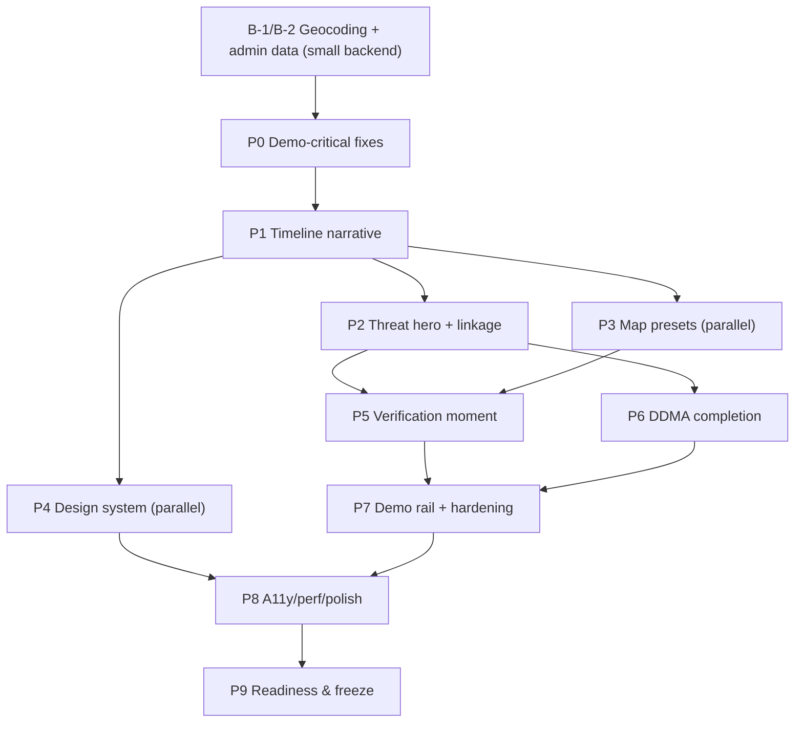

# Vajra — Frontend Implementation Plan (presentation-readiness roadmap)

**Companion docs:** `FRONTEND_UX_AUDIT.md` (verified defects + traceability) ·
`FRONTEND_PRESENTATION_RESEARCH.md` (principles) · `FRONTEND_PRESENTATION_BLUEPRINT.md`
(target design + demo script). **Status: PLAN ONLY — no code written.**

**Ground rules:** keep the vanilla stack (no framework, no build step); backend work is
limited to two small fixes (B-1, B-2 below); every UI element maps to an existing or
minimal-change endpoint; every phase ends with a verifiable check on the running app at
1366×768 and 1920×1080.

---

## 0. Backend prerequisites (small, tracked separately)

| ID | Fix | Why | Files | Status |
|---|---|---|---|---|
| **B-1** | Alert block geocoding population: root-cause why `affected_blocks`/`population_exposed` are empty (spatial index loads only 24 districts/85 blocks vs MASTER.md's 765/534; possible causes: reduced admin GeoJSON, cell placement outside block coverage, intersect fallback path) | Block-level targeting is the flagship story; DEMO.md promises named blocks + population | `src/vajra/geocoding.py`, `data/admin/*.geojson`, `src/vajra/alerts.py` | **SMALL** |
| **B-2** | Admin dataset scale-up: load the full Survey-of-India district/block set (or honestly document the reduced set everywhere) | Demo claim consistency | `data/admin/`, `src/vajra/geocoding.py` | **SMALL** |

Everything else in this plan is frontend-only. No other backend changes are assumed.

---

## Phase P0 — Demo-critical correctness (must be first)

| Field | Content |
|---|---|
| **Objective** | Fix the four P0 defects so prediction, warning, and verification are true on screen |
| **Why** | All downstream UX work is worthless if the core moments are broken or fabricated (audit §3) |
| **Current → target** | Alert center always empty → alerts visible in their replay-time window; blocks/population empty → populated (or honest fallback); scoreboard fabricates ROC 0.86 → mode-gated, no invented numbers; boot runs wrong event at wrong cycle → canonical event at peak cycle, storm-zoomed |
| **UX goal** | Truthfulness of every L1 element |
| **IA change** | None yet |
| **Design change** | None yet |
| **Component change** | `renderAlerts` filter; scoreboard modal gating; boot sequence |
| **Map change** | Camera fit-to-event; default cycle = peak |
| **Interaction change** | None new |
| **Motion change** | None |
| **API dependency** | Existing endpoints only |
| **Backend dependency** | B-1 |
| **Data dependency** | Admin coverage (B-1/B-2) |
| **Files** | `web/app.js` (alerts filter, scoreboard, boot), `src/vajra/geocoding.py` (B-1) |
| **KEEP** | Honesty badges, footer, CAP flows |
| **REMOVE** | `roc_auc || 0.86` fallback; unconditional verdict badges |
| **ADD** | Alert replay-window filter; honest "no alert above threshold" state; zero-state boot |
| **Testing** | API test: alerts match window; UI check: alerts visible at issue cycles; scoreboard renders no numbers when metrics null |
| **Accessibility** | n/a |
| **Performance** | Boot ≤ 8 s |
| **Demo impact** | **Critical** — unblocks every moment |
| **Risks** | Geocoding fix may reveal synthetic cells outside block coverage → place case-study cells within coverage (SIMULATION-labelled; honest) |
| **Definition of done** | All four audit P0 defects fixed and verified in a fresh run |
| **Acceptance** | Judge sees a live alert during replay; blocks + population present or explicitly "pending"; scoreboard shows only real numbers; boot lands on Bihar squall peak cycle, storm-zoomed |

**Tasks**

| ID | Task | Why | Files | Depends on | Input → output | Test | Acceptance |
|---|---|---|---|---|---|---|---|
| T0.1 | Filter alert center by `valid_from ≤ cycle ≤ valid_until` (replay time), fallback to ±30 min around issue only in LIVE mode | Fixes permanent "no alerts" (audit §3.1) | `web/app.js` | — | alerts+cycle → filtered list | unit: filter fn; UI: alerts appear at issue cycles | DDMA card never says "all clear" during a storm |
| T0.2 | Root-cause + fix block geocoding population (B-1) | Flagship story silent (audit §3.2) | `geocoding.py`, admin data | — | cell bbox → blocks/pop | test: Patna-area cell resolves blocks; run-level: ≥1 alert with blocks on Bihar event | Threat card shows named blocks or honest "block resolution pending" |
| T0.3 | Scoreboard mode-gating + remove fabricated fallbacks | Honesty violation (audit §3.4) | `web/app.js` | — | scoreboard payload → gated render | unit: null-metric rendering | SIMULATION shows benchmark pointer; REPLAY shows full audit; zero invented values |
| T0.4 | Zero-state boot: autorun `bihar_squall_2026`, land on peak cycle, fit camera to event bbox | Zero-state contract (blueprint §3) | `web/app.js` | T0.1 | boot → populated scene | manual: 1366/1920 screenshots | First paint = storm-zoomed mid-event with threat data |
| T0.5 | Fix horizontal overflow + pre-warm benchmark run `sevir_s810646` | Polish + demo-rail prep | `web/app.js`, `web/style.css` | — | — | overflow check at 1920 | No horizontal scrollbar; benchmark run cached |

---

## Phase P1 — Timeline as the narrative instrument

| Field | Content |
|---|---|
| **Objective** | One axis communicates past → NOW → forecast with alert/verification markers |
| **Why** | Research principle 4/§4.1: observed vs forecast must be doubly encoded; the old horizon tags conflate progress with lead time |
| **Current → target** | Fraction slider + 9 px tags → segmented axis (observed solid / forecast dashed), NOW pin, +30/+60 ticks, alert ▲ markers (IMD-coloured), peak flag, verification ✓/✗ at settlement, click-to-jump |
| **UX goal** | Temporal comprehension without narration |
| **IA change** | Horizon tags removed (semantics absorbed into axis) |
| **Design change** | Timeline restyle; marker chips |
| **Component change** | New timeline renderer (plain DOM/SVG) |
| **Map change** | None |
| **Interaction change** | Click-to-jump; End key = peak (not last); T0 button = first alert issue cycle |
| **Motion change** | Playhead only |
| **API dependency** | `/alerts` (valid_from, imd_stage), `/runs/{id}/forecasts` (already loaded) |
| **Backend dependency** | None |
| **Data dependency** | None |
| **Files** | `web/app.js`, `web/index.html`, `web/style.css` |
| **KEEP** | Transport controls, speed, loop, keyboard |
| **REMOVE** | Horizon tag chips |
| **MERGE** | Lead select into timeline controls |
| **ADD** | Markers, segments, peak landing |
| **Testing** | Unit: axis mapping fn (time→x); UI: markers align with alert times |
| **Accessibility** | aria-labels on markers; keyboard jump |
| **Performance** | Marker render O(alerts) |
| **Demo impact** | High — moments 3/6/7 depend on it |
| **Risks** | Marker clutter on 82-alert SEVIR run → cap visible markers, cluster |
| **DoD** | Judge can answer "when did it warn / when will it hit / was it verified" from the axis |
| **Acceptance** | Axis shows solid past, dashed future, pinned NOW, ≥1 alert marker on demo event |

**Tasks:** T1.1 axis model + segments · T1.2 markers (alert/impact/verification/peak) ·
T1.3 controls rewiring (End=peak, T0=first issue, horizon tags removed) · T1.4 lead-select
merge. (Same task-field columns as P0; files as above.)

---

## Phase P2 — Threat hero + alert↔map linkage

| Field | Content |
|---|---|
| **Objective** | One card answers WHAT/WHERE/WHEN/CONFIDENT/WHY/ACTION; rail and map are linked |
| **Why** | Research §5.1/§2.2: probability lives with the storm object; COP principle (one authoritative narrative) |
| **Current → target** | Alert list + signal dump → threat hero card + ≤2 alert cards + evidence line; cell popup humanized; alert↔cell hover/flyTo sync |
| **UX goal** | Comprehension at a glance (SA level 2–3) |
| **IA change** | Right rail re-ordered: threat → alert → event (collapsed) |
| **Design change** | Hero card typography (28 px P value), chips |
| **Component change** | New threat-card component; popup rework |
| **Map change** | Cell hover highlight from rail; pulse-on-alert |
| **Interaction change** | "Show on map" flyTo; card collapse/expand |
| **Motion change** | Single pulse on new/escalated alert |
| **API dependency** | `/alerts` (all fields incl. data_quality, contributing_signals), `/forecasts/{id}/cells.geojson` |
| **Backend dependency** | B-1 (blocks) |
| **Data dependency** | None |
| **Files** | `web/app.js`, `web/index.html`, `web/style.css` |
| **KEEP** | CAP buttons, bulletin link |
| **REWORK** | Signal dump → evidence line + L3 raw table |
| **ADD** | Trend (Δp vs prev cycle), data-quality chips, show-on-map |
| **Testing** | Unit: evidence formatter; UI: linkage both directions |
| **Accessibility** | aria-live on threat card |
| **Performance** | Card render ≤ 16 ms |
| **Demo impact** | Critical — moments 1/2/5 |
| **Risks** | Empty geocoding → honest fallback text (never fake, never "all clear") |
| **DoD** | Card answers all six questions without opening anything else |
| **Acceptance** | On Bihar peak cycle: hazard, P with reference class, region, window, confidence+rung, data chips, evidence line, action all visible |

**Tasks:** T2.1 hero card · T2.2 evidence line + WHY disclosure · T2.3 show-on-map + pulse ·
T2.4 popup humanization (km/h, dBZ, km²; drop raw px/°-per-cycle to L3) · T2.5 DDMA
overview from real alerts (honest empty state).

---

## Phase P3 — Map presets & hierarchy

| Field | Content |
|---|---|
| **Objective** | OBSERVE / NOWCAST / COMPARE presets replace the 15-checkbox jungle; camera and legend follow the story |
| **Why** | Audit §4 (layer jungle), research principle 11/§6.2 (palette separation) |
| **Current → target** | 15 checkboxes → 3 preset buttons + expert drawer; COMPARE is an exclusive mode with fixed caption (kills the slider conflict); on-map cell P labels at zoom ≥ 7; contextual legend |
| **UX goal** | Map reads without the rail |
| **IA change** | Layers panel → drawer (L3) |
| **Design change** | Preset segmented control; legend contextual |
| **Component change** | Preset state machine; drawer |
| **Map change** | Layer visibility matrix per preset; label layer; COMPARE split |
| **Interaction change** | One-click preset switching; R = reset view |
| **Motion change** | Field fade ≤ 150 ms on cycle change |
| **API dependency** | Existing |
| **Backend dependency** | None |
| **Data dependency** | None |
| **Files** | `web/app.js`, `web/index.html`, `web/style.css` |
| **KEEP** | All existing layers (relocated to drawer) |
| **REWORK** | Split-slider → COMPARE mode |
| **ADD** | Presets, on-map labels, contextual legend, reset view |
| **Testing** | Table-driven: preset → expected layer visibility |
| **Accessibility** | Preset buttons keyboard-operable |
| **Performance** | No layer reload on preset switch (visibility toggles only) |
| **Demo impact** | High — moments 2/3/4/7 |
| **Risks** | Probability palette vs IMD colours confusion → distinct ramp + legend note |
| **DoD** | Presenter switches narrative stages with one control |
| **Acceptance** | Preset switch ≤ 1 click, no reload flicker, legend matches visible layers |

**Tasks:** T3.1 preset state machine · T3.2 event-fit camera + reset view · T3.3 expert
drawer (all checkboxes + opacity) · T3.4 COMPARE mode with caption · T3.5 contextual
legend · T3.6 on-map probability labels.

---

## Phase P4 — Design system & projector legibility *(parallel with P2/P3 after P1)*

| Field | Content |
|---|---|
| **Objective** | Judge-seat readability; one coherent visual system |
| **Why** | Audit §4 (9–13 px text), research §6.1 (≥16 px body, hero 28 px+, AA contrast) |
| **Current → target** | 13 px base → 16 px body / 14 px titles / 28–32 px hero numbers; spacing on 4/8 grid; status-colour tokens; IMD traffic colours quarantined to the alert strip |
| **UX goal** | Legibility at 3–5 m |
| **IA change** | None |
| **Design change** | Type scale, spacing, colour tokens |
| **Component change** | CSS-only (plus class hooks) |
| **Map change** | Legend swatch contrast |
| **Interaction change** | Focus-visible states |
| **Motion change** | None |
| **API/Backend/Data dependency** | None |
| **Files** | `web/style.css`, minor `web/index.html` |
| **KEEP** | Dark theme, layout skeleton |
| **SIMPLIFY** | Panel chrome; border/radius unification |
| **Testing** | Computed-style checks; printed-screenshot distance test |
| **Accessibility** | WCAG AA contrast pass; focus rings |
| **Performance** | None |
| **Demo impact** | High — every moment is seen through this |
| **Risks** | Density loss → panels may scroll more; mitigate with drawer strategy |
| **DoD** | All L1 text legible from 3 m at 1080p |
| **Acceptance** | 1366/1920 screenshot review: no L1 text below floor; AA pass |

**Tasks:** T4.1 tokens + type scale · T4.2 colour-token separation (probability vs IMD vs
status) · T4.3 panel normalization (right-rail order, bottom strip) · T4.4 contrast +
focus states.

---

## Phase P5 — The verification moment

| Field | Content |
|---|---|
| **Objective** | "Was it right?" is visible without opening a modal |
| **Why** | Audit §4 (verification hidden), research §5.1 (projection = SA level 3); per-alert settlement data already exists |
| **Current → target** | Hidden table/modal → per-alert settled verdict (✓ VERIFIED — n flashes / ✗ NOT CONFIRMED — predicted P%) + bottom VERIFY strip with 4 hero numbers (mode-gated) + reliability mini-chart |
| **UX goal** | Trust through evidence |
| **IA change** | Verification leaves left panel; strip becomes L1 |
| **Design change** | Hero number typography; verdict chips |
| **Component change** | Verdict calculator (client-side from flashes∩window); strip; mini-chart |
| **Map change** | COMPARE preset used for the visual moment |
| **Interaction change** | Full audit behind one click (existing modal, gated) |
| **Motion change** | None |
| **API dependency** | `/events/{id}/flashes.geojson`, `/runs/{id}/scoreboard`, alerts |
| **Backend dependency** | None |
| **Data dependency** | None |
| **Files** | `web/app.js`, `web/index.html`, `web/style.css` |
| **KEEP** | Scoreboard modal (gated), bulletin print |
| **REMOVE** | Fabricated fallback numbers (from P0, kept removed) |
| **ADD** | Settled verdicts, VERIFY strip, reliability mini-chart |
| **Testing** | Unit: verdict fn (window boundary cases); UI: on SEVIR run, settled alerts show verdicts |
| **Accessibility** | Verdicts announced (aria-live) |
| **Performance** | Flash filtering O(n) cached |
| **Demo impact** | Critical — moment 7 (the honesty close) |
| **Risks** | Flash-time semantics (epoch contract) — reuse existing UI filter logic |
| **DoD** | Verification readable from the stage without a modal |
| **Acceptance** | On `sevir_s810646`: ≥1 settled ✓ verdict visible; strip shows BSS +0.50 / FAR 0.08 / POD 0.52 / CSI 0.50 from the real scoreboard |

**Tasks:** T5.1 settlement verdicts · T5.2 VERIFY strip · T5.3 reliability mini-chart ·
T5.4 audit modal refinements (mode-gate consistency).

---

## Phase P6 — DDMA persona completion *(after P2)*

| Field | Content |
|---|---|
| **Objective** | DDMA mode demonstrates impact without lying |
| **Why** | Audit §3.1 consequence + DEMO.md promises (blocks, population, sirens) |
| **Current → target** | Static overview card + hover-only blocks → overview from real alerts; block tint = IMD stage for alert-intersected blocks only (bounded, honest claim); verification visible in DDMA too |
| **UX goal** | Actionability for disaster managers |
| **IA change** | Verification no longer IMD-only |
| **Design change** | Block tint legend (stage colours) |
| **Component change** | Impact overview recompute; block tint layer |
| **Map change** | Alert-intersected blocks filled by stage |
| **Interaction change** | Chime on escalation only |
| **Motion change** | Single pulse per escalation |
| **API dependency** | `/admin/blocks`, alerts |
| **Backend dependency** | B-1 |
| **Data dependency** | Block coverage |
| **Files** | `web/app.js`, `web/style.css` |
| **KEEP** | CAP dispatch, feed, bulletin |
| **REWORK** | Overview card computation |
| **Testing** | UI: tinted blocks match alert intersections; chime fires once per escalation |
| **Accessibility** | Colour+label redundancy on tint |
| **Performance** | Block filter cached per cycle |
| **Demo impact** | High — moment 5 |
| **Risks** | Overclaiming → tint only intersected blocks; "—" when none |
| **DoD** | DDMA mode passes the same 30-second test as IMD mode |
| **Acceptance** | During Bihar peak: ORANGE blocks visible with population counts; overview matches alerts |

**Tasks:** T6.1 overview recompute · T6.2 block stage tinting · T6.3 chime escalation
gating · T6.4 persona-shared verification.

---

## Phase P7 — Presentation rail + rehearsal hardening *(after P5)*

| Field | Content |
|---|---|
| **Objective** | The 8 judge moments are one keystroke each; the demo survives failures |
| **Why** | Blueprint §11/§13; audit §6 failure inventory |
| **Current → target** | Manual orchestration → 8-chip demo rail (real state sequencer) + keyboard 1–8, R reset + pre-warmed runs + offline basemap fallback + error toasts |
| **UX goal** | Presenter reliability |
| **IA change** | Rail overlays console (dismissible = operational mode) |
| **Design change** | Rail chips styling |
| **Component change** | Rail component + step state definitions |
| **Map change** | Camera targets per step |
| **Interaction change** | 1–8/R/Space/←→/Home/End |
| **Motion change** | Camera flyTo per step |
| **API dependency** | Existing (rail triggers existing state changes) |
| **Backend dependency** | None |
| **Data dependency** | Pre-warmed runs (T0.5) |
| **Files** | `web/app.js`, `web/index.html`, `web/style.css` |
| **KEEP** | Everything (rail adds, not replaces) |
| **ADD** | Rail, shortcuts, reset, basemap fallback, toast errors |
| **Testing** | Scripted Playwright pass of the full 8-step sequence |
| **Accessibility** | Rail keyboard-operable; visible focus |
| **Performance** | Step switch ≤ 300 ms |
| **Demo impact** | Critical — the whole rehearsal depends on it |
| **Risks** | Rail becomes a second product → it only sets existing state; cap at 8 steps |
| **DoD** | Full 4-minute script runs cold with ≤ 12 clicks |
| **Acceptance** | 5 consecutive dry runs pass; each step has a rehearsed recovery |

**Tasks:** T7.1 rail + step sequencer · T7.2 keyboard map · T7.3 basemap fallback + reset ·
T7.4 error toasts for silent-catch paths · T7.5 pre-warm verification.

---

## Phase P8 — Accessibility, performance, polish *(after P4+P7)*

Focus order and aria completeness; `prefers-reduced-motion`; contrast recheck; render
profiling (≤ 50 ms/cycle UI budget); fetch dedupe; 1366/1920 QA matrix (2 resolutions ×
3 events × 3 presets); console-clean assertion.
**Tasks:** T8.1 a11y pass · T8.2 perf profiling + dedupe · T8.3 QA matrix.

## Phase P9 — Final presentation readiness

Demo-script dry runs; docs sync (`docs/DEMO.md` corrected to verified capabilities —
block claims gated on B-1, rung story narrated); readiness checklist from Blueprint §18;
freeze.

---

## Dependency graph

**Critical path:** B-1 → P0 → P1 → P2 → P5 → P7 → P8 → P9. Parallel: P3, P4 (after P1);
P6 (after P2).

## Phase validation (per persona)

| Persona | Validated by |
|---|---|
| First-time user | 30-second test passes at zero interaction (P0/P2/P3) |
| Presenter | 4-minute script ≤ 12 clicks with recoveries (P7) |
| Judge | All 8 moments land; no fabricated numbers anywhere (P0/P5) |
| Meteorologist | Correct encoding semantics, palette separation, honest rung narration (P3/P4) |
| ML reviewer | Model provenance, reliability chart, mode-gated claims (P5) |

## Acceptance criteria (global)

1. All four audit P0 defects fixed with tests. 2. Zero state = populated storm-zoomed
scene ≤ 8 s cold. 3. Alerts visible during replay with correct IMD staging; DDMA never
contradicts the map. 4. Probability field visible at event zoom in NOWCAST preset.
5. Scoreboard renders no invented values; benchmark numbers carry mode provenance.
6. Settled per-alert verdicts appear on the SEVIR benchmark event. 7. Judge-seat
legibility at 1366×768 (print test). 8. Zero console errors; render ≤ 50 ms/cycle.
9. Offline basemap fallback verified. 10. Demo script passes 5 consecutive dry runs.

## Risks & mitigations

- **Geocoding fix scope creep** (admin datasets large): timebox; ship reduced-but-correct
  coverage for demo districts, honest fallback elsewhere.
- **Rung still REDUCED on synthetic events:** narrate the fallback ladder as a feature
  (moment 6); do not fake FULL_FUSION.
- **Autoplay policies for chime:** gate on first user gesture; chime is optional.
- **Venue offline:** vendor basemap fallback (P7.3) + map never blocks narrative.
- **Scope creep into a redesign:** P0–P5 touch existing components only; no framework.

## Do-not-build list

No separate presentation product/slideshow; no framework migration or build tooling;
no new component library; no choropleth of all 765 districts; no LLM-generated
narratives; no decorative animation/particles/3D; no "AI" badge spam; no fake live-IMD
claims; no exact strike-point localization; no mobile-first redesign (demo targets
1366/1920); no backend features not traceable to a UI element used in the demo.

## Final readiness checklist

- [ ] P0–P9 definition-of-done met, tests green
- [ ] 30-second test recorded at 1366 and 1920
- [ ] 4-minute script dry run ×5, ≤ 12 clicks, recoveries rehearsed
- [ ] Scoreboard verified on `sevir_s810646` (BSS/FAR/POD/CSI match MASTER.md §6 story)
- [ ] CAP XML/JSON + Atom + bulletin print verified end-to-end once more
- [ ] Offline boot rehearsal passes
- [ ] `docs/DEMO.md` synced to verified capabilities; MASTER.md pointer present
