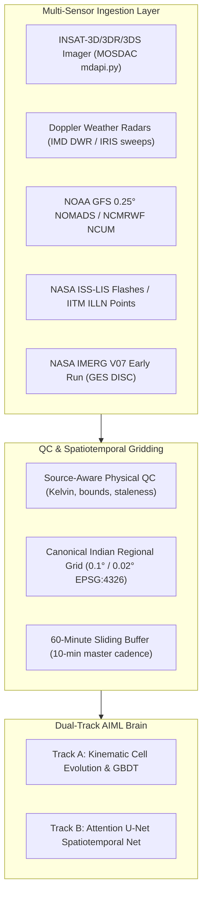

# Project Vajra: Version 2 Master Blueprint

**Smart India Hackathon 2026 · Problem Statement ID: 26072**  
**Ministry of Earth Sciences (MoES) / India Meteorological Department (IMD)**  
*Project Name:* Project Vajra (वज्र)  
*Status:* Authoritative V2 Concept, Scientific Architecture & Strategic Blueprint  
*Date:* September 2026

---

## 1. What V2 Is

**Project Vajra Version 2** is an operational-grade, multi-sensor atmospheric nowcasting and impact-based decision-support platform engineered specifically for the convective regimes of the Indian subcontinent.

It ingests real-time and replay multi-spectral geostationary satellite telemetry (INSAT-3D/3DR/3DS), multi-radar Doppler mosaics, numerical weather prediction (NWP) thermodynamic soundings, and satellite/ground lightning point vectors. Leveraging a **Dual-Track Hybrid AIML Brain** (Lagrangian storm-object kinematics coupled with an attention-gated spatiotemporal neural network), Vajra V2 generates continuous, calibrated 0–60 minute probabilistic hazard fields and sub-district CAP 1.2 emergency alerts for convective initiation, severe thunderstorm winds/rain, and destructive cloud-to-ground lightning strikes.

---

## 2. Why V2 Exists

Version 1 proved the end-to-end viability of atmospheric AI nowcasting on commodity hardware. However, V1 remains scientifically bounded by:
1. **Heuristic Spatial Probability Generation:** Convective hazards in Track A were rendered via anisotropic Gaussian dilation around bounding-box centroids rather than as continuous, fluid-dynamical probability fields.
2. **Conflated Hazard Modeling:** V1 treated thunderstorm nowcasting and lightning nowcasting as a single prediction target ($P(\text{flash} \ge 1)$), ignoring that lightning electrification, severe downdraft wind gusts, and localized cloudbursts represent distinct microphysical processes requiring specialized predictive heads.
3. **Absence of Convective Initiation (CI) Precursors:** V1 was predominantly reactive to existing mature radar/satellite echoes, lacking the multi-spectral infrared cooling rate ($dT_b/dt$) and split-window water vapor saturation analysis necessary to issue warnings 15–45 minutes *before* first cloud-to-ground strike or radar echo emergence.
4. **Institutional Alignment with Mission Mausam:** With the Government of India's ₹2,000 crore **Mission Mausam** (launched 2024–2025) mandating AI/ML integration into rapid-update nowcasting and expansion of radar/satellite observations to the Gram/Panchayat level, Vajra V2 provides a scientifically defensible, reproducible reference architecture tailored to these exact national priorities.

---

## 3. What Changes from V1: The Comprehensive Delta

```
┌───────────────────────────────────────┬───────────────────────────────────────────┐
│               V1 State                │                 V2 State                  │
├───────────────────────────────────────┼───────────────────────────────────────────┤
│ Cell-level tabular XGBoost primary    │ Dual-Track: Spatiotemporal U-Net & GBDT   │
│ Bounding-box Gaussian painted field   │ Continuous 2D spatiotemporal neural field │
│ Single hazard: P(flash >= 1)          │ Decoupled multi-hazard: Lightning + Storm │
│ Reactive to mature radar echoes       │ Convective Initiation (CI) 15-45m lead    │
│ Single-station radar GIF scraper      │ Multi-Radar Cartesian MaxZ Mosaic engine  │
│ Arbitrary cell bounding box alerts    │ Sub-district / Block CAP 1.2 geo-alerts   │
│ Static NWP scalar thermodynamic check │ Dynamically embedded NWP 3D context       │
│ US SEVIR validation only              │ Curated Indian convective case studies    │
│ Single forecaster map view            │ Dual-mode Forecaster / Disaster Mgmt UI   │
└───────────────────────────────────────┴───────────────────────────────────────────┘
```

---

## 4. What We Are Building in V2

1. **Intermediate Cross-Modal Attention Fusion Engine:** Modality-specific encoders for INSAT-3DS (TIR1, WV, Split, CTT), Doppler radar MaxZ, NWP thermodynamic profiles (CAPE, CIN, 0–6 km shear), and lightning flash density history, fused via spatial attention gates with graceful zero-masking for missing sensors.
2. **Continuous 2D Spatiotemporal Nowcaster (15, 30, 45, 60 min):** Deep encoder-decoder generating continuous probability rasters with focal loss handling extreme spatial sparsity.
3. **Multi-Spectral Convective Initiation (CI) Detector:** Real-time extraction of pre-convective cooling plumes ($\le -4\text{ K / 15 min}$, $T_b \le 273.15\text{ K}$, $T_{\text{IR1}} - T_{\text{WV}} \ge -1\text{ K}$), injecting early 15–45 min warning signals prior to radar echo appearance.
4. **Decoupled Multi-Task Hazard Heads:**
   - *Head 1 (Lightning):* Calibrated probability of $\ge 1$ flash, flash density, and $2\sigma$ lightning jump detection.
   - *Head 2 (Severe Storm):* Probability of severe surface wind gusts and rainfall rates $\ge 20\text{ mm/h}$.
5. **Multi-Radar Cartesian Mosaic Engine:** Distance-weighted Cressman interpolation merging overlapping radar sweeps into a unified Cartesian grid.
6. **Administrative Impact-Based Alerting 2.0:** Real-time spatial R-Tree intersection with official Indian administrative boundaries, outputting OASIS CAP 1.2 XML/JSON alerts with bilingual (Hindi/English) advisories.
7. **Verification & Audit Scoreboard 2.0:** Automated, reproducible scoring against 5 meteorological baselines using Murphy's (1973) Brier score decomposition, BSS, and Fractions Skill Score (FSS).

---

## 5. What We Are NOT Building in V2 (Explicit Non-Goals)

To prevent feature creep, protect computational budgets, and preserve scientific credibility:
1. **NO Generative LLM Weather Forecasts:** Large Language Models hallucinate non-physical meteorological dynamics. LLMs will never generate nowcast fields.
2. **NO 3D Generative Diffusion Models (DiffCast / Video Diffusion):** Diffusion models require multi-GPU clusters and minutes of denoising latency, violating the strict $<15\text{ second}$ operational inference SLA.
3. **NO Commercial Black-Box Weather APIs:** Ingesting OpenWeatherMap or Tomorrow.io destroys academic integrity and defeats the purpose of an atmospheric nowcasting prototype for MoES/IMD.
4. **NO Exact Lightning Strike Point Localization:** Claiming to predict the exact GPS coordinate of a cloud-to-ground strike is physically impossible and scientifically indefensible at nowcast resolutions.
5. **NO Unvalidated Social/Crowdsourcing Features:** Vajra is a professional meteorological decision-support tool, not a consumer social weather app.

---

## 6. Target Data Architecture



- **Primary Operational Track (India):** INSAT-3DS multi-spectral + NOAA GFS/ECMWF NWP + NASA IMERG + ISS LIS. Operates 100% reliably even when raw radar is offline.
- **Quantitative Benchmark Track (SEVIR):** Used for reproducible baseline verification, training convergence, and ablation studies.

---

## 7. Target Machine Learning Architecture

- **Core Backbone:** 4-level Residual Attention U-Net with skip connections modulated by spatial attention gates (Oktay et al., 2018).
- **Latent Dimension:** Base 32 feature maps expanding to 256 at the bottleneck.
- **Optimization Strategy:** Combined Binary Focal Loss ($\alpha=0.25, \gamma=2.0$) and Soft Dice Loss.
- **Calibration Head:** Monotonic non-decreasing Isotonic Regression (PAVA) fitted on held-out validation events to guarantee empirical reliability.
- **Inference Latency Target:** $< 250\text{ ms}$ on GPU; $< 1,200\text{ ms}$ on 4-core CPU.

---

## 8. Target Outputs & Products

1. **Calibrated Probability Field:** Floating-point raster $P(x, y) \in [0.0, 1.0]$ for lead times 15, 30, 45, and 60 minutes.
2. **Convective Cell Trackers:** Polygon geometries with kinematic velocity vectors, 30-min forward cones, and lifecycle state flags.
3. **Convective Initiation Precursors:** Georeferenced plume candidates with estimated time-to-first-flash.
4. **Spatial Uncertainty Raster:** Normalized uncertainty field $\sigma(x, y)$ capturing aleatoric atmospheric spread and sensor degradation.
5. **OASIS CAP 1.2 Alert Records:** Machine-readable XML/JSON alerts linked to Survey of India administrative block codes.
6. **Interactive Forecaster / Disaster Console:** WebGL 60 FPS MapLibre interface supporting layer toggles, split-screen verification, and historical timeline replay.

---

## 9. Target Verification Matrix (The Proof of Skill)

To be certified as "Operationally Superior" in V2, models must achieve the following quantitative benchmarks on held-out test events:

| Metric | Target Standard | Operational Baseline (Persistence) | Success Criterion |
|---|---|---|---|
| **Brier Score (30m)** | $\le 0.050$ | $0.112$ | $\ge 50\%$ reduction in error |
| **Brier Skill Score (BSS)** | $\ge +0.450$ | $-0.261$ (Negative skill) | Decisive positive predictive skill |
| **Critical Success Index (CSI)** | $\ge 0.450$ | $0.224$ | $> 2\times$ persistence threat score |
| **Probability of Detection (POD)** | $\ge 0.500$ (Operational) / $\ge 0.800$ (Protective) | $0.285$ | Robust hit rate on severe cores |
| **False Alarm Ratio (FAR)** | $\le 0.150$ | $0.742$ | Drastic reduction in false warnings |
| **Fractions Skill Score (FSS)** | $\ge 0.700$ at $20\text{ km}$ scale | $< 0.400$ | Preserves spatial structure |

---

## 10. Research-Backed Unique Selling Propositions (USPs)

1. **Dual-Track Operational Resiliency:** The only system that maintains a deep spatiotemporal neural network for continuous probability fields, backed by an instant-fallback kinematic cell tracker that never crashes when radars drop offline.
2. **Pre-Convective Initiation (CI) Forecasting:** Exploits INSAT-3DS multi-spectral infrared cooling to detect lightning threats 15–45 minutes *before* first radar echo emergence.
3. **Physics-Gated Thermodynamic Integrity:** Deep learning predictions are rigorously modulated by pure-Python GRIB2 thermodynamic gating, suppressing false alarms from decaying cirrus shields.
4. **Sub-District Administrative Actionability:** Alerts are automatically mapped to Census administrative blocks with bilingual advisories and population exposure, directly serving District Disaster Management Authorities (DDMAs).
5. **Murphy-Decomposed Verification Transparency:** Every prediction cycle is audited against 5 meteorological baselines on a public scoreboard, eliminating black-box AI claims.

---

## 11. Known Limitations & Scientific Honesty

- **Radar Access:** Live Indian radar numerical volumes require formal MoES/IMD data-sharing agreements. V2 demonstrates complete technical capability via synthetic radar mosaics and SEVIR benchmarking while running satellite/NWP-first over India.
- **Lightning Sensor Resolution:** NASA ISS-LIS orbital passes provide episodic sampling rather than continuous 24/7 geostationary lightning mapping.
- **High-Altitude Orography:** Cloud-top temperature thresholds for convective initiation require adjusted lapse rates over the Tibetan plateau and Western Himalayas.

---

## 12. Success Criteria for Version 2

- **Data Success:** Operational ingestion of INSAT-3DS HDF5, NOAA GFS GRIB2, and NASA IMERG V07 without third-party commercial APIs.
- **ML Success:** Spatiotemporal U-Net trained, calibrated, and outperforming Persistence and NWP Thresholds with BSS $\ge +0.45$.
- **Scientific Success:** Successful demonstration of Convective Initiation pre-radar lead time on at least 2 distinct Indian convective events.
- **Engineering Success:** $< 1,000\text{ ms}$ end-to-end cycle latency across 72 consecutive cycles in automated burn-in load tests.
- **Disaster Decision Success:** Automated generation and validation of OASIS CAP 1.2 XML feeds with valid block geocodes.
