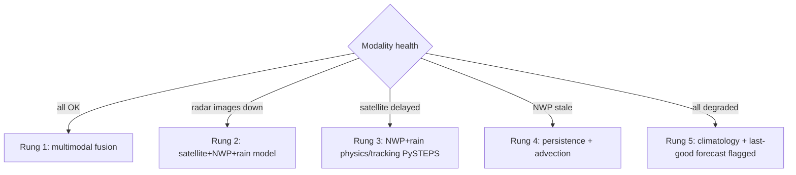

# Deliverable 9 — Architecture Document

Design derived from research (brief Parts 12, 14, 15, 29, 40–42). Principles: satellite+NWP-first (radar optional), replay-as-first-class, graceful degradation, every output labelled and archived.

## 1. High-level architecture

```mermaid
flowchart LR
  subgraph SOURCES[Data sources]
    SEVIR[SEVIR S3]
    MOSDAC[MOSDAC INSAT]
    NOMADS[GFS NOMADS]
    ECMWF[ECMWF Open Data]
    CDS[ERA5 CDS]
    IMERG[IMERG Earthdata/GEE]
    LIS[ISS LIS / LIS-OTD]
    DWR[IMD DWR GIFs]
  end
  subgraph INGEST[Ingestion & QC]
    FETCH[Fetchers + mdapi/wradlib/satpy]
    QC[Format/QC/geo-clip]
    STORE[(Zarr/Object store)]
  end
  subgraph BRAIN[Processing & Models]
    ALIGN[Temporal+spatial alignment 0.1 deg]
    CELL[Cell segmentation tracking tobac/tintX]
    FEAT[Feature builder]
    MODELS{Model router}
    XGB[XGBoost late fusion]
    UNET[U-Net LightningCast]
    PHYS[PySTEPS + jump rule]
    CAL[Isotonic calibration]
  end
  subgraph SERVE[Serving]
    FCAST[(Forecast store + archive)]
    API[FastAPI]
    ALERT[Alert engine CAP-JSON + block rollup]
    VERIF[Verification job]
    UI[MapLibre dashboard]
  end
  SOURCES --> FETCH --> QC --> STORE --> ALIGN --> CELL --> FEAT --> MODELS
  MODELS --> XGB & UNET & PHYS --> CAL --> FCAST --> API --> UI
  FCAST --> ALERT --> UI
  FCAST --> VERIF --> API
```



## 2. Data pipeline (stages)

| Stage | What happens | AI? | Tech |
|---|---|---|---|
| Ingestion | SEVIR S3 sync; MOSDAC `mdapi.py` (bbox, quota-aware); NOMADS grib-filter; CDS `cdsapi`; Earthdata IMERG/LIS; DWR GIF scraper | No — deterministic | Python, httpx, boto3 |
| Quality control | format validation, geo-clip to India window, missing-feed detection, unit normalization, GIF→grid [EXPERIMENTAL] | No | xarray, satpy, rasterio |
| Storage | versioned Zarr chunks + object store; forecast archive (immutable, config-hash stamped) | No | Zarr + MinIO/S3 |
| Alignment | regrid to 0.1°; time-resample to 30-min lattice; lag registration per modality | No | xarray/verde |
| Features | cell attributes (area, max VIL/rain, trend, age, motion), IR channel stats + 30/60-min cooling, flash-rate trends, NWP (CAPE, shear, RH) sampled at cells | deterministic stats | pandas/xarray |
| Models | router picks per data health (see §5) | **Yes** | XGBoost, PyTorch, PySTEPS |
| Calibration | isotonic per lead time; drift-monitored | statistical | scikit-learn |
| Verification | auto-score every archived forecast vs LIS/IMERG truth when truth ages in | statistical | custom + PySTEPS verification |

## 3. Real-time inference & alert pipeline (30-min cycle)

```mermaid
sequenceDiagram
  participant S as Scheduler (every 30 min)
  participant I as Ingest
  participant M as Models
  participant A as Alert engine
  participant U as Dashboard/API
  S->>I: check feed freshness (per modality)
  I-->>M: available modalities + health flags
  M->>M: router selects rung; features; predict 30/60-min
  M->>M: calibrate + assemble confidence
  M->>A: 0.1 deg grid + cells + confidence
  A->>A: block/district rollup; preset thresholds; diff vs previous alert
  A->>U: CAP-style JSON (new/upgraded alerts only)
  U->>U: map layers + mode badge + data-health strip
```

## 4. Latency budget (Part 15) [D]

| Segment | Budget | Basis |
|---|---|---|
| Observation availability | GFS ~3.5–5 h after cycle; IMERG Early ~4 h; INSAT 15–30 min (privileged) or 3 d (general); DWR GIFs ~10 min | [V/S] — the dominant, unavoidable term |
| Ingest + QC | ≤ 3 min per cycle | local compute |
| Alignment + features | ≤ 2 min | vectorized |
| Inference | XGBoost ≤ 5 s; U-Net ≤ 5 s GPU / ≤ 60 s CPU (Earthformer inference-class models run seconds on V100 [V]); PySTEPS ≤ 30 s | [V/S] |
| Calibrate + alert + render | ≤ 2 min | — |
| **Total (post-data)** | **≤ 10 min**; effective alert latency = source latency + 10 min | design target |

Map update frequency: 30-min cycle; dashboard polls; alerts pushed on change. The honest headline for judges: *our software adds ~10 minutes; nature's data latency we cannot negotiate — which is why INSAT privileged access matters and why the 0–60-min horizon tolerates GFS's 4-hour latency (environment changes slowly).*

## 5. Failure / fallback design (Part 29) [D]


- Delayed feed → hold last good forecast, show age; malformed → QC reject + health flag; conflicting obs → model-level disagreement surfaced as confidence spread; GPU failure → CPU path for XGBoost/U-Net; API failure → cached tiles + static JSON.
- **The active rung is always displayed on the UI.** Malfunctions are information, not embarrassment.

## 6. Component stack & justification (Part 41)

| Area | Choice | Why this? / why not simpler? |
|---|---|---|
| Language | Python | entire geo-ML ecosystem |
| Data | xarray + Zarr | multidim grids + chunked cloud storage; simpler than a DB for rasters |
| Radar I/O | wradlib / Py-ART / xradar (future) | standard; satpy for INSAT HDF5 |
| Cell tracking | tobac (or tintX) | maintained, object-tracking lineage of TITAN [S] |
| Physics nowcast | PySTEPS | BSD-3, operational-grade, NWP-blend module [V] |
| ML | XGBoost + PyTorch | tabular fusion + DL; scikit-learn calibration |
| API | FastAPI | async, typed, OpenAPI docs free |
| Alert store / metadata | PostgreSQL (+PostGIS) | block geometries + alert history + auth tables; SQLite acceptable for demo |
| Frontend | React + **MapLibre GL** (open, no key) | Mapbox rejected: cost/key dependency |
| Tiles/COG | TiTiler-style COG serving (or pre-generated tiles) | avoid heavy tile infra |
| Deploy | Docker Compose (single host) | reproducibility without K8s complexity |
| CI/CD | GitHub Actions | free, obvious |
| Monitoring | Prometheus + Grafana (or_structured logs + uptime checks for MVP) | feed freshness is a first-class metric |
| Auth | simple JWT (demo: read-only public, admin for presets) | least privilege; no IdP zoo |

## 7. Codebase layout (Part 42)

```
sih26072/
├── docs/                  # research brief, deliverables (this), ADRs
├── configs/               # dataset/model/split/alert YAML configs
├── src/
│   ├── ingest/            # sevir.py mosdac.py gfs.py era5.py imerg.py lis.py dwr_gif.py
│   ├── core/              # grid.py align.py qc.py health.py
│   ├── cells/             # segmentation + tracking (tobac wrapper)
│   ├── features/          # cell_stats.py ir.py flash.py env.py
│   ├── models/            # xgb_fusion.py unet.py baselines/pysteps_run.py jump.py
│   ├── calibrate/         # isotonic.py reliability.py
│   ├── verify/            # metrics.py scoreboard.py
│   ├── serve/             # api/ alerts/ fallback_router.py
│   └── ui/                # (or /frontend) MapLibre app
├── experiments/           # E1–E7 notebooks + configs + result JSONs
├── tests/                 # unit + replay regression
└── data/                  # git-ignored (raw/ interim/ processed/ external/)
```

## 8. Security & operations notes

Secrets (MOSDAC/Earthdata/CDS credentials) via `.env` (git-ignored); least-privilege API keys; attribution strings embedded for GODL/CC-BY/IMD terms; all access to government portals rate-limited and polite; no scraping beyond public pages' intended use — DWR GIF use documented as visual reference with attribution [PROPOSED — see backlog B-5].
