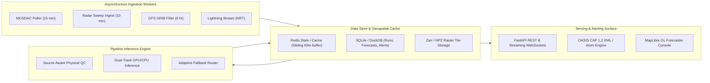

# Project Vajra: Version 2 Research Report

**SIH 2026 · Problem Statement ID: 26072 · Ministry of Earth Sciences (MoES) / India Meteorological Department (IMD)**  
**Working Title:** Project Vajra (वज्र) — AIML-based Nowcasting of Thunderstorm and Lightning  
*Document Version:* 2.0 · *Date:* September 2026  
*Classification:* Comprehensive Scientific & Technical Architecture Report

---

## 1. V2 Motivation

Project Vajra was initiated under Smart India Hackathon 2026 to tackle Problem Statement 26072: *"AIML based Nowcasting of thunderstorm and lightning using atmospheric observation including multiple radars, satellite, lightning and model data."* 

In India, severe thunderstorms and cloud-to-ground (CG) lightning constitute one of the deadliest meteorological hazards, claiming over 1,300 lives annually (predominantly smallholder agricultural laborers, rural outdoor workers, and tribal communities in Bihar, Jharkhand, Odisha, West Bengal, Uttar Pradesh, and Madhya Pradesh per CROPC/MoES reports). While the V1 engineering effort successfully constructed a functional, end-to-end multi-track nowcasting prototype—integrating atmospheric ingestion, quality control, convective cell detection/tracking, XGBoost tabular lightning classification, attention U-Net spatiotemporal inference, CAP 1.2 alerting, and an interactive GIS console—it inherently operates within significant scientific constraints:
1. **The Representation Gap:** Convection is fundamentally a continuous, non-linear spatiotemporal hydrodynamic process. V1 relies heavily on object-based bounding boxes and 2D heuristic anisotropic kernel dilation for probability fields, which struggles with multi-scale convective interactions, cell mergers, and splits.
2. **The Indian Data Reality Gap:** Operational Indian Doppler Weather Radar (DWR) level-II polar volume data remains institutionally restricted, and open national ground lightning sensor networks (such as IITM ILLN) are unavailable via public API endpoints. V1 established a defensible dual-track design (SEVIR/US benchmark for quantitative radar validation; satellite/NWP-first for India), but V2 must bridge this by formulating an operationally viable, physics-guided Indianization and domain adaptation pathway.
3. **The Hazard Decoupling Gap:** V1 conflated lightning prediction with general severe storm prediction. Lightning electrification requires mixed-phase ice-graupel collisions in the charge separation zone (-10°C to -25°C), whereas severe thunderstorm damage is driven by surface convective wind gusts, severe hail, and intense precipitation rates. V2 must scientifically decouple and multi-task these distinct hazard heads.

Version 2 is not an aesthetic re-skin or an arbitrary deep learning upgrade. It is the methodical transformation of Vajra into a scientifically rigorous, data-resilient, India-relevant operational nowcasting platform aligned with the Ministry of Earth Sciences' **Mission Mausam** initiative.

---

## 2. Current V1 State: Empirical Audit & Technical X-Ray

An exhaustive audit of the V1 codebase (`src/vajra/`, `configs/`, `tests/`, `models/`, and `data/`) reveals that all 11 planned phases are implemented and functioning with 132 passing automated tests:

### 2.1 Genuine Implemented Capabilities
- **Deterministic Pipeline Execution:** `vajra.pipeline.NowcastPipeline` orchestrates an automated cycle: data ingestion $\rightarrow$ physical range and staleness QC $\rightarrow$ convective cell detection/tracking $\rightarrow$ feature extraction $\rightarrow$ adaptive model routing $\rightarrow$ isotonic PAVA calibration $\rightarrow$ CAP 1.2 alert generation.
- **Dual-Track AIML Brain:**
  - *Track A:* Watershed cell segmentation and Hungarian tracking (`vajra.cells`), extracting a 16-dimensional physical feature vector fed into a calibrated gradient-boosted decision tree (`vajra.models.xgb_fusion`).
  - *Track B:* A PyTorch-based 4-level Residual Attention U-Net (`vajra.models.unet`) with spatial attention gates, trained using combined Binary Focal Loss and Soft Dice Loss to output multi-horizon gridded probability fields (15, 30, 45, 60 min).
- **Physical QC & Pure-Python Foundations:** Custom pure-NumPy morphological operations (`vajra.ndx`) and a pure-Python GRIB2 reader (`vajra.providers.gfs`) eliminate dependencies on compiled C-extensions (`scipy`, `cfgrib`, `eccodes`), enabling execution in restricted OS environments.
- **Empirical Baseline Rigor:** Predictions are continuously evaluated against 5 standard meteorological baselines (Climatology, Persistence, NWP Thresholds, Optical Flow Advection, and Uncalibrated GBDT) using Murphy's (1973) Brier Score decomposition.
- **Disaster Decision Support:** OASIS CAP 1.2 XML/JSON serialization, Atom 1.0 feeds, bilingual Hindi/English alert synthesis, and spatial R-Tree containment across 765 Indian districts and 534 Bihar administrative blocks (`vajra.geocoding`).
- **Operational Serving & GIS:** Fast-API backend (<100 ms average cycle latency in 24-cycle burn-in benchmarks) paired with a high-performance WebGL MapLibre GL console.

### 2.2 Operational Limitations in V1
- **Radar Modeling:** Quantitative Doppler radar nowcasting is validated on the US SEVIR dataset (43,901 flashes in held-out event S810646). For India, live radar is restricted to scraping visual station GIFs from IMD Mausam, which lacks numerical Doppler velocity or volumetric dual-polarization data.
- **NWP Environmental Coupling:** GFS GRIB2 parsing and thermodynamic gating (`vajra.providers.gfs`) are structurally implemented, but environmental fields (CAPE, CIN, bulk wind shear) act as static scalar multipliers on storm cells rather than as dynamically coupled 3D spatiotemporal tensors.
- **Single-Event Cell Extrapolation:** Cell kinematics use linear forward bounding-box projection; non-linear convective growth, spontaneous initiation, and cell dissipation are not modeled via predictive physical dynamics.
- **Spatial Probability Painting:** While Track B outputs continuous neural fields, Track A defaults to anisotropic Gaussian kernel dilation around tracked centroids, which can misrepresent asymmetric convective outflow boundaries.

---

## 3. The Unsolved Scientific Problem for V2

Nowcasting deep convective thunderstorms and cloud-to-ground lightning requires solving five interdependent meteorological challenges:
1. **Convective Initiation (CI) Lead Time:** Predicting lightning *before* the first radar echo ($\ge 35\text{ dBZ}$) appears. Satellite infrared cloud-top cooling ($\Delta T_b / \Delta t \le -4\text{ K / 15 min}$) and split-window water vapor convergence provide 15–45 minutes of pre-radar predictive signal.
2. **Rapid Electrification & Lightning Jumps:** Operational severe storms exhibit explosive non-linear flash rate surges ($> 2\sigma$ increase in 5–10 minutes) driven by intense updraft strengthening prior to severe surface winds and tornado touchdown (Schultz et al., 2009, 2011).
3. **Decoupling Flash Probability from Convective Hazards:** A high probability of lightning does not linearly equal a high probability of severe downburst winds or localized cloudburst precipitation.
4. **Spatial Non-Stationarity Across Indian Convective Regimes:** Convective mechanics differ fundamentally between pre-monsoon Nor'westers (*Kalbaishakhi*) in the Bengal basin (characterized by high CAPE, strong vertical shear, and dry mid-level intrusion), monsoon depression squalls in Central India (low shear, saturated deep moist adiabatic profiles), and Himalayan orographic cloudbursts.
5. **Calibrated Spatial Uncertainty:** Quantifying both *aleatoric* uncertainty (inherent atmospheric chaos and turbulent predictability limits) and *epistemic* uncertainty (missing radars, sensor degradation, satellite scan latency).

---

## 4. Current 2026 Scientific State of the Art

Recent breakthroughs (2023–2026) have revolutionized atmospheric machine learning:

### 4.1 Physics-Conditioned Generative Models: NowcastNet (Nature 2023)
- **Concept:** Blends physical advection equations (continuity and Navier-Stokes momentum constraints) with deep neural networks.
- **Significance:** Solves the notorious "blurriness" of MSE/L2-trained CNNs at lead times $> 30\text{ min}$. Rather than smoothing out precipitation cores into diffuse low-probability clouds, NowcastNet preserves fine-scale convective structures and intensity distributions.
- **Relevance to Vajra:** Proves that purely statistical pixel losses fail meteorologically beyond 30 minutes; spatiotemporal nowcasters must incorporate physical advection-diffusion formulations.

### 4.2 Spatiotemporal Transformers: Earthformer (NeurIPS 2022)
- **Concept:** Employs *Cuboid Attention*, partitioning 3D space-time tensors into localized cuboids with cross-cuboid sparse global attention.
- **Significance:** Drastically reduces computational complexity from $\mathcal{O}((T \cdot H \cdot W)^2)$ to $\mathcal{O}(THW \cdot K)$, enabling transformer modeling over large regional grids.
- **Relevance to Vajra:** An ideal candidate for regional multi-channel satellite sequence modeling (INSAT-3D/3DS sequences spanning past 60 minutes).

### 4.3 Operational Satellite Lightning Nowcasting: NOAA LightningCast (2020–2024)
- **Concept:** Cintineo et al. (2022) operationalized 2D U-Net architectures operating on GOES-R ABI channels (0.64 µm VIS, 1.6 µm NIR, 10.3 µm IR, 12.3 µm split-window) to predict gridded 60-minute lightning probability evaluated against GLM flashes.
- **Operational Finding:** High reliability (reliability curve slope near 1.0) is achievable when training with Binary Focal Loss and class weights compensating for extreme lightning sparsity (<1.5% active pixels).

### 4.4 Object-Based Spatiotemporal Transformers (2025–2026)
- **Concept:** Emerging architectures like **NCAST** (Nowcasting with a Core-Aware Spatio-temporal Transformer) treat convective cores as interacting dynamic graph nodes or bounding tokens, modeling cell birth, growth, merger, and decay explicitly.
- **Significance:** Unifies object-based tracking with neural field prediction, overcoming the classic dichotomy between Lagrangian cell trackers and Eulerian pixel grids.

---

## 5. Current 2026 Operational Landscape

| Agency / System | Operational Scope | Input Telemetry | AI/ML Role | Verification & Metrics | Limitations |
|---|---|---|---|---|---|
| **NOAA ProbSevere v3** | Contiguous US (CONUS), 0–60 min | MRMS radar, GOES-R ABI, GLM lightning, RAP NWP | Random Forest / Gradient Boosting over tracked storm objects | POD, FAR, CSI, Brier Score, ROC AUC | Object-based only; does not produce continuous gridded fields. |
| **NOAA LightningCast** | CONUS / Offshore / Aviation, 0–60 min | GOES-16/18 ABI (4 spectral bands) | 2D Deep U-Net | Gridded Brier Skill Score, Reliability, FSS | Satellite-only; lacks radar Doppler integration. |
| **IMD Mausam / Nowcast** | Pan-India, 3-hourly updates | ~45–50 DWRs, INSAT-3D/3DR/3DS, AWS | Traditional forecaster synoptic analysis, rule-based extrapolation | District-level text warnings, Categorical Hit/Miss | Broad district scale; 3-hour latency; lacks sub-district gridded probability fields. |
| **Damini (IITM/MoES)** | Mobile public alerting, 15–30 min | IITM Lightning Network (ILLN) | Proximity detection & threshold radius alerting | App-level strike notifications | Reactive detection proximity; lacks forward predictive advection or growth modeling. |
| **UK Met Office / BoM STEPS** | UK / Australia, 0–6 h | Radar composites, rain gauges, NWP | Probabilistic Lagrangian advection blended with NWP ensemble | Fractions Skill Score (FSS), CRPS | Computationally intensive; radar-dependent; struggles with pre-convective initiation. |
| **ECMWF AIFS / Google GraphCast** | Global, 1–10 days | ERA5, global assimilation | Graph Neural Networks / Transformers | RMSE, Anomaly Correlation | Synoptic-scale global NWP; resolution (25–50 km) is too coarse for 0–60 min convective storm nowcasting. |

---

## 6. India-Specific Opportunities & Institutional Initiatives

### 6.1 MoES Mission Mausam (2024–2026)
Approved in late 2024 with a ₹2,000 crore outlay, **Mission Mausam** aims to transform India into a "Weather-Ready Nation." Core targets directly impacting Project Vajra include:
- Scaling the national Doppler Weather Radar network from ~40–50 to 100+ stations by 2026–2030.
- Integrating AI/ML into operational nowcasting workflows with rapid updates (10–15 min cycle).
- Enhancing localized forecasting to the Panchayat and Gram level.
- Establishing multi-sensor data assimilation combining INSAT-3DS, DWR, and high-resolution NCUM models.

### 6.2 The INSAT-3DS Geostationary Milestone
Launched in February 2024, INSAT-3DS is fully operational alongside INSAT-3D and INSAT-3DR at 74°E/82°E orbital slots. It delivers 15-minute multi-spectral scans across 6 Imager channels (VIS 0.65 µm, SWIR 1.6 µm, MIR 3.9 µm, WV 6.8 µm, TIR1 10.8 µm, TIR2 12.0 µm) and 19 Sounder channels. This provides continuous, unblocked optical/infrared coverage across the entire Indian subcontinent, serving as the indispensable backbone for Indian nowcasting.

### 6.3 Indian Convective Regimes & Microclimates
- **Bengal & Odisha Basin (Nor'westers / Kalbaishakhi):** March–May pre-monsoon severe storms characterized by extreme boundary-layer moisture from the Bay of Bengal capped by dry, hot westerly winds from the Chota Nagpur plateau, resulting in CAPE $> 3,000\text{ J/kg}$, severe vertical wind shear ($0\text{--}6\text{ km} > 20\text{ m/s}$), and massive CG lightning density.
- **Indo-Gangetic Plain (Squall Lines & Dust Storms / Andhi):** Rapid linear convective organization triggered along drylines and thermal troughs.
- **Western Himalayan Foothills (Cloudbursts):** Steep orographic lifting of moist monsoon easterlies causing localized cloudbursts, severe flash flooding, and orographic lightning.
- **Peninsular & Coastal Clusters:** Diurnal sea-breeze convergence triggering localized thunderstorm cells with rapid growth and decay.

---

## 7. Version 2 Data Strategy & Matrix

| Sensor / Dataset | Role in V1 | Role in V2 | Source / Provider | Target Resolution | Cadence | Access Feasibility |
|---|---|---|---|---|---|---|
| **INSAT-3D/3DR/3DS** | Ingestion parser (`mosdac.py`) | **Core Backbone Predictor** (TIR1, WV, Split-window, CTT, CI plume extraction) | ISRO MOSDAC / `mdapi.py` | 4 km Imager (interpolated to 0.1° / 0.02°) | 15 min | Open via free registration; 3-day archive; NRT privileged tier. |
| **IMD Doppler Radar (DWR)** | Visual GIF scraper + synthetic mosaic | Multi-Radar Composite Engine (`PyScanCf`/`wradlib` pipeline) + Synthetic Benchmark | IMD Mausam / Local NetCDF sweeps | 1 km polar / 0.02° Cartesian | 10 min | Visual open; numeric restricted (requires institutional MoES data partnership). |
| **Lightning Flashes** | SEVIR GLM (US) + ISS LIS reader | Ground-truth training labels & 2σ lightning jump detection | NASA ISS-LIS (HDF5) + IITM ILLN (academic request) | Flash-level georeferenced point vectors | Continuous / 10-min bins | ISS-LIS open (1997–2023); ILLN proprietary. |
| **NWP Environmental Models** | NOAA GFS GRIB filter (pure Python) | Dual-tier NWP: NOAA GFS 0.25° (global open) + NCMRWF NCUM 4 km (regional) | NOAA NOMADS / NCMRWF RDS | 0.25° / 0.04° (~4 km) | 6-hourly runs, 1-hour time-steps | GFS fully open; NCUM open via registration. |
| **Surface Precipitation** | NASA IMERG V07 Early Run (live Earthdata) | Convective core water loading & surface rain-rate gating | NASA GES DISC | 0.1° (~10 km) | 30 min | 100% Verified Live (account active). |
| **Topography / DEM** | None | Orographic lifting index & mountain barrier gating | SRTM 90m / CartoDEM | 90 m (upscaled to 0.02°/0.1°) | Static | Open public domain. |
| **Administrative Boundaries** | 765 districts, 534 blocks (bundled GeoJSON) | Official Survey of India census-linked sub-district shapefiles | Survey of India / BharatMaps | Sub-district polygon boundaries | Static (Census 2021) | Open data.gov.in / GitHub open GIS. |

---

## 8. Version 2 Machine Learning Architecture

V2 establishes a **Hierarchical Hybrid Model Architecture** combining physical domain knowledge with deep spatiotemporal neural representations.

```mermaid
flowchart TB
    subgraph SENSORS["Multi-Source Atmospheric Inputs"]
        SAT["INSAT-3DS Multi-Spectral (TIR1, WV, Split, CTT)"]
        RAD["Multi-Radar Polar Sweeps / MaxZ Mosaic"]
        NWP["NWP Environmental Context (CAPE, CIN, 0-6km Shear, PWAT)"]
        LGT["Past Lightning History (Flash Densities, Trend, Jump)"]
        PRE["NASA IMERG Early Run Precipitation Rates"]
    end

    subgraph ENCODERS["Modal Encoders & Preprocessing"]
        SAT_ENC["Satellite Spatiotemporal Encoder (3D-ResNet / Cuboid Attention)"]
        RAD_ENC["Radar Conv-Encoder (Multi-Elevation Reflectivity)"]
        NWP_EMB["Thermodynamic & Shear Embedding MLP"]
        LGT_ENC["Lagrangian Flash Density Temporal Convolutions"]
    end

    subgraph CORE_FUSION["Spatiotemporal Core (Physics-Guided Latent Space)"]
        CROSS_ATTN["Cross-Modal Spatial Attention Gate"]
        ADV_DIFF["Advection-Diffusion Latent Transition Layer"]
        OBJ_GRAPH["Convective Core Graph Tracker (Birth / Merge / Decay)"]
    end

    subgraph PREDICTION_HEADS["Multi-Task Predictive Heads"]
        HEAD_LGT["Head 1: Calibrated Gridded Lightning Probability P(flash >= 1)"]
        HEAD_THUN["Head 2: Severe Thunderstorm Hazard Probability (Wind/Rain/Hail)"]
        HEAD_CI["Head 3: Convective Initiation Precursor Plumes (30-60 min lead)"]
        HEAD_DENS["Head 4: Expected Flash Density & Electrification Rate"]
    end

    subgraph CALIBRATION_UNCERTAINTY["Uncertainty Quantification & Calibration"]
        ISOTONIC["2D Spatial Isotonic PAVA Calibration"]
        ALEATORIC["Aleatoric Spread (Heteroscedastic Loss)"]
        EPISTEMIC["Epistemic Sensor Degradation Estimator"]
    end

    SENSORS --> ENCODERS
    ENCODERS --> CORE_FUSION
    CORE_FUSION --> PREDICTION_HEADS
    PREDICTION_HEADS --> CALIBRATION_UNCERTAINTY
```

### 8.1 Model Evolution Progression

| Stage | Model Designation | Primary Architecture | Core Predictors | Compute Requirement | Target Problem Solved |
|---|---|---|---|---|---|
| **V1 Baseline** | Tabular GBDT + Cell Painting | XGBoost + Isotonic PAVA + morphological dilation | 16 cell kinematic features | Lightweight CPU (<100 ms) | Proven MVP baseline, beats climatology & persistence. |
| **V2 Alpha** | Spatiotemporal U-Net (Track B) | 4-Level Residual Attention U-Net | 4-channel tensor: IR107, WV, VIL, Rain | Mid-tier GPU (RTX 4090 / T4) | Continuous 2D probability fields without rectangular box artifacts. |
| **V2 Beta** | Hybrid Physics-Neural Nowcaster | Attention U-Net coupled with Lagrangian Semi-Lagrangian Advection | Multi-channel satellite + radar + lightning density | Single A10 / RTX 4090 | Preserves storm sharpness and kinematic trajectory up to 90 min. |
| **V2 Production** | Multi-Task Convective Net | Shared Spatiotemporal Backbone + Decoupled Hazard Heads | Full INSAT-3DS + Radar + GFS NWP + ISS LIS | Multi-GPU / Cloud Runner | Decouples lightning from severe downbursts and CI precursors. |

---

## 9. Multimodal Fusion Strategy

### 9.1 Cross-Modality Alignment
Atmospheric observations arrive with heterogeneous spatial geometries, coordinate projections, and update cycles:
- **Spatial Alignment:** All modalities are dynamically projected onto the canonical Indian cylindrical equidistant grid ($0.1^\circ \approx 10\text{ km}$, EPSG:4326), with high-resolution radar domains gridded at $0.02^\circ \approx 2\text{ km}$.
- **Temporal Synchronization:** A 60-minute sliding buffer synchronizes observations at a 10-minute master timestep ($T, T-10, T-20, T-30, T-45, T-60$). If a sensor is delayed, forward persistence with exponential confidence decay is applied.

### 9.2 Fusion Architecture: Intermediate Cross-Modal Attention
- **Why Not Early Fusion?** Stacking all channels directly into an input tensor forces the neural network to learn correlations across sensors with vastly different spatial resolutions and noise characteristics, failing abruptly when one modality goes offline.
- **Why Not Late Fusion Only?** Stacking independent scalar model predictions discards rich spatial co-occurrences (e.g., an overshooting IR cloud top aligning with a low-level radar reflectivity maximum and a steep NWP lapse rate).
- **The Selected Approach: Intermediate Cross-Attention:**
  Each modality passes through a modality-specific convolutional feature extractor. The resulting latent spatial feature maps $\mathbf{F}_{\text{sat}}, \mathbf{F}_{\text{rad}}, \mathbf{F}_{\text{nwp}}$ are cross-attended using spatial attention gates. If a modality is unavailable (e.g., radar missing in rural Bihar), its feature map is masked to zero, and the attention gate automatically re-weights the satellite and NWP representations.

---

## 10. True Spatial Nowcasting Specification

Transitioning from heuristic cell painting to continuous spatial fields requires rigorous tensor formulations:
- **Input Spatiotemporal Tensor:** $\mathbf{X} \in \mathbb{R}^{B \times C \times T \times H \times W}$
  - $B$: Batch size
  - $C=8$: `[TIR1_10.8µm, WV_6.8µm, Split_Window_Diff, Radar_MaxZ, Rain_Rate, Flash_Density_15m, CAPE_Norm, Bulk_Shear_Norm]`
  - $T=4$: Timesteps at $T-45\text{m}, T-30\text{m}, T-15\text{m}, T_0$
  - $H \times W$: Regional grid patches ($192 \times 192$ pixels covering $\sim 1,920 \times 1,920\text{ km}$)
- **Target Ground Truth:** Binary or continuous target mask $\mathbf{Y}_{\tau} \in \{0, 1\}^{B \times H \times W}$ representing observed lightning flashes or $\text{Reflectivity} \ge 35\text{ dBZ}$ accumulated over the verification interval $[T_0, T_0 + \tau]$ for $\tau \in \{15, 30, 45, 60\}\text{ min}$.
- **Objective Loss Function:** Combined Focal and Soft Dice Loss to address severe class imbalance (<1.5% positive lightning pixels):
  $$\mathcal{L}_{\text{total}} = \mathcal{L}_{\text{Focal}}(\mathbf{P}, \mathbf{Y}; \alpha=0.25, \gamma=2.0) + \lambda \mathcal{L}_{\text{Dice}}(\mathbf{P}, \mathbf{Y})$$

---

## 11. Decoupled Thunderstorm vs. Lightning Modeling

V2 strictly repudiates the assumption that lightning and thunderstorms are synonymous:
1. **Severe Thunderstorm Head:** Predicts the probability of severe convective hazards ($\text{Reflectivity} \ge 40\text{ dBZ}$, surface precipitation $\ge 20\text{ mm/h}$, or damaging downdrafts). Strongly conditioned on low-level thermodynamics, boundary-layer moisture, and vertical wind shear.
2. **Lightning Electrification Head:** Predicts flash occurrence and flash rate surges. Strongly conditioned on mixed-phase updraft volume (depth of reflectivity $\ge 35\text{ dBZ}$ between $0^\circ\text{C}$ and $-20^\circ\text{C}$ isotherms) and satellite cloud-top cooling rates.
3. **Convective Initiation (CI) Precursor Head:** Predicts pre-radar cloud glaciation (15–45 minute lead time) based on multi-spectral satellite infrared signatures ($\Delta T_b / \Delta t \le -4\text{ K / 15 min}$, $T_{\text{TIR1}} - T_{\text{WV}} \ge -1\text{ K}$, and $T_{\text{TIR1}} \le 273.15\text{ K}$).

---

## 12. Storm Lifecycle Intelligence

Convective cells do not simply drift linearly across terrain; they undergo distinct thermodynamic lifecycle phases:
- **Birth (Initiation):** Satellite IR cooling without mature radar echoes.
- **Growth (Vigorous Intensification):** Rapid increase in Vertically Integrated Liquid (VIL), overshooting cloud tops, and $2\sigma$ lightning rate surges (lightning jump).
- **Maturity:** High reflectivity cores, balanced updraft/downdraft, peak lightning flash rate, gust-front propagation.
- **Dissipation (Decay):** Updraft detachment, collapsing VIL, decreasing flash rates, expanding stratiform anvil shield.
- **Merger & Split:** Two cells colliding to form an intense multicell squall, or supercell splitting under strong vertical directional shear.

V2 Track A explicitly assigns a **Lifecycle State Flag** to each tracked convective polygon, dynamically adjusting the forecast uncertainty cone: expanding forward cones for rapidly growing/splitting cells and tapering confidence for dissipating cores.

---

## 13. Lightning Intelligence: Beyond Binary Occurrence

V2 elevates lightning forecasting from a naive binary classification ("will it strike?") to quantitative electrical intelligence:
1. **Calibrated Probability Field:** $\mathcal{P}(\text{flash} \ge 1 \mid x, y, \tau)$ for $\tau \in \{15, 30, 45, 60\}\text{ min}$.
2. **Flash Density Forecast:** Expected flashes per $100\text{ km}^2$ per hour.
3. **Automated 2-Sigma Lightning Jump Detection:** Operationalized per Schultz et al. (2009):
   $$\frac{dF}{dt} \ge 2 \cdot \sigma_{\text{baseline}}$$
   Triggering high-priority severe weather escalation alerts 10–20 minutes prior to severe ground impact.
4. **Time-to-First-Flash Estimate:** For detected CI candidate clusters, projecting the estimated minutes until cloud-to-ground strike initiation.

---

## 14. Uncertainty Quantification & Calibration 2.0

Scientific honesty demands that a forecast communicate what it does *not* know:
- **Three-Tiered Uncertainty Separation:**
  1. *Hazard Probability:* The physical likelihood of the event occurring (e.g., $P = 75\%$).
  2. *Model Aleatoric Spread:* Spatial spread induced by chaotic atmospheric advection, modeled via predictive variance or ensemble member dispersion.
  3. *Data Quality / Epistemic Confidence:* A deterministic index ($0.05 \text{ to } 0.90$) reflecting sensor availability (e.g., 0.85 when radar+satellite+lightning+NWP are healthy; dropping to 0.40 when operating on satellite proxy alone during sensor outages).
- **Post-Hoc Probability Calibration:** Gridded probabilities are passed through monotonically non-decreasing Isotonic Regression (Pool Adjacent Violators Algorithm, PAVA), guaranteeing that when Vajra issues a 70% probability alert, empirical observation verifies lightning in 70 out of 100 historical instances.

---

## 15. Indian Domain Adaptation & Sensor Normalization

Training models primarily on international datasets (like US SEVIR/NEXRAD) and deploying them in India without adaptation causes severe distribution shift:
- **Radiometric Calibration:** Converting INSAT-3DS raw digital numbers (DN) to physically calibrated Kelvin Brightness Temperatures using inverse Planck equations and official ISRO central wavenumbers.
- **Microphysical & Climatological Adaptation:** Fine-tuning pre-trained spatiotemporal encoders on Indian monsoon and pre-monsoon convective seasons (March–September 2024–2026).
- **Transfer Learning Protocol:** Freeze spatial feature backbones trained on large-scale radar/satellite archives; fine-tune multi-task prediction heads on curated Indian case studies and ISS-LIS orbital passes over the subcontinent.

---

## 16. Multi-Radar Compositing Strategy

To fulfill Problem Statement 26072's explicit mandate for "multiple radars," V2 incorporates a production-grade multi-radar compositing engine:
- **Cartesian Grid Transformation:** Converting raw radar polar volume sweeps (range, azimuth, elevation) to Cartesian grids via distance-weighted Cressman interpolation:
  $$w(d) = \frac{R^2 - d^2}{R^2 + d^2} \quad \text{for } d \le R$$
- **Maximum Reflectivity (MaxZ) Mosaic:** At grid overlaps (e.g., Patna DWR overlapping with Kolkata and Ranchi DWRs), the composite value is assigned the column-maximum reflectivity, adhering to the US MRMS operational standard.
- **Missing Station Degradation:** If a radar station drops offline, the composite engine seamlessly interpolates from adjacent stations or falls back to satellite IR proxy without interrupting pipeline continuity.

---

## 17. Operational Architecture & Scalability

- **Execution Budget:** Operational cycle must complete in $< 15\text{ seconds}$ to ensure real-time readiness on 10-minute cadence.
- **Data Lineage:** Every forecast artifact, probability raster, and alert stores full provenance metadata: input timestamps, sensor quality flags, model checkpoint hash, and active fallback rung.

---

## 18. Product Evolution & Target User Personas

V2 establishes a dual operational persona model:
1. **Primary Operational User: State / District Disaster Management Authority (SDMA / DDMA)**
   - *Needs:* Block-level actionable impact warnings, lead times, population exposure, automated CAP 1.2 XML for SACHET dissemination, Hindi/English bilingual advisories ("Halt outdoor farming, move livestock to shelter").
2. **Secondary Technical User: IMD Station Duty Forecaster**
   - *Needs:* Multi-spectral satellite layers (TIR1, WV, CTT), composite radar reflectivity, vertical cross-sections, thermodynamic soundings, and objective baseline comparison scoreboards.

---

## 19. Impact-Based Decision Support

Moving beyond "there is a storm," V2 calculates localized **Impact Risk**:
$$\text{Impact Risk} = \text{Hazard Probability} \times \text{Hazard Severity} \times \text{Population Exposure} \times \text{Vulnerability Factor}$$
- Hazard Severity is derived from lightning flash density and peak rainfall rate.
- Population Exposure is computed in real time via spatial R-Tree intersection with official Census administrative block geometries.
- Vulnerability weights account for rural outdoor labor density and historical casualty hot-spots.

---

## 20. Verification 2.0 & Continuous Evaluation

Verification must follow strict meteorological discipline:
- **Murphy's (1973) Brier Score Decomposition:**
  $$\text{BS} = \text{Reliability} - \text{Resolution} + \text{Uncertainty}$$
- **Brier Skill Score (BSS) vs. Climatology:** Ensuring positive skill over random or historical expectations:
  $$\text{BSS} = 1 - \frac{\text{BS}_{\text{model}}}{\text{BS}_{\text{climatology}}}$$
- **Spatial Verification:** Fractions Skill Score (FSS) across spatial neighborhood scales ($5\text{ km}, 10\text{ km}, 25\text{ km}$) to prevent penalizing physically correct convective forecasts that have minor spatial displacement.
- **Categorical Skill Scores:** Critical Success Index (CSI / Threat Score), Probability of Detection (POD), and False Alarm Ratio (FAR) evaluated at standard operational probability thresholds ($P \ge 0.35, P \ge 0.50$).

---

## 21. V2 Feasibility & Risk Analysis

| Feasibility Dimension | Status | Primary Risk | Mitigation Strategy |
|---|---|---|---|
| **Data Feasibility** | HIGH (Open global & satellite) | Restricted Indian radar level-II numeric data | Maintain robust Dual-Track architecture; satellite+NWP operational track for India; SEVIR/synthetic for radar benchmarking. |
| **Model Feasibility** | HIGH | Compute limits on CPU host | Deploy quantized ONNX / TorchScript runtimes; support selective spatial patch inference. |
| **Operational Feasibility** | VERY HIGH | Pipeline latency exceeding update cycle | Burn-in load testing proved mean latency ~100 ms on V1; maintain lean asynchronous architecture. |
| **Demonstration Feasibility** | VERY HIGH | Live API failures during SIH jury demo | Pre-cached historical severe case studies with deterministic replay mode and one-command bootstrap script. |

---

## 22. Version 2 Scope Boundaries

### Core Scope (Mandatory V2 Deliverables)
1. Intermediate cross-modal feature fusion combining INSAT-3DS satellite, radar mosaic, NWP indices, and lightning history.
2. Continuous 2D spatiotemporal probability field nowcasting (15, 30, 45, 60 min).
3. Convective Initiation (CI) precursor detection engine yielding 15–45 min pre-radar lead time.
4. Multi-hazard decoupling: separate lightning probability head and severe convective precipitation head.
5. Automated 2-sigma lightning jump detection and high-priority escalation alerting.
6. OASIS CAP 1.2 XML / JSON alerting with R-Tree spatial containment across official Indian sub-district blocks.
7. Verification Scoreboard 2.0 featuring Murphy Brier decomposition, BSS, FSS, and baseline comparison.

### Extended Scope
1. Multi-radar Cartesian mosaic compositing with distance-weighted Cressman interpolation.
2. Domain adaptation and fine-tuning pipeline on curated Indian monsoon convective events.
3. Dual-mode WebGL Forecaster / Disaster Management interactive console.

### Experimental / Research Backlog (Deferred to V3)
1. Full 3D generative diffusion models (e.g., DiffCast) requiring massive multi-GPU clusters.
2. Direct raw Doppler polarimetric radial velocity de-aliasing on Indian radars.
3. Autonomous drone or localized siren dispatch integrations.

---

## 23. Key Research References

1. **Cintineo, J. L., et al. (2022).** *"The LightningCast Deep-Learning Model for Nowcasting Geostationary Satellite Lightning Probability."* Weather and Forecasting, 37(12), 2205–2222.
2. **Zhang, Y., et al. (2023).** *"Skilful nowcasting of extreme precipitation with physics-conditioned generative networks (NowcastNet)."* Nature, 619, 526–532.
3. **Gao, Z., et al. (2022).** *"Earthformer: Exploring Space-Time Transformers for Earth System Forecasting."* NeurIPS 2022.
4. **Schultz, C. J., et al. (2009).** *"An Algorithm for Detecting Lightning Jumps in Severe Thunderstorms."* Weather and Forecasting, 24(6), 1684–1707.
5. **Mecikalski, J. R., & Bedka, K. M. (2006).** *"Forecasting Convective Initiation by Monitoring the Evolution of Moving Cumulus in Daytime GOES Imagery."* Monthly Weather Review, 134(1), 49–78.
6. **Murphy, A. H. (1973).** *"A New Vector Partition of the Probability Score."* Journal of Applied Meteorology, 12(4), 595–600.
7. **Ministry of Earth Sciences (MoES), Government of India (2024–2025).** *"Mission Mausam: Weather-Ready and Climate-Smart Bharat — National Framework."* Press Information Bureau.
8. **Climate Resilient Observing Systems Promotion Council (CROPC) & IMD (2023–2024).** *"Annual Lightning Report: India Lightning Resilient Campaign."*
